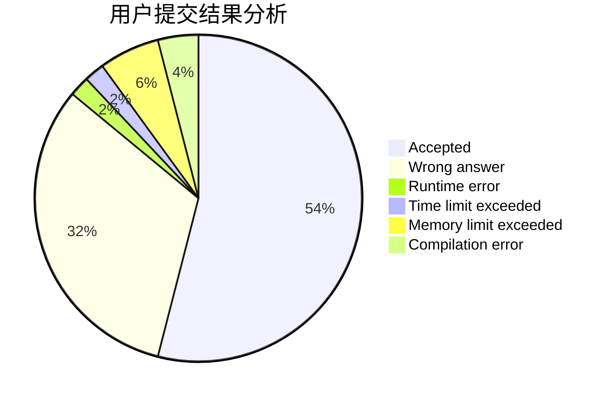
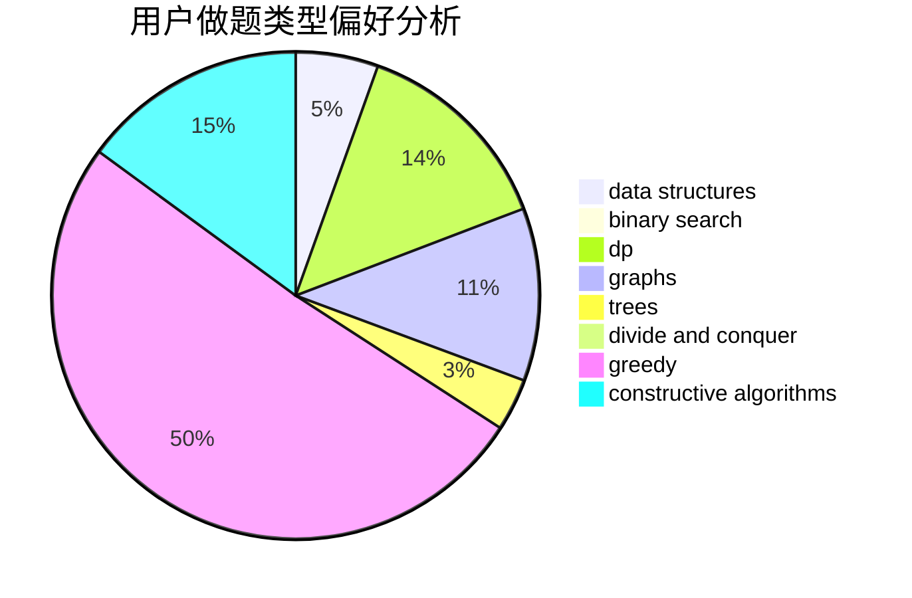

# KL-loveSAGIRI
<!-- tabs:start -->
#### **用户提交结果分析**

#### **用户做题类型偏好分析**

#### **用户错题知识点分析**

<!-- tabs:end -->
# 推荐题目
[Devu and his Brother](http://codeforces.com/problemset/problem/439/D)		binary search,
                        sortings,
                        ternary search,
                        two pointers		  
[Road Improvement](http://codeforces.com/problemset/problem/638/C)		*special problem,
                        dfs and similar,
                        graphs,
                        greedy,
                        trees		  
[Jeff and Furik](http://codeforces.com/problemset/problem/351/B)		combinatorics,
                        dp,
                        probabilities		  
[Flag 2](http://codeforces.com/problemset/problem/18/E)		dp		  
[Group Projects](http://codeforces.com/problemset/problem/626/F)		dp		  
[Forgery](http://codeforces.com/problemset/problem/1059/B)		implementation		  
[Famil Door and Brackets](http://codeforces.com/problemset/problem/629/C)		dp,
                        strings		  
[Multicolored Cars](http://codeforces.com/problemset/problem/818/D)		data structures,
                        implementation		  
[Planning](https://codeforces.com/contest/854/problem/C)		greedy		  
[Amr and Pins](http://codeforces.com/problemset/problem/507/B)		geometry,
                        math		  
<!-- tabs:start -->
#### **data structures**
[Multicolored Cars](http://codeforces.com/problemset/problem/818/D)		data structures,
                        implementation		  
[Skyline Photo](http://codeforces.com/problemset/problem/1482/E)		data structures,
                        divide and conquer,
                        dp		  
[Generating Sets](http://codeforces.com/problemset/problem/722/D)		binary search,
                        data structures,
                        dfs and similar,
                        greedy,
                        strings,
                        trees		  
[Buses](http://codeforces.com/problemset/problem/101/B)		binary search,
                        data structures,
                        dp		  
[Famil Door and Roads](http://codeforces.com/problemset/problem/629/E)		combinatorics,
                        data structures,
                        dfs and similar,
                        dp,
                        probabilities,
                        trees		  
[Split the Tree](http://codeforces.com/problemset/problem/1059/E)		binary search,
                        data structures,
                        dp,
                        greedy,
                        trees		  
[Jamie and To-do List](http://codeforces.com/problemset/problem/916/D)		data structures,
                        interactive,
                        trees		  
[Recommendations](https://codeforces.com/contest/1314/problem/A)		data structures,
                        greedy,
                        sortings		  
[Nastya and Strange Generator](http://codeforces.com/problemset/problem/1340/A)		brute force,
                        data structures,
                        greedy,
                        implementation		  
[Tree and Queries](http://codeforces.com/problemset/problem/375/D)		data structures,
                        dfs and similar,
                        trees		  
#### **binary search**
[Devu and his Brother](http://codeforces.com/problemset/problem/439/D)		binary search,
                        sortings,
                        ternary search,
                        two pointers		  
[Generating Sets](http://codeforces.com/problemset/problem/722/D)		binary search,
                        data structures,
                        dfs and similar,
                        greedy,
                        strings,
                        trees		  
[Buses](http://codeforces.com/problemset/problem/101/B)		binary search,
                        data structures,
                        dp		  
[Michael and Charging Stations](http://codeforces.com/problemset/problem/853/D)		binary search,
                        dp,
                        greedy		  
[Split the Tree](http://codeforces.com/problemset/problem/1059/E)		binary search,
                        data structures,
                        dp,
                        greedy,
                        trees		  
[Optimal Point](http://codeforces.com/problemset/problem/685/C)		binary search,
                        math		  
[Mushroom Gnomes - 2](http://codeforces.com/problemset/problem/138/C)		binary search,
                        data structures,
                        probabilities,
                        sortings		  
[Sage's Birthday (hard version)](http://codeforces.com/problemset/problem/1419/D2)		binary search,
                        brute force,
                        constructive algorithms,
                        greedy,
                        sortings,
                        two pointers		  
[Accidental Victory](http://codeforces.com/problemset/problem/1490/E)		binary search,
                        data structures,
                        greedy		  
[Maximum width](http://codeforces.com/problemset/problem/1492/C)		binary search,
                        data structures,
                        dp,
                        greedy,
                        two pointers		  
#### **dp**
[Jeff and Furik](http://codeforces.com/problemset/problem/351/B)		combinatorics,
                        dp,
                        probabilities		  
[Flag 2](http://codeforces.com/problemset/problem/18/E)		dp		  
[Group Projects](http://codeforces.com/problemset/problem/626/F)		dp		  
[Famil Door and Brackets](http://codeforces.com/problemset/problem/629/C)		dp,
                        strings		  
[Skyline Photo](http://codeforces.com/problemset/problem/1482/E)		data structures,
                        divide and conquer,
                        dp		  
[Buses](http://codeforces.com/problemset/problem/101/B)		binary search,
                        data structures,
                        dp		  
[Famil Door and Roads](http://codeforces.com/problemset/problem/629/E)		combinatorics,
                        data structures,
                        dfs and similar,
                        dp,
                        probabilities,
                        trees		  
[Michael and Charging Stations](http://codeforces.com/problemset/problem/853/D)		binary search,
                        dp,
                        greedy		  
[Split the Tree](http://codeforces.com/problemset/problem/1059/E)		binary search,
                        data structures,
                        dp,
                        greedy,
                        trees		  
[World of Tank](http://codeforces.com/problemset/problem/936/D)		dp,
                        greedy		  
#### **graph**
[Road Improvement](http://codeforces.com/problemset/problem/638/C)		*special problem,
                        dfs and similar,
                        graphs,
                        greedy,
                        trees		  
[Privatization of Roads in Berland](http://codeforces.com/problemset/problem/1070/I)		flows,
                        graph matchings,
                        graphs		  
[Flawed Flow](http://codeforces.com/problemset/problem/269/C)		constructive algorithms,
                        flows,
                        graphs,
                        greedy		  
[Mars rover](https://codeforces.com/contest/1011/problem/F)		dfs and similar,
                        graphs,
                        implementation,
                        trees		  
[Nastya and Scoreboard](http://codeforces.com/problemset/problem/1340/B)		bitmasks,
                        dp,
                        graphs,
                        greedy		  
[Balance the Cards](http://codeforces.com/problemset/problem/1503/F)		constructive algorithms,
                        data structures,
                        divide and conquer,
                        geometry,
                        graphs,
                        implementation		  
[Minimum Ties](http://codeforces.com/problemset/problem/1487/C)		brute force,
                        constructive algorithms,
                        dfs and similar,
                        graphs,
                        greedy,
                        implementation,
                        math		  
[Chef Monocarp](http://codeforces.com/problemset/problem/1437/C)		dp,
                        flows,
                        graph matchings,
                        greedy,
                        math,
                        sortings		  
[Strange Housing](http://codeforces.com/problemset/problem/1470/D)		constructive algorithms,
                        dfs and similar,
                        graph matchings,
                        graphs,
                        greedy		  
[Longest Simple Cycle](http://codeforces.com/problemset/problem/1476/C)		dp,
                        graphs,
                        greedy		  
#### **trees**
[Road Improvement](http://codeforces.com/problemset/problem/638/C)		*special problem,
                        dfs and similar,
                        graphs,
                        greedy,
                        trees		  
[Generating Sets](http://codeforces.com/problemset/problem/722/D)		binary search,
                        data structures,
                        dfs and similar,
                        greedy,
                        strings,
                        trees		  
[Famil Door and Roads](http://codeforces.com/problemset/problem/629/E)		combinatorics,
                        data structures,
                        dfs and similar,
                        dp,
                        probabilities,
                        trees		  
[Split the Tree](http://codeforces.com/problemset/problem/1059/E)		binary search,
                        data structures,
                        dp,
                        greedy,
                        trees		  
[Mars rover](https://codeforces.com/contest/1011/problem/F)		dfs and similar,
                        graphs,
                        implementation,
                        trees		  
[Jamie and To-do List](http://codeforces.com/problemset/problem/916/D)		data structures,
                        interactive,
                        trees		  
[Tree and Queries](http://codeforces.com/problemset/problem/375/D)		data structures,
                        dfs and similar,
                        trees		  
[Ehab and a weird weight formula](http://codeforces.com/problemset/problem/1088/F)		data structures,
                        trees		  
[Iqea](http://codeforces.com/problemset/problem/936/E)		data structures,
                        dfs and similar,
                        divide and conquer,
                        dsu,
                        shortest paths,
                        trees		  
[Olha and Igor](http://codeforces.com/problemset/problem/1438/F)		interactive,
                        probabilities,
                        trees		  
#### **divide and conquer**
[Skyline Photo](http://codeforces.com/problemset/problem/1482/E)		data structures,
                        divide and conquer,
                        dp		  
[Iqea](http://codeforces.com/problemset/problem/936/E)		data structures,
                        dfs and similar,
                        divide and conquer,
                        dsu,
                        shortest paths,
                        trees		  
[Balance the Cards](http://codeforces.com/problemset/problem/1503/F)		constructive algorithms,
                        data structures,
                        divide and conquer,
                        geometry,
                        graphs,
                        implementation		  
[Divide and Summarize](http://codeforces.com/problemset/problem/1461/D)		binary search,
                        brute force,
                        data structures,
                        divide and conquer,
                        implementation,
                        sortings		  
[Song of the Sirens](http://codeforces.com/problemset/problem/1466/G)		combinatorics,
                        divide and conquer,
                        hashing,
                        math,
                        string suffix structures,
                        strings		  
[Permutation Transformation](http://codeforces.com/problemset/problem/1490/D)		dfs and similar,
                        divide and conquer,
                        implementation		  
[Fib-tree](http://codeforces.com/problemset/problem/1491/E)		brute force,
                        dfs and similar,
                        divide and conquer,
                        number theory,
                        trees		  
[Sum of Prefix Sums](http://codeforces.com/problemset/problem/1303/G)		data structures,
                        divide and conquer,
                        geometry,
                        trees		  
[Dogeforces](http://codeforces.com/problemset/problem/1494/D)		constructive algorithms,
                        data structures,
                        dfs and similar,
                        divide and conquer,
                        dsu,
                        greedy,
                        sortings,
                        trees		  
[Logistical Questions](http://codeforces.com/problemset/problem/566/C)		dfs and similar,
                        divide and conquer,
                        trees		  
#### **greedy**
[Road Improvement](http://codeforces.com/problemset/problem/638/C)		*special problem,
                        dfs and similar,
                        graphs,
                        greedy,
                        trees		  
[Planning](https://codeforces.com/contest/854/problem/C)		greedy		  
[Restoring Permutation](http://codeforces.com/problemset/problem/1315/C)		greedy		  
[Product of Three Numbers](http://codeforces.com/problemset/problem/1294/C)		greedy,
                        math,
                        number theory		  
[Generating Sets](http://codeforces.com/problemset/problem/722/D)		binary search,
                        data structures,
                        dfs and similar,
                        greedy,
                        strings,
                        trees		  
[Elections](http://codeforces.com/problemset/problem/1019/A)		brute force,
                        greedy		  
[Michael and Charging Stations](http://codeforces.com/problemset/problem/853/D)		binary search,
                        dp,
                        greedy		  
[Flawed Flow](http://codeforces.com/problemset/problem/269/C)		constructive algorithms,
                        flows,
                        graphs,
                        greedy		  
[Split the Tree](http://codeforces.com/problemset/problem/1059/E)		binary search,
                        data structures,
                        dp,
                        greedy,
                        trees		  
[Greed](http://codeforces.com/problemset/problem/892/A)		greedy,
                        implementation		  
#### **constructive algorithms**
[Pashmak and Buses](http://codeforces.com/problemset/problem/459/C)		combinatorics,
                        constructive algorithms,
                        math		  
[Flawed Flow](http://codeforces.com/problemset/problem/269/C)		constructive algorithms,
                        flows,
                        graphs,
                        greedy		  
[Bad Ugly Numbers](http://codeforces.com/problemset/problem/1326/A)		constructive algorithms,
                        number theory		  
[What Is It?](http://codeforces.com/problemset/problem/1474/E)		constructive algorithms,
                        greedy		  
[Game With Array](http://codeforces.com/problemset/problem/1355/D)		constructive algorithms,
                        math		  
[Sage's Birthday (hard version)](http://codeforces.com/problemset/problem/1419/D2)		binary search,
                        brute force,
                        constructive algorithms,
                        greedy,
                        sortings,
                        two pointers		  
[Maximum Subsequence Value](http://codeforces.com/problemset/problem/1365/E)		brute force,
                        constructive algorithms		  
[Berserk Robot](http://codeforces.com/problemset/problem/538/G)		constructive algorithms,
                        math,
                        sortings		  
[Sorted Adjacent Differences](http://codeforces.com/problemset/problem/1339/B)		constructive algorithms,
                        sortings		  
[Balance the Cards](http://codeforces.com/problemset/problem/1503/F)		constructive algorithms,
                        data structures,
                        divide and conquer,
                        geometry,
                        graphs,
                        implementation		  
#### **sortings**
[Devu and his Brother](http://codeforces.com/problemset/problem/439/D)		binary search,
                        sortings,
                        ternary search,
                        two pointers		  
[Origami](http://codeforces.com/problemset/problem/1381/E)		geometry,
                        math,
                        sortings		  
[Recommendations](https://codeforces.com/contest/1314/problem/A)		data structures,
                        greedy,
                        sortings		  
[Mushroom Gnomes - 2](http://codeforces.com/problemset/problem/138/C)		binary search,
                        data structures,
                        probabilities,
                        sortings		  
[Sage's Birthday (hard version)](http://codeforces.com/problemset/problem/1419/D2)		binary search,
                        brute force,
                        constructive algorithms,
                        greedy,
                        sortings,
                        two pointers		  
[Berserk Robot](http://codeforces.com/problemset/problem/538/G)		constructive algorithms,
                        math,
                        sortings		  
[Sorted Adjacent Differences](http://codeforces.com/problemset/problem/1339/B)		constructive algorithms,
                        sortings		  
[Diamond Miner](https://codeforces.com/contest/1496/problem/C)		geometry,
                        greedy,
                        math,
                        sortings		  
[Meximization](http://codeforces.com/problemset/problem/1497/A)		brute force,
                        data structures,
                        greedy,
                        sortings		  
[Avoiding Zero](http://codeforces.com/problemset/problem/1427/A)		math,
                        sortings		  
<!-- tabs:end -->
