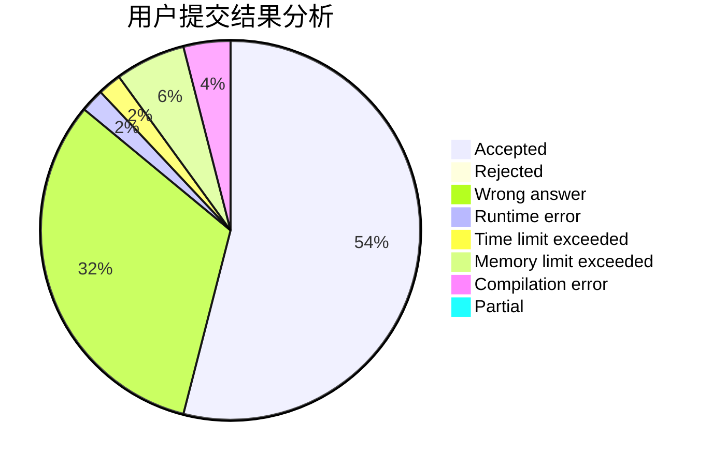
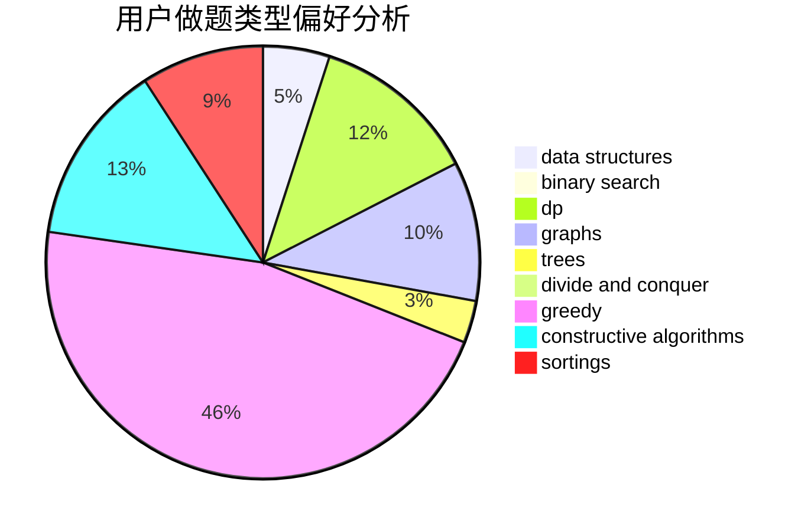

# KL-loveSAGIRI
<!-- tabs:start -->
#### **用户提交结果分析**

#### **用户做题类型偏好分析**

#### **用户错题知识点分析**

<!-- tabs:end -->
# 推荐题目
[439D](http://codeforces.com/problemset/problem/439/D)		binary search,
                        sortings,
                        ternary search,
                        two pointers		  
[638C](http://codeforces.com/problemset/problem/638/C)		*special problem,
                        dfs and similar,
                        graphs,
                        greedy,
                        trees		  
[351B](http://codeforces.com/problemset/problem/351/B)		combinatorics,
                        dp,
                        probabilities		  
[18E](http://codeforces.com/problemset/problem/18/E)		dp		  
[626F](http://codeforces.com/problemset/problem/626/F)		dp		  
[1059B](http://codeforces.com/problemset/problem/1059/B)		implementation		  
[629C](http://codeforces.com/problemset/problem/629/C)		dp,
                        strings		  
[818D](http://codeforces.com/problemset/problem/818/D)		data structures,
                        implementation		  
[854C](https://codeforces.com/contest/854/problem/C)		greedy		  
[507B](http://codeforces.com/problemset/problem/507/B)		geometry,
                        math		  
<!-- tabs:start -->
#### **data structures**
[818D](http://codeforces.com/problemset/problem/818/D)		data structures,
                        implementation		  
[1482E](http://codeforces.com/problemset/problem/1482/E)		data structures,
                        divide and conquer,
                        dp		  
[722D](http://codeforces.com/problemset/problem/722/D)		binary search,
                        data structures,
                        dfs and similar,
                        greedy,
                        strings,
                        trees		  
[101B](http://codeforces.com/problemset/problem/101/B)		binary search,
                        data structures,
                        dp		  
[629E](http://codeforces.com/problemset/problem/629/E)		combinatorics,
                        data structures,
                        dfs and similar,
                        dp,
                        probabilities,
                        trees		  
[1059E](http://codeforces.com/problemset/problem/1059/E)		binary search,
                        data structures,
                        dp,
                        greedy,
                        trees		  
[916D](http://codeforces.com/problemset/problem/916/D)		data structures,
                        interactive,
                        trees		  
[1314A](https://codeforces.com/contest/1314/problem/A)		data structures,
                        greedy,
                        sortings		  
[1340A](http://codeforces.com/problemset/problem/1340/A)		brute force,
                        data structures,
                        greedy,
                        implementation		  
[375D](http://codeforces.com/problemset/problem/375/D)		data structures,
                        dfs and similar,
                        trees		  
#### **binary search**
[439D](http://codeforces.com/problemset/problem/439/D)		binary search,
                        sortings,
                        ternary search,
                        two pointers		  
[722D](http://codeforces.com/problemset/problem/722/D)		binary search,
                        data structures,
                        dfs and similar,
                        greedy,
                        strings,
                        trees		  
[101B](http://codeforces.com/problemset/problem/101/B)		binary search,
                        data structures,
                        dp		  
[853D](http://codeforces.com/problemset/problem/853/D)		binary search,
                        dp,
                        greedy		  
[1059E](http://codeforces.com/problemset/problem/1059/E)		binary search,
                        data structures,
                        dp,
                        greedy,
                        trees		  
[685C](http://codeforces.com/problemset/problem/685/C)		binary search,
                        math		  
[138C](http://codeforces.com/problemset/problem/138/C)		binary search,
                        data structures,
                        probabilities,
                        sortings		  
[1419D2](http://codeforces.com/problemset/problem/1419/D2)		binary search,
                        brute force,
                        constructive algorithms,
                        greedy,
                        sortings,
                        two pointers		  
[1490E](http://codeforces.com/problemset/problem/1490/E)		binary search,
                        data structures,
                        greedy		  
[1492C](http://codeforces.com/problemset/problem/1492/C)		binary search,
                        data structures,
                        dp,
                        greedy,
                        two pointers		  
#### **dp**
[351B](http://codeforces.com/problemset/problem/351/B)		combinatorics,
                        dp,
                        probabilities		  
[18E](http://codeforces.com/problemset/problem/18/E)		dp		  
[626F](http://codeforces.com/problemset/problem/626/F)		dp		  
[629C](http://codeforces.com/problemset/problem/629/C)		dp,
                        strings		  
[1482E](http://codeforces.com/problemset/problem/1482/E)		data structures,
                        divide and conquer,
                        dp		  
[101B](http://codeforces.com/problemset/problem/101/B)		binary search,
                        data structures,
                        dp		  
[629E](http://codeforces.com/problemset/problem/629/E)		combinatorics,
                        data structures,
                        dfs and similar,
                        dp,
                        probabilities,
                        trees		  
[853D](http://codeforces.com/problemset/problem/853/D)		binary search,
                        dp,
                        greedy		  
[1059E](http://codeforces.com/problemset/problem/1059/E)		binary search,
                        data structures,
                        dp,
                        greedy,
                        trees		  
[936D](http://codeforces.com/problemset/problem/936/D)		dp,
                        greedy		  
#### **graph**
[638C](http://codeforces.com/problemset/problem/638/C)		*special problem,
                        dfs and similar,
                        graphs,
                        greedy,
                        trees		  
[1070I](http://codeforces.com/problemset/problem/1070/I)		flows,
                        graph matchings,
                        graphs		  
[269C](http://codeforces.com/problemset/problem/269/C)		constructive algorithms,
                        flows,
                        graphs,
                        greedy		  
[1011F](https://codeforces.com/contest/1011/problem/F)		dfs and similar,
                        graphs,
                        implementation,
                        trees		  
[1340B](http://codeforces.com/problemset/problem/1340/B)		bitmasks,
                        dp,
                        graphs,
                        greedy		  
[1503F](http://codeforces.com/problemset/problem/1503/F)		constructive algorithms,
                        data structures,
                        divide and conquer,
                        geometry,
                        graphs,
                        implementation		  
[1487C](http://codeforces.com/problemset/problem/1487/C)		brute force,
                        constructive algorithms,
                        dfs and similar,
                        graphs,
                        greedy,
                        implementation,
                        math		  
[1437C](http://codeforces.com/problemset/problem/1437/C)		dp,
                        flows,
                        graph matchings,
                        greedy,
                        math,
                        sortings		  
[1470D](http://codeforces.com/problemset/problem/1470/D)		constructive algorithms,
                        dfs and similar,
                        graph matchings,
                        graphs,
                        greedy		  
[1476C](http://codeforces.com/problemset/problem/1476/C)		dp,
                        graphs,
                        greedy		  
#### **trees**
[638C](http://codeforces.com/problemset/problem/638/C)		*special problem,
                        dfs and similar,
                        graphs,
                        greedy,
                        trees		  
[722D](http://codeforces.com/problemset/problem/722/D)		binary search,
                        data structures,
                        dfs and similar,
                        greedy,
                        strings,
                        trees		  
[629E](http://codeforces.com/problemset/problem/629/E)		combinatorics,
                        data structures,
                        dfs and similar,
                        dp,
                        probabilities,
                        trees		  
[1059E](http://codeforces.com/problemset/problem/1059/E)		binary search,
                        data structures,
                        dp,
                        greedy,
                        trees		  
[1011F](https://codeforces.com/contest/1011/problem/F)		dfs and similar,
                        graphs,
                        implementation,
                        trees		  
[916D](http://codeforces.com/problemset/problem/916/D)		data structures,
                        interactive,
                        trees		  
[375D](http://codeforces.com/problemset/problem/375/D)		data structures,
                        dfs and similar,
                        trees		  
[1088F](http://codeforces.com/problemset/problem/1088/F)		data structures,
                        trees		  
[936E](http://codeforces.com/problemset/problem/936/E)		data structures,
                        dfs and similar,
                        divide and conquer,
                        dsu,
                        shortest paths,
                        trees		  
[1438F](http://codeforces.com/problemset/problem/1438/F)		interactive,
                        probabilities,
                        trees		  
#### **divide and conquer**
[1482E](http://codeforces.com/problemset/problem/1482/E)		data structures,
                        divide and conquer,
                        dp		  
[936E](http://codeforces.com/problemset/problem/936/E)		data structures,
                        dfs and similar,
                        divide and conquer,
                        dsu,
                        shortest paths,
                        trees		  
[1503F](http://codeforces.com/problemset/problem/1503/F)		constructive algorithms,
                        data structures,
                        divide and conquer,
                        geometry,
                        graphs,
                        implementation		  
[1461D](http://codeforces.com/problemset/problem/1461/D)		binary search,
                        brute force,
                        data structures,
                        divide and conquer,
                        implementation,
                        sortings		  
[1466G](http://codeforces.com/problemset/problem/1466/G)		combinatorics,
                        divide and conquer,
                        hashing,
                        math,
                        string suffix structures,
                        strings		  
[1490D](http://codeforces.com/problemset/problem/1490/D)		dfs and similar,
                        divide and conquer,
                        implementation		  
[1483C](https://codeforces.com/contest/1483/problem/C)		data structures,
                        divide and conquer,
                        dp		  
[1491E](http://codeforces.com/problemset/problem/1491/E)		brute force,
                        dfs and similar,
                        divide and conquer,
                        number theory,
                        trees		  
[1303G](http://codeforces.com/problemset/problem/1303/G)		data structures,
                        divide and conquer,
                        geometry,
                        trees		  
[1494D](http://codeforces.com/problemset/problem/1494/D)		constructive algorithms,
                        data structures,
                        dfs and similar,
                        divide and conquer,
                        dsu,
                        greedy,
                        sortings,
                        trees		  
#### **greedy**
[638C](http://codeforces.com/problemset/problem/638/C)		*special problem,
                        dfs and similar,
                        graphs,
                        greedy,
                        trees		  
[854C](https://codeforces.com/contest/854/problem/C)		greedy		  
[1315C](http://codeforces.com/problemset/problem/1315/C)		greedy		  
[1294C](http://codeforces.com/problemset/problem/1294/C)		greedy,
                        math,
                        number theory		  
[722D](http://codeforces.com/problemset/problem/722/D)		binary search,
                        data structures,
                        dfs and similar,
                        greedy,
                        strings,
                        trees		  
[1019A](http://codeforces.com/problemset/problem/1019/A)		brute force,
                        greedy		  
[853D](http://codeforces.com/problemset/problem/853/D)		binary search,
                        dp,
                        greedy		  
[269C](http://codeforces.com/problemset/problem/269/C)		constructive algorithms,
                        flows,
                        graphs,
                        greedy		  
[1059E](http://codeforces.com/problemset/problem/1059/E)		binary search,
                        data structures,
                        dp,
                        greedy,
                        trees		  
[892A](http://codeforces.com/problemset/problem/892/A)		greedy,
                        implementation		  
#### **constructive algorithms**
[459C](http://codeforces.com/problemset/problem/459/C)		combinatorics,
                        constructive algorithms,
                        math		  
[269C](http://codeforces.com/problemset/problem/269/C)		constructive algorithms,
                        flows,
                        graphs,
                        greedy		  
[1326A](http://codeforces.com/problemset/problem/1326/A)		constructive algorithms,
                        number theory		  
[1474E](http://codeforces.com/problemset/problem/1474/E)		constructive algorithms,
                        greedy		  
[1355D](http://codeforces.com/problemset/problem/1355/D)		constructive algorithms,
                        math		  
[1419D2](http://codeforces.com/problemset/problem/1419/D2)		binary search,
                        brute force,
                        constructive algorithms,
                        greedy,
                        sortings,
                        two pointers		  
[1365E](http://codeforces.com/problemset/problem/1365/E)		brute force,
                        constructive algorithms		  
[538G](http://codeforces.com/problemset/problem/538/G)		constructive algorithms,
                        math,
                        sortings		  
[1339B](http://codeforces.com/problemset/problem/1339/B)		constructive algorithms,
                        sortings		  
[1503F](http://codeforces.com/problemset/problem/1503/F)		constructive algorithms,
                        data structures,
                        divide and conquer,
                        geometry,
                        graphs,
                        implementation		  
#### **sortings**
[439D](http://codeforces.com/problemset/problem/439/D)		binary search,
                        sortings,
                        ternary search,
                        two pointers		  
[1381E](http://codeforces.com/problemset/problem/1381/E)		geometry,
                        math,
                        sortings		  
[1314A](https://codeforces.com/contest/1314/problem/A)		data structures,
                        greedy,
                        sortings		  
[138C](http://codeforces.com/problemset/problem/138/C)		binary search,
                        data structures,
                        probabilities,
                        sortings		  
[1419D2](http://codeforces.com/problemset/problem/1419/D2)		binary search,
                        brute force,
                        constructive algorithms,
                        greedy,
                        sortings,
                        two pointers		  
[538G](http://codeforces.com/problemset/problem/538/G)		constructive algorithms,
                        math,
                        sortings		  
[1339B](http://codeforces.com/problemset/problem/1339/B)		constructive algorithms,
                        sortings		  
[1496C](https://codeforces.com/contest/1496/problem/C)		geometry,
                        greedy,
                        math,
                        sortings		  
[1495A](http://codeforces.com/problemset/problem/1495/A)		geometry,
                        greedy,
                        math,
                        sortings		  
[1497A](http://codeforces.com/problemset/problem/1497/A)		brute force,
                        data structures,
                        greedy,
                        sortings		  
<!-- tabs:end -->
