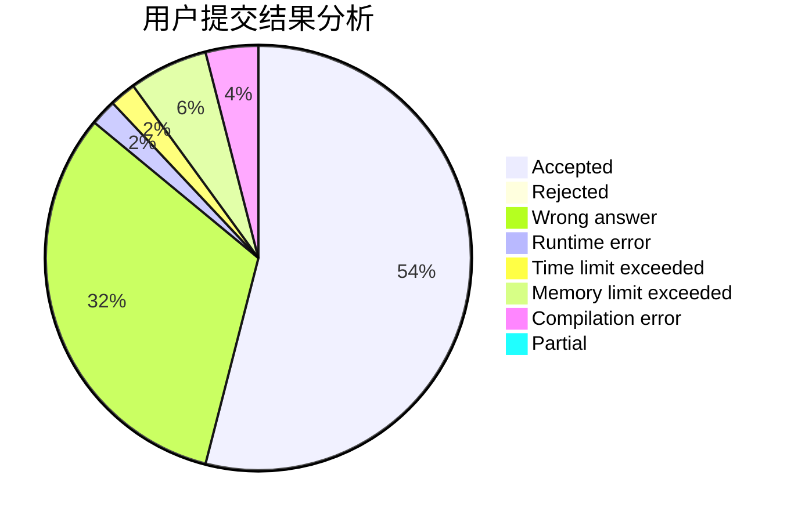
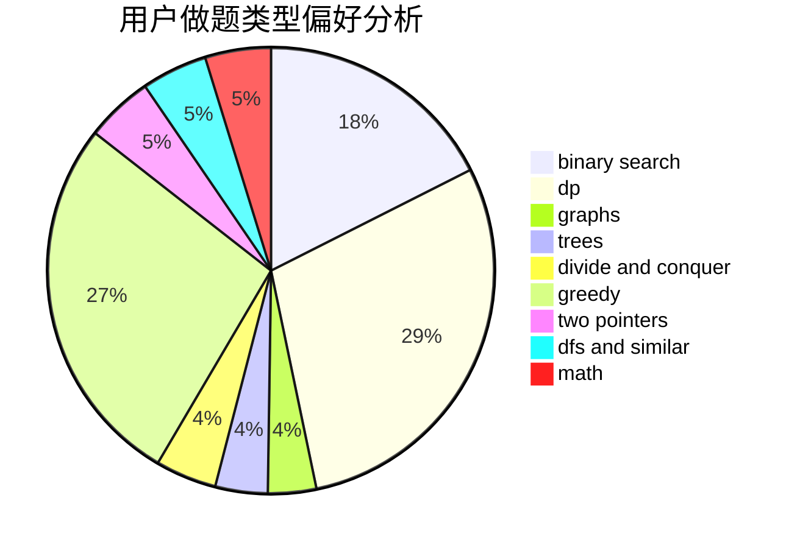

# KL-loveSAGIRI

<!-- tabs:start -->

#### **用户提交结果分析**

#### **用户做题类型偏好分析**

<!-- tabs:end -->
# 推荐题目
[1490C](https://codeforces.com/contest/1490/problem/C)
[668C](https://codeforces.com/contest/668/problem/C)
[527C](https://codeforces.com/contest/527/problem/C)
[1059E](https://codeforces.com/contest/1059/problem/E)
[653A](https://codeforces.com/contest/653/problem/A)
[1060E](https://codeforces.com/contest/1060/problem/E)
[659B](https://codeforces.com/contest/659/problem/B)
[873A](https://codeforces.com/contest/873/problem/A)
[659E](https://codeforces.com/contest/659/problem/E)
[1070L](https://codeforces.com/contest/1070/problem/L)
