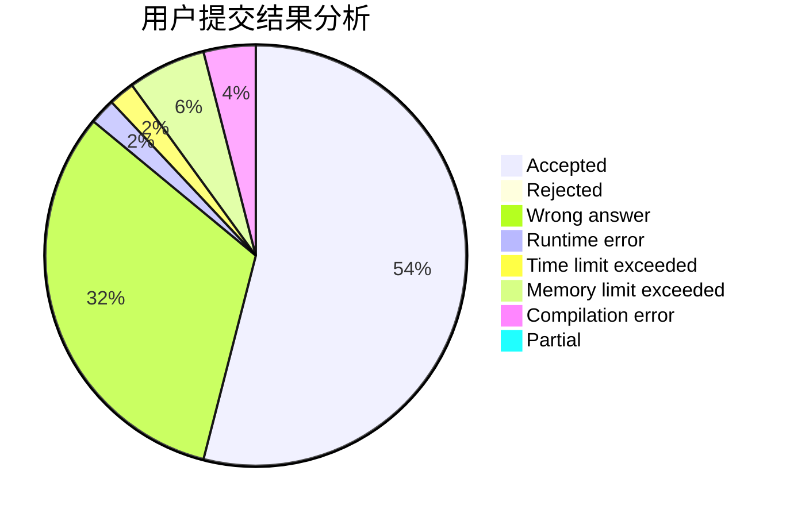
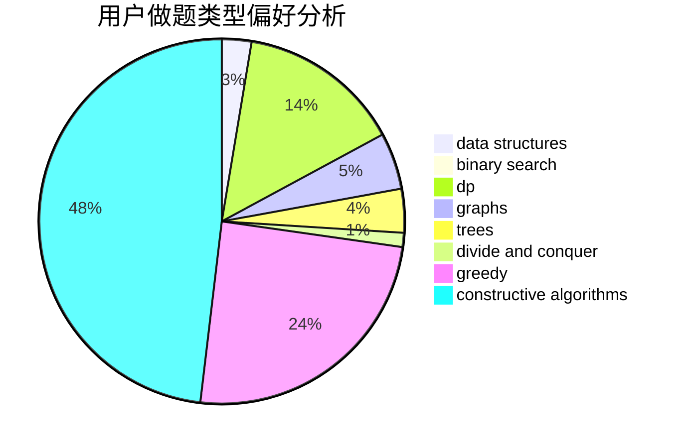

# KL-loveSAGIRI

<!-- tabs:start -->

#### **用户提交结果分析**

#### **用户做题类型偏好分析**

#### **用户错题知识点分析**

<!-- tabs:end -->
# 推荐题目
[1490C](https://codeforces.com/contest/1490/problem/C)		binary search,
                        brute force,
                        brute force,
                        math		  
[668C](https://codeforces.com/contest/668/problem/C)		dsu,graphs,sortings,trees		  
[527C](https://codeforces.com/contest/527/problem/C)		binary search,
                        data structures,
                        implementation		  
[1059E](https://codeforces.com/contest/1059/problem/E)		binary search,
                        data structures,
                        dp,
                        greedy,
                        trees		  
[653A](https://codeforces.com/contest/653/problem/A)		brute force,
                        implementation,
                        sortings		  
[1060E](https://codeforces.com/contest/1060/problem/E)		dfs and similar,
                        dp,
                        trees		  
[659B](https://codeforces.com/contest/659/problem/B)		constructive algorithms,
                        sortings		  
[873A](https://codeforces.com/contest/873/problem/A)		implementation		  
[659E](https://codeforces.com/contest/659/problem/E)		data structures,
                        dfs and similar,
                        dsu,
                        graphs,
                        greedy		  
[1070L](https://codeforces.com/contest/1070/problem/L)		constructive algorithms		  
