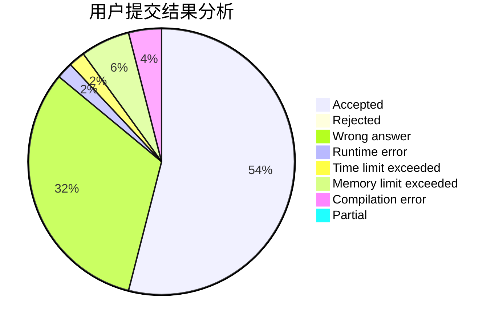
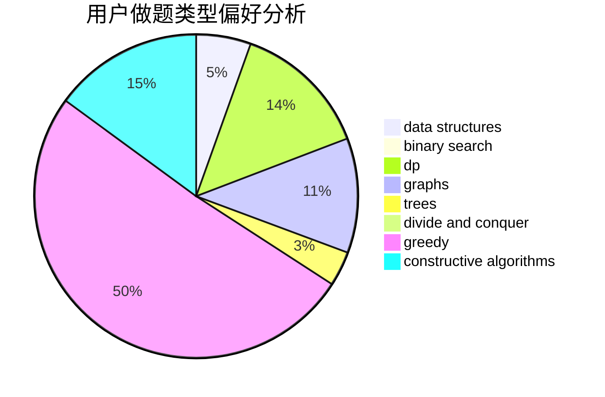

# KL-loveSAGIRI

<!-- tabs:start -->

#### **用户提交结果分析**

#### **用户做题类型偏好分析**

#### **用户错题知识点分析**

<!-- tabs:end -->
# 推荐题目
[1482E](https://codeforces.com/contest/1482/problem/E)		data structures,
                        divide and conquer,
                        dp		  
[638C](https://codeforces.com/contest/638/problem/C)		*special problem,
                        dfs and similar,
                        graphs,
                        greedy,
                        trees		  
[507B](https://codeforces.com/contest/507/problem/B)		geometry,
                        math		  
[1059B](https://codeforces.com/contest/1059/problem/B)		implementation		  
[626F](https://codeforces.com/contest/626/problem/F)		dp		  
[1060B](https://codeforces.com/contest/1060/problem/B)		greedy		  
[629C](https://codeforces.com/contest/629/problem/C)		dp,
                        strings		  
[854C](https://codeforces.com/contest/854/problem/C)		dsu,graphs,sortings,trees		  
[629E](https://codeforces.com/contest/629/problem/E)		combinatorics,
                        data structures,
                        dfs and similar,
                        dp,
                        probabilities,
                        trees		  
[1070I](https://codeforces.com/contest/1070/problem/I)		flows,
                        graph matchings,
                        graphs		  
