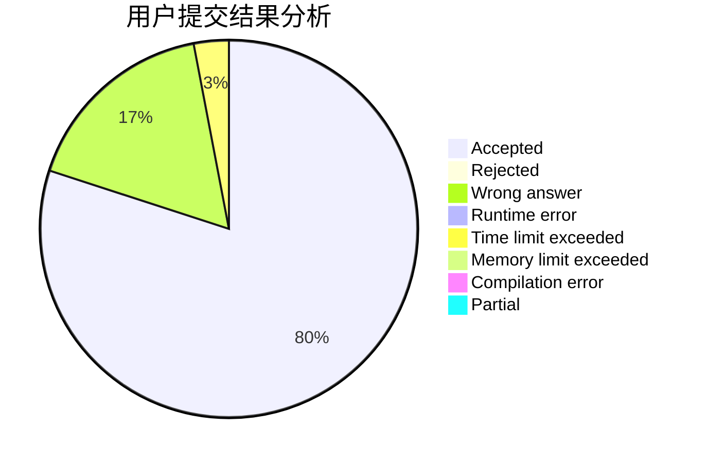
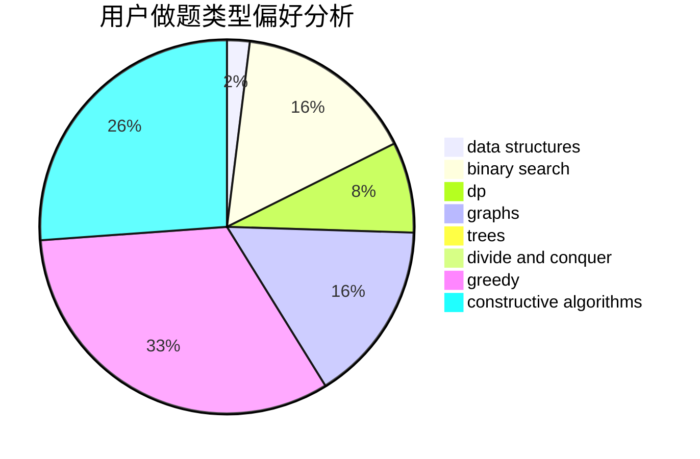
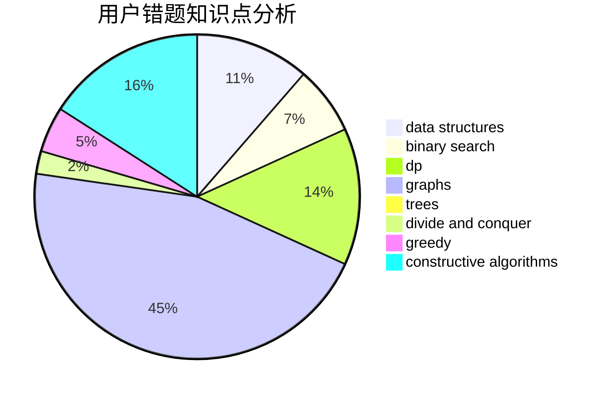

# KMnO4y_Fish
<!-- tabs:start -->
#### **用户提交结果分析**

#### **用户做题类型偏好分析**

#### **用户错题知识点分析**

<!-- tabs:end -->
# 推荐题目
[Gena and Second Distance](http://codeforces.com/problemset/problem/442/E)		geometry		  
[Multicolored Markers](http://codeforces.com/problemset/problem/1029/F)		binary search,
                        brute force,
                        math,
                        number theory		  
[Police Station](http://codeforces.com/problemset/problem/208/C)		dp,
                        graphs,
                        shortest paths		  
[Data Center](http://codeforces.com/problemset/problem/1250/F)		brute force,
                        implementation		  
[Memory for Arrays](http://codeforces.com/problemset/problem/309/C)		binary search,
                        bitmasks,
                        greedy		  
[Cutting Banner](http://codeforces.com/problemset/problem/538/A)		brute force,
                        implementation		  
[How Many Squares?](http://codeforces.com/problemset/problem/11/C)		implementation		  
[Keep talking and nobody explodes -- easy](http://codeforces.com/problemset/problem/1302/F)		bitmasks,
                        brute force,
                        expression parsing		  
[Game with modulo](https://codeforces.com/contest/1104/problem/D)		binary search,
                        constructive algorithms,
                        interactive		  
[Morse Code](http://codeforces.com/problemset/problem/1129/C)		binary search,
                        data structures,
                        dp,
                        hashing,
                        sortings,
                        string suffix structures,
                        strings		  
<!-- tabs:start -->
#### **data structures**
[Gena and Second Distance](http://codeforces.com/problemset/problem/1129/C)		binary search,
                        data structures,
                        dp,
                        hashing,
                        sortings,
                        string suffix structures,
                        strings		  
[Multicolored Markers](http://codeforces.com/problemset/problem/912/D)		data structures,
                        graphs,
                        greedy,
                        probabilities,
                        shortest paths		  
[Police Station](http://codeforces.com/problemset/problem/424/D)		binary search,
                        brute force,
                        constructive algorithms,
                        data structures,
                        dp		  
[Data Center](http://codeforces.com/problemset/problem/718/C)		data structures,
                        math,
                        matrices		  
[Memory for Arrays](http://codeforces.com/problemset/problem/600/E)		data structures,
                        dfs and similar,
                        dsu,
                        trees		  
[Cutting Banner](http://codeforces.com/problemset/problem/1498/B)		binary search,
                        bitmasks,
                        data structures,
                        greedy		  
[How Many Squares?](http://codeforces.com/problemset/problem/1492/C)		binary search,
                        data structures,
                        dp,
                        greedy,
                        two pointers		  
[Keep talking and nobody explodes -- easy](http://codeforces.com/problemset/problem/1490/G)		binary search,
                        data structures,
                        math		  
[Game with modulo](http://codeforces.com/problemset/problem/1479/D)		binary search,
                        bitmasks,
                        brute force,
                        data structures,
                        probabilities,
                        trees		  
[Morse Code](http://codeforces.com/problemset/problem/1497/A)		brute force,
                        data structures,
                        greedy,
                        sortings		  
#### **binary search**
[Gena and Second Distance](http://codeforces.com/problemset/problem/1029/F)		binary search,
                        brute force,
                        math,
                        number theory		  
[Multicolored Markers](http://codeforces.com/problemset/problem/309/C)		binary search,
                        bitmasks,
                        greedy		  
[Police Station](https://codeforces.com/contest/1104/problem/D)		binary search,
                        constructive algorithms,
                        interactive		  
[Data Center](http://codeforces.com/problemset/problem/1129/C)		binary search,
                        data structures,
                        dp,
                        hashing,
                        sortings,
                        string suffix structures,
                        strings		  
[Memory for Arrays](http://codeforces.com/problemset/problem/424/D)		binary search,
                        brute force,
                        constructive algorithms,
                        data structures,
                        dp		  
[Cutting Banner](http://codeforces.com/problemset/problem/1498/B)		binary search,
                        bitmasks,
                        data structures,
                        greedy		  
[How Many Squares?](http://codeforces.com/problemset/problem/1492/C)		binary search,
                        data structures,
                        dp,
                        greedy,
                        two pointers		  
[Keep talking and nobody explodes -- easy](http://codeforces.com/problemset/problem/1463/D)		binary search,
                        constructive algorithms,
                        greedy,
                        two pointers		  
[Game with modulo](http://codeforces.com/problemset/problem/1490/G)		binary search,
                        data structures,
                        math		  
[Morse Code](http://codeforces.com/problemset/problem/1479/D)		binary search,
                        bitmasks,
                        brute force,
                        data structures,
                        probabilities,
                        trees		  
#### **dp**
[Gena and Second Distance](http://codeforces.com/problemset/problem/208/C)		dp,
                        graphs,
                        shortest paths		  
[Multicolored Markers](http://codeforces.com/problemset/problem/1129/C)		binary search,
                        data structures,
                        dp,
                        hashing,
                        sortings,
                        string suffix structures,
                        strings		  
[Police Station](http://codeforces.com/problemset/problem/424/D)		binary search,
                        brute force,
                        constructive algorithms,
                        data structures,
                        dp		  
[Data Center](http://codeforces.com/problemset/problem/811/C)		dp,
                        implementation		  
[Memory for Arrays](http://codeforces.com/problemset/problem/1491/D)		bitmasks,
                        constructive algorithms,
                        dp,
                        greedy,
                        math		  
[Cutting Banner](http://codeforces.com/problemset/problem/1492/C)		binary search,
                        data structures,
                        dp,
                        greedy,
                        two pointers		  
[How Many Squares?](https://codeforces.com/contest/1457/problem/C)		brute force,
                        dp,
                        implementation		  
[Keep talking and nobody explodes -- easy](http://codeforces.com/problemset/problem/1491/C)		brute force,
                        data structures,
                        dp,
                        greedy,
                        implementation		  
[Game with modulo](http://codeforces.com/problemset/problem/1437/C)		dp,
                        flows,
                        graph matchings,
                        greedy,
                        math,
                        sortings		  
[Morse Code](http://codeforces.com/problemset/problem/1499/B)		brute force,
                        dp,
                        greedy,
                        implementation		  
#### **graph**
[Gena and Second Distance](http://codeforces.com/problemset/problem/208/C)		dp,
                        graphs,
                        shortest paths		  
[Multicolored Markers](http://codeforces.com/problemset/problem/912/D)		data structures,
                        graphs,
                        greedy,
                        probabilities,
                        shortest paths		  
[Police Station](http://codeforces.com/problemset/problem/1250/N)		dfs and similar,
                        graphs,
                        greedy		  
[Data Center](http://codeforces.com/problemset/problem/1255/B)		graphs,
                        implementation		  
[Memory for Arrays](http://codeforces.com/problemset/problem/1485/D)		constructive algorithms,
                        graphs,
                        math,
                        number theory		  
[Cutting Banner](http://codeforces.com/problemset/problem/1487/C)		brute force,
                        constructive algorithms,
                        dfs and similar,
                        graphs,
                        greedy,
                        implementation,
                        math		  
[How Many Squares?](http://codeforces.com/problemset/problem/1437/C)		dp,
                        flows,
                        graph matchings,
                        greedy,
                        math,
                        sortings		  
[Keep talking and nobody explodes -- easy](http://codeforces.com/problemset/problem/1470/D)		constructive algorithms,
                        dfs and similar,
                        graph matchings,
                        graphs,
                        greedy		  
[Game with modulo](http://codeforces.com/problemset/problem/1476/C)		dp,
                        graphs,
                        greedy		  
[Morse Code](http://codeforces.com/problemset/problem/1304/D)		constructive algorithms,
                        graphs,
                        greedy,
                        two pointers		  
#### **trees**
[Gena and Second Distance](http://codeforces.com/problemset/problem/600/E)		data structures,
                        dfs and similar,
                        dsu,
                        trees		  
[Multicolored Markers](http://codeforces.com/problemset/problem/1479/D)		binary search,
                        bitmasks,
                        brute force,
                        data structures,
                        probabilities,
                        trees		  
[Police Station](http://codeforces.com/problemset/problem/1511/C)		brute force,
                        data structures,
                        implementation,
                        trees		  
[Data Center](http://codeforces.com/problemset/problem/1499/F)		combinatorics,
                        dfs and similar,
                        dp,
                        trees		  
[Memory for Arrays](http://codeforces.com/problemset/problem/1491/E)		brute force,
                        dfs and similar,
                        divide and conquer,
                        number theory,
                        trees		  
[Cutting Banner](http://codeforces.com/problemset/problem/1466/D)		data structures,
                        greedy,
                        sortings,
                        trees		  
[How Many Squares?](http://codeforces.com/problemset/problem/1495/D)		combinatorics,
                        dfs and similar,
                        graphs,
                        math,
                        shortest paths,
                        trees		  
[Keep talking and nobody explodes -- easy](http://codeforces.com/problemset/problem/1303/G)		data structures,
                        divide and conquer,
                        geometry,
                        trees		  
[Game with modulo](http://codeforces.com/problemset/problem/1454/E)		combinatorics,
                        dfs and similar,
                        graphs,
                        trees		  
[Morse Code](http://codeforces.com/problemset/problem/1494/D)		constructive algorithms,
                        data structures,
                        dfs and similar,
                        divide and conquer,
                        dsu,
                        greedy,
                        sortings,
                        trees		  
#### **divide and conquer**
[Gena and Second Distance](http://codeforces.com/problemset/problem/1461/D)		binary search,
                        brute force,
                        data structures,
                        divide and conquer,
                        implementation,
                        sortings		  
[Multicolored Markers](http://codeforces.com/problemset/problem/1466/G)		combinatorics,
                        divide and conquer,
                        hashing,
                        math,
                        string suffix structures,
                        strings		  
[Police Station](http://codeforces.com/problemset/problem/1490/D)		dfs and similar,
                        divide and conquer,
                        implementation		  
[Data Center](https://codeforces.com/contest/1483/problem/C)		data structures,
                        divide and conquer,
                        dp		  
[Memory for Arrays](http://codeforces.com/problemset/problem/1491/E)		brute force,
                        dfs and similar,
                        divide and conquer,
                        number theory,
                        trees		  
[Cutting Banner](http://codeforces.com/problemset/problem/1303/G)		data structures,
                        divide and conquer,
                        geometry,
                        trees		  
[How Many Squares?](http://codeforces.com/problemset/problem/1494/D)		constructive algorithms,
                        data structures,
                        dfs and similar,
                        divide and conquer,
                        dsu,
                        greedy,
                        sortings,
                        trees		  
[Keep talking and nobody explodes -- easy](http://codeforces.com/problemset/problem/1482/E)		data structures,
                        divide and conquer,
                        dp		  
[Game with modulo](http://codeforces.com/problemset/problem/566/C)		dfs and similar,
                        divide and conquer,
                        trees		  
[Morse Code](http://codeforces.com/problemset/problem/1428/F)		binary search,
                        data structures,
                        divide and conquer,
                        dp,
                        two pointers		  
#### **greedy**
[Gena and Second Distance](http://codeforces.com/problemset/problem/309/C)		binary search,
                        bitmasks,
                        greedy		  
[Multicolored Markers](http://codeforces.com/problemset/problem/912/D)		data structures,
                        graphs,
                        greedy,
                        probabilities,
                        shortest paths		  
[Police Station](http://codeforces.com/problemset/problem/1250/N)		dfs and similar,
                        graphs,
                        greedy		  
[Data Center](http://codeforces.com/problemset/problem/1380/D)		constructive algorithms,
                        greedy,
                        implementation,
                        math,
                        two pointers		  
[Memory for Arrays](http://codeforces.com/problemset/problem/1491/D)		bitmasks,
                        constructive algorithms,
                        dp,
                        greedy,
                        math		  
[Cutting Banner](http://codeforces.com/problemset/problem/1498/B)		binary search,
                        bitmasks,
                        data structures,
                        greedy		  
[How Many Squares?](http://codeforces.com/problemset/problem/1492/C)		binary search,
                        data structures,
                        dp,
                        greedy,
                        two pointers		  
[Keep talking and nobody explodes -- easy](https://codeforces.com/contest/1496/problem/C)		geometry,
                        greedy,
                        math,
                        sortings		  
[Game with modulo](http://codeforces.com/problemset/problem/1493/A)		constructive algorithms,
                        greedy		  
[Morse Code](http://codeforces.com/problemset/problem/1463/D)		binary search,
                        constructive algorithms,
                        greedy,
                        two pointers		  
#### **constructive algorithms**
[Gena and Second Distance](https://codeforces.com/contest/1104/problem/D)		binary search,
                        constructive algorithms,
                        interactive		  
[Multicolored Markers](http://codeforces.com/problemset/problem/424/D)		binary search,
                        brute force,
                        constructive algorithms,
                        data structures,
                        dp		  
[Police Station](http://codeforces.com/problemset/problem/1380/D)		constructive algorithms,
                        greedy,
                        implementation,
                        math,
                        two pointers		  
[Data Center](http://codeforces.com/problemset/problem/1491/D)		bitmasks,
                        constructive algorithms,
                        dp,
                        greedy,
                        math		  
[Memory for Arrays](http://codeforces.com/problemset/problem/1485/D)		constructive algorithms,
                        graphs,
                        math,
                        number theory		  
[Cutting Banner](http://codeforces.com/problemset/problem/1493/A)		constructive algorithms,
                        greedy		  
[How Many Squares?](http://codeforces.com/problemset/problem/1463/D)		binary search,
                        constructive algorithms,
                        greedy,
                        two pointers		  
[Keep talking and nobody explodes -- easy](https://codeforces.com/contest/1456/problem/B)		bitmasks,
                        brute force,
                        constructive algorithms		  
[Game with modulo](http://codeforces.com/problemset/problem/1492/D)		bitmasks,
                        constructive algorithms,
                        greedy,
                        math		  
[Morse Code](https://codeforces.com/contest/1504/problem/D)		constructive algorithms,
                        games,
                        interactive		  
#### **sortings**
[Gena and Second Distance](http://codeforces.com/problemset/problem/1129/C)		binary search,
                        data structures,
                        dp,
                        hashing,
                        sortings,
                        string suffix structures,
                        strings		  
[Multicolored Markers](https://codeforces.com/contest/1496/problem/C)		geometry,
                        greedy,
                        math,
                        sortings		  
[Police Station](http://codeforces.com/problemset/problem/1495/A)		geometry,
                        greedy,
                        math,
                        sortings		  
[Data Center](http://codeforces.com/problemset/problem/1497/A)		brute force,
                        data structures,
                        greedy,
                        sortings		  
[Memory for Arrays](http://codeforces.com/problemset/problem/1427/A)		math,
                        sortings		  
[Cutting Banner](http://codeforces.com/problemset/problem/1461/D)		binary search,
                        brute force,
                        data structures,
                        divide and conquer,
                        implementation,
                        sortings		  
[How Many Squares?](http://codeforces.com/problemset/problem/1437/C)		dp,
                        flows,
                        graph matchings,
                        greedy,
                        math,
                        sortings		  
[Keep talking and nobody explodes -- easy](http://codeforces.com/problemset/problem/1473/A)		greedy,
                        implementation,
                        math,
                        sortings		  
[Game with modulo](http://codeforces.com/problemset/problem/1486/B)		binary search,
                        geometry,
                        shortest paths,
                        sortings		  
[Morse Code](http://codeforces.com/problemset/problem/1480/B)		greedy,
                        implementation,
                        sortings		  
<!-- tabs:end -->
