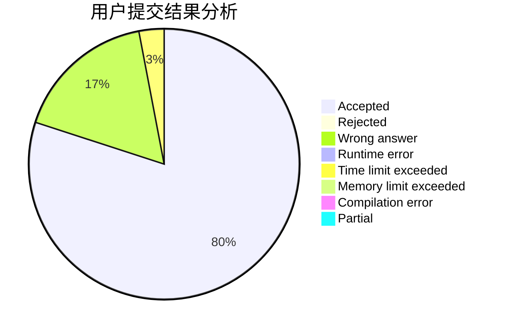
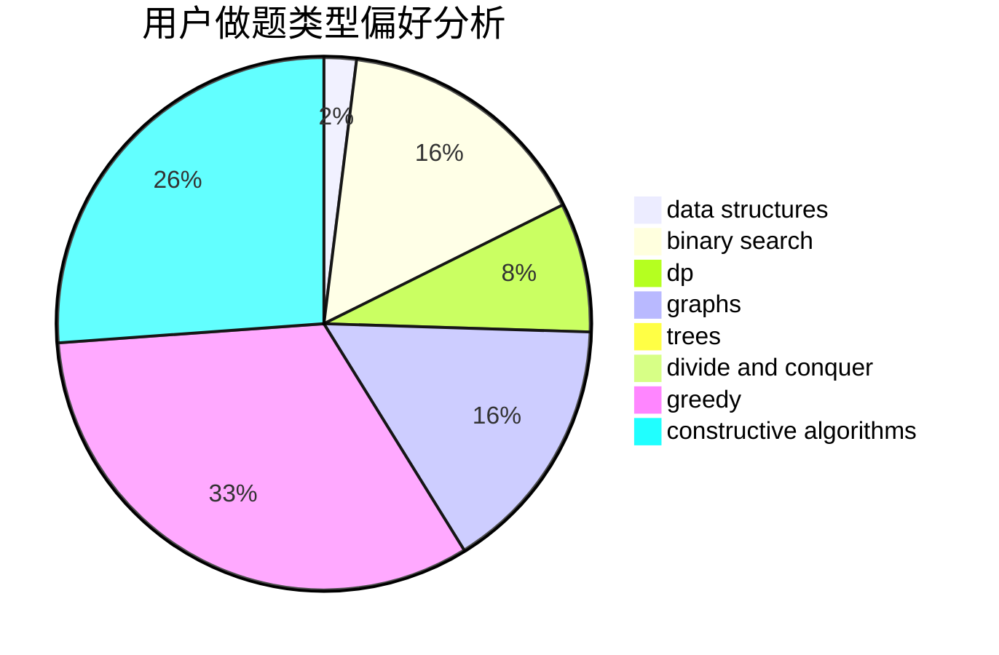
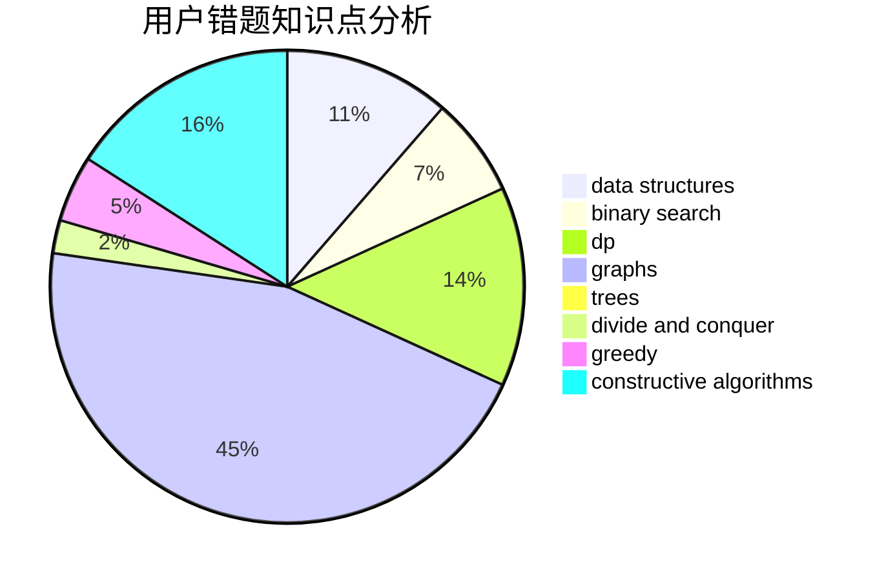

# KMnO4y_Fish

<!-- tabs:start -->

#### **用户提交结果分析**

#### **用户做题类型偏好分析**

#### **用户错题知识点分析**

<!-- tabs:end -->
# 推荐题目
[1250F](https://codeforces.com/contest/1250/problem/F)		brute force,
                        implementation		  
[442E](https://codeforces.com/contest/442/problem/E)		geometry		  
[208C](https://codeforces.com/contest/208/problem/C)		dp,
                        graphs,
                        shortest paths		  
[11C](https://codeforces.com/contest/11/problem/C)		implementation		  
[424D](https://codeforces.com/contest/424/problem/D)		binary search,
                        brute force,
                        constructive algorithms,
                        data structures,
                        dp		  
[309C](https://codeforces.com/contest/309/problem/C)		binary search,
                        bitmasks,
                        greedy		  
[538A](https://codeforces.com/contest/538/problem/A)		brute force,
                        implementation		  
[1255B](https://codeforces.com/contest/1255/problem/B)		graphs,
                        implementation		  
[1029F](https://codeforces.com/contest/1029/problem/F)		binary search,
                        brute force,
                        math,
                        number theory		  
[510E](https://codeforces.com/contest/510/problem/E)		flows		  
