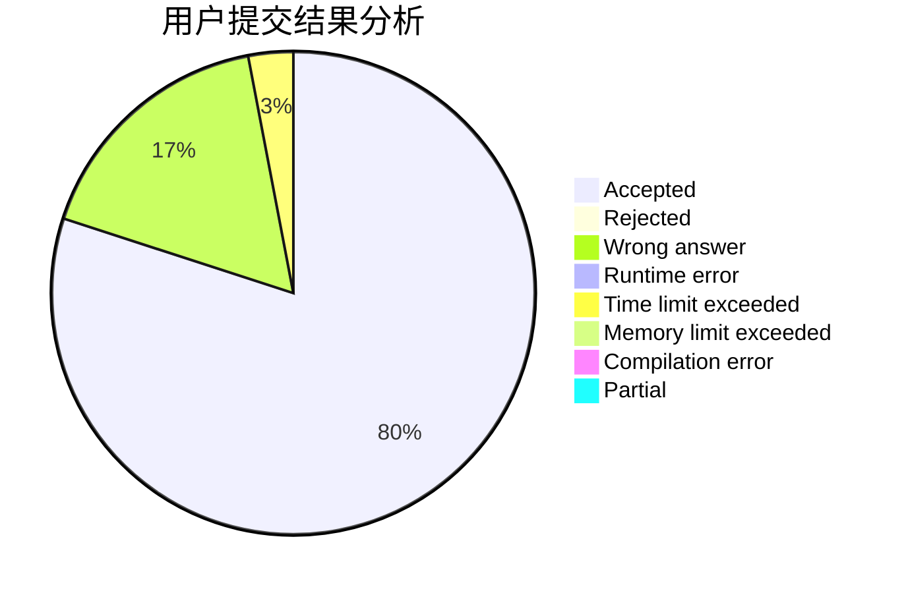
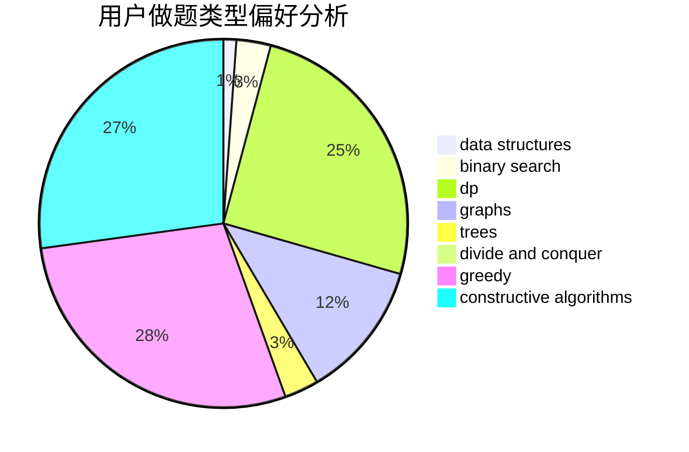
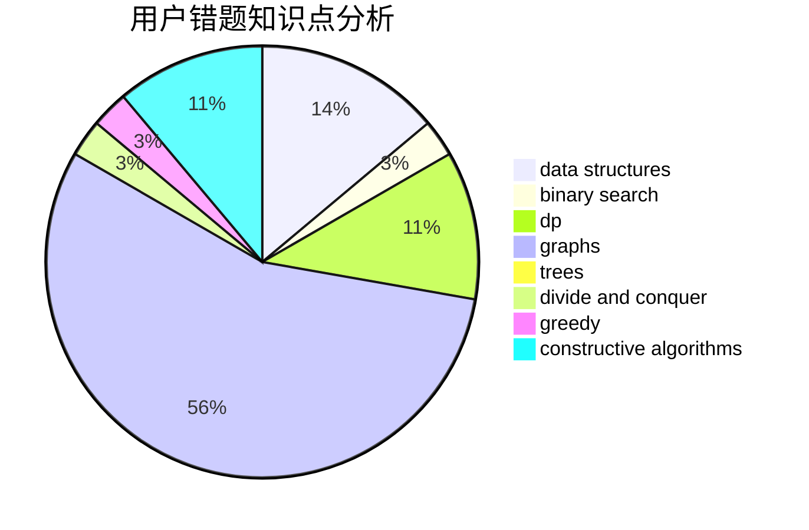

# KMnO4y_Fish

<!-- tabs:start -->

#### **用户提交结果分析**

#### **用户做题类型偏好分析**

#### **用户错题知识点分析**

<!-- tabs:end -->
# 推荐题目
[1254E](https://codeforces.com/contest/1254/problem/E)		combinatorics,
                        dfs and similar,
                        dsu,
                        trees		  
[463C](https://codeforces.com/contest/463/problem/C)		greedy,
                        hashing,
                        implementation		  
[22E](https://codeforces.com/contest/22/problem/E)		dfs and similar,
                        graphs,
                        trees		  
[1204A](https://codeforces.com/contest/1204/problem/A)		math		  
[447E](https://codeforces.com/contest/447/problem/E)		dsu,graphs,sortings,trees		  
[32B](https://codeforces.com/contest/32/problem/B)		expression parsing,
                        implementation		  
[559B](https://codeforces.com/contest/559/problem/B)		divide and conquer,
                        hashing,
                        sortings,
                        strings		  
[1262B](https://codeforces.com/contest/1262/problem/B)		dsu,graphs,sortings,trees		  
[1030A](https://codeforces.com/contest/1030/problem/A)		implementation		  
[534F](https://codeforces.com/contest/534/problem/F)		bitmasks,
                        dp,
                        hashing,
                        meet-in-the-middle		  
