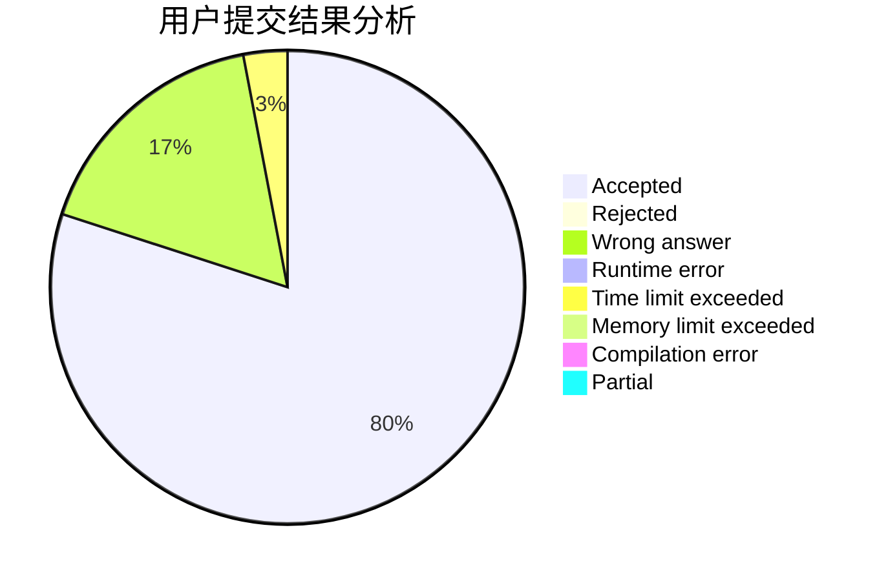
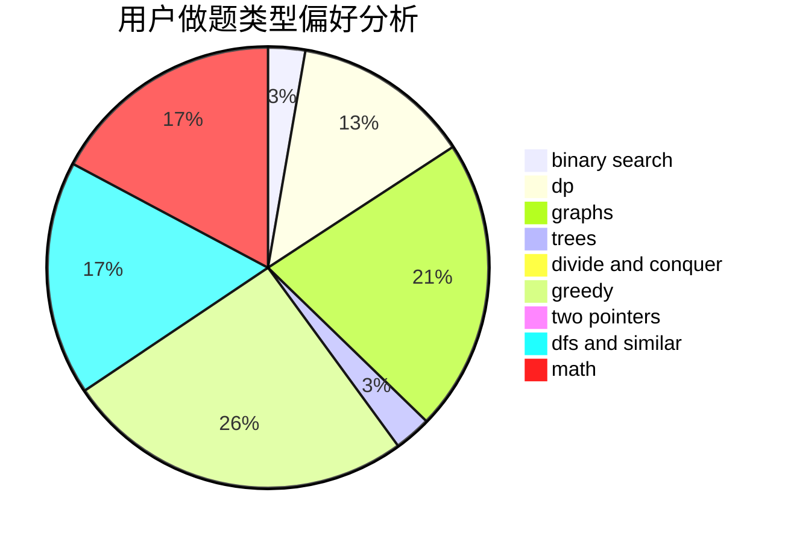

# KMnO4y_Fish

<!-- tabs:start -->

#### **用户提交结果分析**

#### **用户做题类型偏好分析**

<!-- tabs:end -->
# 推荐题目
[1254E](https://codeforces.com/contest/1254/problem/E)
[463C](https://codeforces.com/contest/463/problem/C)
[22E](https://codeforces.com/contest/22/problem/E)
[1204A](https://codeforces.com/contest/1204/problem/A)
[447E](https://codeforces.com/contest/447/problem/E)
[32B](https://codeforces.com/contest/32/problem/B)
[559B](https://codeforces.com/contest/559/problem/B)
[1262B](https://codeforces.com/contest/1262/problem/B)
[1030A](https://codeforces.com/contest/1030/problem/A)
[534F](https://codeforces.com/contest/534/problem/F)
