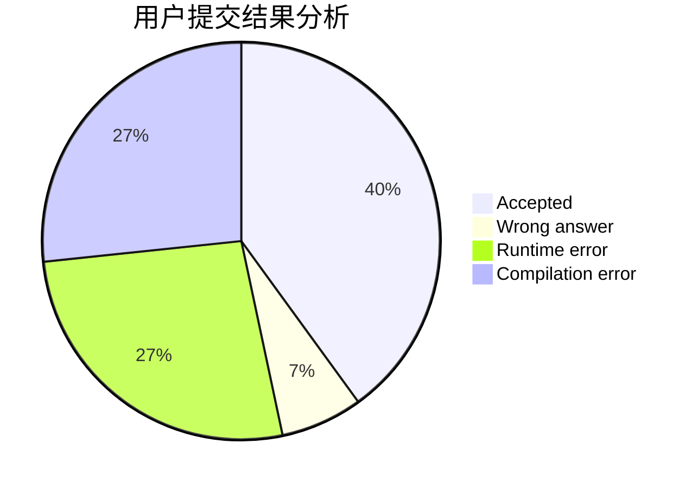
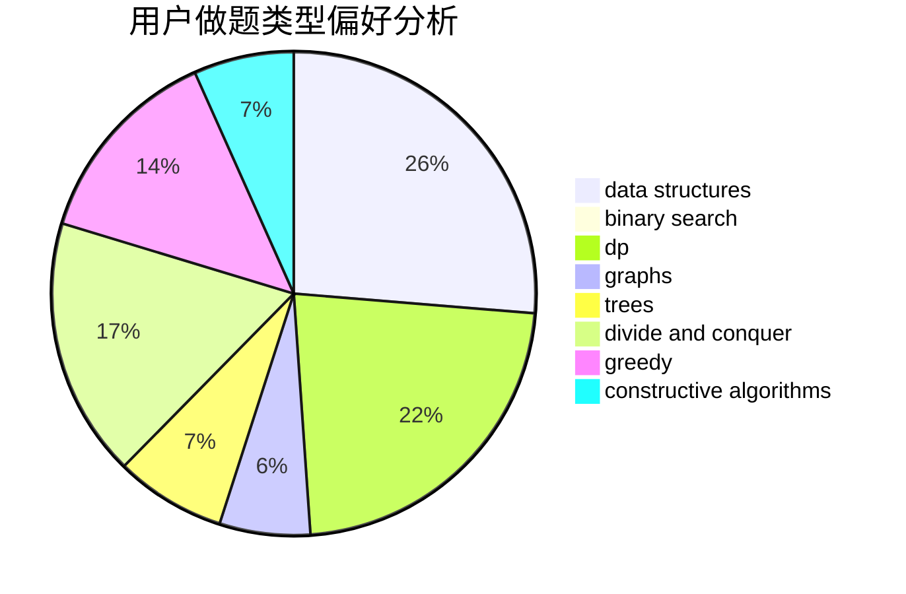

# KQFLMY
<!-- tabs:start -->
#### **用户提交结果分析**

#### **用户做题类型偏好分析**

#### **用户错题知识点分析**

<!-- tabs:end -->
# 推荐题目
[Maximums](http://codeforces.com/problemset/problem/1326/B)		implementation,
                        math		  
[Special Edges](http://codeforces.com/problemset/problem/1383/F)		flows,
                        graphs		  
[Yet Another Subarray Problem](http://codeforces.com/problemset/problem/1197/D)		dp,
                        greedy,
                        math		  
[Maximum Value](https://codeforces.com/contest/485/problem/D)		binary search,
                        math,
                        sortings,
                        two pointers		  
[Even Odds](http://codeforces.com/problemset/problem/318/A)		math		  
[Distance Matching](http://codeforces.com/problemset/problem/1396/E)		constructive algorithms,
                        dfs and similar,
                        trees		  
[Phone Talks](http://codeforces.com/problemset/problem/158/E)		*special problem,
                        dp,
                        sortings		  
[Margarite and the best present](http://codeforces.com/problemset/problem/1080/B)		math		  
[Game with Strings](http://codeforces.com/problemset/problem/354/B)		bitmasks,
                        dp,
                        games		  
[Happy Cactus](http://codeforces.com/problemset/problem/1268/E)		dp		  
<!-- tabs:start -->
#### **data structures**
[Generating Sets](http://codeforces.com/problemset/problem/722/D)		binary search,
                        data structures,
                        dfs and similar,
                        greedy,
                        strings,
                        trees		  
[Mystic Carvings](http://codeforces.com/problemset/problem/297/E)		data structures		  
[Store](http://codeforces.com/problemset/problem/1010/E)		data structures		  
[Danil and a Part-time Job](http://codeforces.com/problemset/problem/877/E)		bitmasks,
                        data structures,
                        trees		  
[Maximum width](http://codeforces.com/problemset/problem/1492/C)		binary search,
                        data structures,
                        dp,
                        greedy,
                        two pointers		  
[Old Floppy Drive](http://codeforces.com/problemset/problem/1490/G)		binary search,
                        data structures,
                        math		  
[Odd Mineral Resource](http://codeforces.com/problemset/problem/1479/D)		binary search,
                        bitmasks,
                        brute force,
                        data structures,
                        probabilities,
                        trees		  
[Meximization](http://codeforces.com/problemset/problem/1497/A)		brute force,
                        data structures,
                        greedy,
                        sortings		  
[Pekora and Trampoline](http://codeforces.com/problemset/problem/1491/C)		brute force,
                        data structures,
                        dp,
                        greedy,
                        implementation		  
[Card Deck](http://codeforces.com/problemset/problem/1492/B)		data structures,
                        greedy,
                        math		  
#### **binary search**
[Maximum Value](https://codeforces.com/contest/485/problem/D)		binary search,
                        math,
                        sortings,
                        two pointers		  
[Generating Sets](http://codeforces.com/problemset/problem/722/D)		binary search,
                        data structures,
                        dfs and similar,
                        greedy,
                        strings,
                        trees		  
[Résumé Review](http://codeforces.com/problemset/problem/1344/D)		binary search,
                        greedy,
                        math		  
[The Hidden Pair (Easy Version)](http://codeforces.com/problemset/problem/1370/F1)		binary search,
                        dfs and similar,
                        graphs,
                        interactive,
                        shortest paths,
                        trees		  
[Birthday](http://codeforces.com/problemset/problem/1131/C)		binary search,
                        greedy,
                        sortings		  
[Maximum width](http://codeforces.com/problemset/problem/1492/C)		binary search,
                        data structures,
                        dp,
                        greedy,
                        two pointers		  
[Pairs](http://codeforces.com/problemset/problem/1463/D)		binary search,
                        constructive algorithms,
                        greedy,
                        two pointers		  
[Old Floppy Drive](http://codeforces.com/problemset/problem/1490/G)		binary search,
                        data structures,
                        math		  
[Odd Mineral Resource](http://codeforces.com/problemset/problem/1479/D)		binary search,
                        bitmasks,
                        brute force,
                        data structures,
                        probabilities,
                        trees		  
[Complicated Computations](http://codeforces.com/problemset/problem/1436/E)		binary search,
                        data structures,
                        two pointers		  
#### **dp**
[Yet Another Subarray Problem](http://codeforces.com/problemset/problem/1197/D)		dp,
                        greedy,
                        math		  
[Phone Talks](http://codeforces.com/problemset/problem/158/E)		*special problem,
                        dp,
                        sortings		  
[Game with Strings](http://codeforces.com/problemset/problem/354/B)		bitmasks,
                        dp,
                        games		  
[Happy Cactus](http://codeforces.com/problemset/problem/1268/E)		dp		  
[Magic Gems](http://codeforces.com/problemset/problem/1117/D)		dp,
                        math,
                        matrices		  
[Masha and Cactus](http://codeforces.com/problemset/problem/856/D)		dp,
                        trees		  
[Simba on the Circle](http://codeforces.com/problemset/problem/612/F)		dp		  
[Castle](http://codeforces.com/problemset/problem/101/D)		dp,
                        greedy,
                        probabilities,
                        sortings,
                        trees		  
[Breaking Good](http://codeforces.com/problemset/problem/507/E)		dfs and similar,
                        dp,
                        graphs,
                        shortest paths		  
[Short Colorful Strip](http://codeforces.com/problemset/problem/1178/F1)		combinatorics,
                        dfs and similar,
                        dp		  
#### **graph**
[Special Edges](http://codeforces.com/problemset/problem/1383/F)		flows,
                        graphs		  
[Breaking Good](http://codeforces.com/problemset/problem/507/E)		dfs and similar,
                        dp,
                        graphs,
                        shortest paths		  
[The Hidden Pair (Easy Version)](http://codeforces.com/problemset/problem/1370/F1)		binary search,
                        dfs and similar,
                        graphs,
                        interactive,
                        shortest paths,
                        trees		  
[Minimum Ties](http://codeforces.com/problemset/problem/1487/C)		brute force,
                        constructive algorithms,
                        dfs and similar,
                        graphs,
                        greedy,
                        implementation,
                        math		  
[Chef Monocarp](http://codeforces.com/problemset/problem/1437/C)		dp,
                        flows,
                        graph matchings,
                        greedy,
                        math,
                        sortings		  
[Strange Housing](http://codeforces.com/problemset/problem/1470/D)		constructive algorithms,
                        dfs and similar,
                        graph matchings,
                        graphs,
                        greedy		  
[Longest Simple Cycle](http://codeforces.com/problemset/problem/1476/C)		dp,
                        graphs,
                        greedy		  
[Shortest and Longest LIS](http://codeforces.com/problemset/problem/1304/D)		constructive algorithms,
                        graphs,
                        greedy,
                        two pointers		  
[Ball in Berland](http://codeforces.com/problemset/problem/1475/C)		combinatorics,
                        graphs,
                        math		  
[Kyoya and Train](http://codeforces.com/problemset/problem/553/E)		dp,
                        fft,
                        graphs,
                        math,
                        probabilities		  
#### **trees**
[Distance Matching](http://codeforces.com/problemset/problem/1396/E)		constructive algorithms,
                        dfs and similar,
                        trees		  
[Generating Sets](http://codeforces.com/problemset/problem/722/D)		binary search,
                        data structures,
                        dfs and similar,
                        greedy,
                        strings,
                        trees		  
[Masha and Cactus](http://codeforces.com/problemset/problem/856/D)		dp,
                        trees		  
[Castle](http://codeforces.com/problemset/problem/101/D)		dp,
                        greedy,
                        probabilities,
                        sortings,
                        trees		  
[Edge Weight Assignment](https://codeforces.com/contest/1339/problem/D)		bitmasks,
                        constructive algorithms,
                        dfs and similar,
                        greedy,
                        math,
                        trees		  
[Road Projects](http://codeforces.com/problemset/problem/1016/F)		dfs and similar,
                        dp,
                        trees		  
[The Hidden Pair (Easy Version)](http://codeforces.com/problemset/problem/1370/F1)		binary search,
                        dfs and similar,
                        graphs,
                        interactive,
                        shortest paths,
                        trees		  
[Danil and a Part-time Job](http://codeforces.com/problemset/problem/877/E)		bitmasks,
                        data structures,
                        trees		  
[Tree-Tac-Toe](http://codeforces.com/problemset/problem/1110/G)		constructive algorithms,
                        games,
                        trees		  
[Odd Mineral Resource](http://codeforces.com/problemset/problem/1479/D)		binary search,
                        bitmasks,
                        brute force,
                        data structures,
                        probabilities,
                        trees		  
#### **divide and conquer**
[Find a car](https://codeforces.com/contest/810/problem/E)		combinatorics,
                        divide and conquer,
                        dp		  
[Song of the Sirens](http://codeforces.com/problemset/problem/1466/G)		combinatorics,
                        divide and conquer,
                        hashing,
                        math,
                        string suffix structures,
                        strings		  
[Perfect Triples](http://codeforces.com/problemset/problem/1338/C)		bitmasks,
                        brute force,
                        constructive algorithms,
                        divide and conquer,
                        math		  
[Divide and Summarize](http://codeforces.com/problemset/problem/1461/D)		binary search,
                        brute force,
                        data structures,
                        divide and conquer,
                        implementation,
                        sortings		  
[Permutation Transformation](http://codeforces.com/problemset/problem/1490/D)		dfs and similar,
                        divide and conquer,
                        implementation		  
[Skyline Photo](https://codeforces.com/contest/1483/problem/C)		data structures,
                        divide and conquer,
                        dp		  
[Fib-tree](http://codeforces.com/problemset/problem/1491/E)		brute force,
                        dfs and similar,
                        divide and conquer,
                        number theory,
                        trees		  
[Sum of Prefix Sums](http://codeforces.com/problemset/problem/1303/G)		data structures,
                        divide and conquer,
                        geometry,
                        trees		  
[Dogeforces](http://codeforces.com/problemset/problem/1494/D)		constructive algorithms,
                        data structures,
                        dfs and similar,
                        divide and conquer,
                        dsu,
                        greedy,
                        sortings,
                        trees		  
[Logistical Questions](http://codeforces.com/problemset/problem/566/C)		dfs and similar,
                        divide and conquer,
                        trees		  
#### **greedy**
[Yet Another Subarray Problem](http://codeforces.com/problemset/problem/1197/D)		dp,
                        greedy,
                        math		  
[Generating Sets](http://codeforces.com/problemset/problem/722/D)		binary search,
                        data structures,
                        dfs and similar,
                        greedy,
                        strings,
                        trees		  
[Castle](http://codeforces.com/problemset/problem/101/D)		dp,
                        greedy,
                        probabilities,
                        sortings,
                        trees		  
[Leha and Function](http://codeforces.com/problemset/problem/840/A)		combinatorics,
                        greedy,
                        math,
                        number theory,
                        sortings		  
[Duff and Meat](http://codeforces.com/problemset/problem/588/A)		greedy		  
[Appleman and Toastman](https://codeforces.com/contest/462/problem/C)		greedy,
                        sortings		  
[Sockets](http://codeforces.com/problemset/problem/732/E)		greedy,
                        sortings		  
[Edge Weight Assignment](https://codeforces.com/contest/1339/problem/D)		bitmasks,
                        constructive algorithms,
                        dfs and similar,
                        greedy,
                        math,
                        trees		  
[Résumé Review](http://codeforces.com/problemset/problem/1344/D)		binary search,
                        greedy,
                        math		  
[Anu Has a Function](https://codeforces.com/contest/1300/problem/C)		brute force,
                        greedy,
                        math		  
#### **constructive algorithms**
[Distance Matching](http://codeforces.com/problemset/problem/1396/E)		constructive algorithms,
                        dfs and similar,
                        trees		  
[Edge Weight Assignment](https://codeforces.com/contest/1339/problem/D)		bitmasks,
                        constructive algorithms,
                        dfs and similar,
                        greedy,
                        math,
                        trees		  
[Chris and Magic Square](http://codeforces.com/problemset/problem/711/B)		constructive algorithms,
                        implementation		  
[Increasing Sequence](http://codeforces.com/problemset/problem/11/A)		constructive algorithms,
                        implementation,
                        math		  
[Perfect Triples](http://codeforces.com/problemset/problem/1338/C)		bitmasks,
                        brute force,
                        constructive algorithms,
                        divide and conquer,
                        math		  
[Rectangular Polyline](http://codeforces.com/problemset/problem/1444/D)		constructive algorithms,
                        dp,
                        geometry		  
[Tree-Tac-Toe](http://codeforces.com/problemset/problem/1110/G)		constructive algorithms,
                        games,
                        trees		  
[Anti-knapsack](http://codeforces.com/problemset/problem/1493/A)		constructive algorithms,
                        greedy		  
[Pairs](http://codeforces.com/problemset/problem/1463/D)		binary search,
                        constructive algorithms,
                        greedy,
                        two pointers		  
[XOR-gun](https://codeforces.com/contest/1456/problem/B)		bitmasks,
                        brute force,
                        constructive algorithms		  
#### **sortings**
[Maximum Value](https://codeforces.com/contest/485/problem/D)		binary search,
                        math,
                        sortings,
                        two pointers		  
[Phone Talks](http://codeforces.com/problemset/problem/158/E)		*special problem,
                        dp,
                        sortings		  
[Castle](http://codeforces.com/problemset/problem/101/D)		dp,
                        greedy,
                        probabilities,
                        sortings,
                        trees		  
[Leha and Function](http://codeforces.com/problemset/problem/840/A)		combinatorics,
                        greedy,
                        math,
                        number theory,
                        sortings		  
[Appleman and Toastman](https://codeforces.com/contest/462/problem/C)		greedy,
                        sortings		  
[Sockets](http://codeforces.com/problemset/problem/732/E)		greedy,
                        sortings		  
[Olympiad](http://codeforces.com/problemset/problem/937/A)		implementation,
                        sortings		  
[Birthday](http://codeforces.com/problemset/problem/1131/C)		binary search,
                        greedy,
                        sortings		  
[Diamond Miner](https://codeforces.com/contest/1496/problem/C)		geometry,
                        greedy,
                        math,
                        sortings		  
[Meximization](http://codeforces.com/problemset/problem/1497/A)		brute force,
                        data structures,
                        greedy,
                        sortings		  
<!-- tabs:end -->
