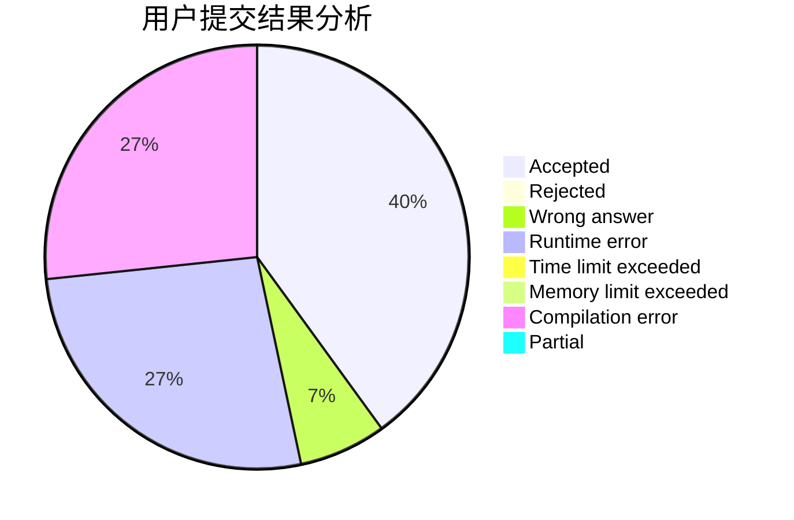
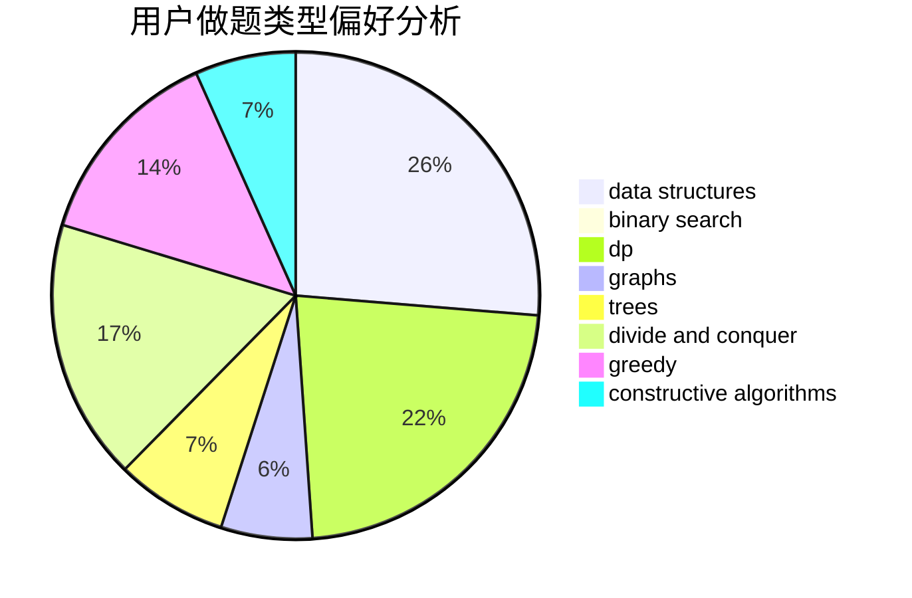

# KQFLMY
<!-- tabs:start -->
#### **用户提交结果分析**

#### **用户做题类型偏好分析**

#### **用户错题知识点分析**

<!-- tabs:end -->
# 推荐题目
[Maximums](http://codeforces.com/problemset/problem/1326/B)		implementation,
                        math		  
[Special Edges](http://codeforces.com/problemset/problem/1383/F)		flows,
                        graphs		  
[Yet Another Subarray Problem](http://codeforces.com/problemset/problem/1197/D)		dp,
                        greedy,
                        math		  
[Maximum Value](https://codeforces.com/contest/485/problem/D)		binary search,
                        math,
                        sortings,
                        two pointers		  
[Even Odds](http://codeforces.com/problemset/problem/318/A)		math		  
[Distance Matching](http://codeforces.com/problemset/problem/1396/E)		constructive algorithms,
                        dfs and similar,
                        trees		  
[Phone Talks](http://codeforces.com/problemset/problem/158/E)		*special problem,
                        dp,
                        sortings		  
[Margarite and the best present](http://codeforces.com/problemset/problem/1080/B)		math		  
[Game with Strings](http://codeforces.com/problemset/problem/354/B)		bitmasks,
                        dp,
                        games		  
[Happy Cactus](http://codeforces.com/problemset/problem/1268/E)		dp		  
<!-- tabs:start -->
#### **data structures**
[Maximums](http://codeforces.com/problemset/problem/722/D)		binary search,
                        data structures,
                        dfs and similar,
                        greedy,
                        strings,
                        trees		  
[Special Edges](http://codeforces.com/problemset/problem/297/E)		data structures		  
[Yet Another Subarray Problem](http://codeforces.com/problemset/problem/1010/E)		data structures		  
[Maximum Value](http://codeforces.com/problemset/problem/877/E)		bitmasks,
                        data structures,
                        trees		  
[Even Odds](http://codeforces.com/problemset/problem/1492/C)		binary search,
                        data structures,
                        dp,
                        greedy,
                        two pointers		  
[Distance Matching](http://codeforces.com/problemset/problem/1490/G)		binary search,
                        data structures,
                        math		  
[Phone Talks](http://codeforces.com/problemset/problem/1479/D)		binary search,
                        bitmasks,
                        brute force,
                        data structures,
                        probabilities,
                        trees		  
[Margarite and the best present](http://codeforces.com/problemset/problem/1497/A)		brute force,
                        data structures,
                        greedy,
                        sortings		  
[Game with Strings](http://codeforces.com/problemset/problem/1491/C)		brute force,
                        data structures,
                        dp,
                        greedy,
                        implementation		  
[Happy Cactus](http://codeforces.com/problemset/problem/1492/B)		data structures,
                        greedy,
                        math		  
#### **binary search**
[Maximums](https://codeforces.com/contest/485/problem/D)		binary search,
                        math,
                        sortings,
                        two pointers		  
[Special Edges](http://codeforces.com/problemset/problem/722/D)		binary search,
                        data structures,
                        dfs and similar,
                        greedy,
                        strings,
                        trees		  
[Yet Another Subarray Problem](http://codeforces.com/problemset/problem/1344/D)		binary search,
                        greedy,
                        math		  
[Maximum Value](http://codeforces.com/problemset/problem/1370/F1)		binary search,
                        dfs and similar,
                        graphs,
                        interactive,
                        shortest paths,
                        trees		  
[Even Odds](http://codeforces.com/problemset/problem/1131/C)		binary search,
                        greedy,
                        sortings		  
[Distance Matching](http://codeforces.com/problemset/problem/1492/C)		binary search,
                        data structures,
                        dp,
                        greedy,
                        two pointers		  
[Phone Talks](http://codeforces.com/problemset/problem/1463/D)		binary search,
                        constructive algorithms,
                        greedy,
                        two pointers		  
[Margarite and the best present](http://codeforces.com/problemset/problem/1490/G)		binary search,
                        data structures,
                        math		  
[Game with Strings](http://codeforces.com/problemset/problem/1479/D)		binary search,
                        bitmasks,
                        brute force,
                        data structures,
                        probabilities,
                        trees		  
[Happy Cactus](http://codeforces.com/problemset/problem/1436/E)		binary search,
                        data structures,
                        two pointers		  
#### **dp**
[Maximums](http://codeforces.com/problemset/problem/1197/D)		dp,
                        greedy,
                        math		  
[Special Edges](http://codeforces.com/problemset/problem/158/E)		*special problem,
                        dp,
                        sortings		  
[Yet Another Subarray Problem](http://codeforces.com/problemset/problem/354/B)		bitmasks,
                        dp,
                        games		  
[Maximum Value](http://codeforces.com/problemset/problem/1268/E)		dp		  
[Even Odds](http://codeforces.com/problemset/problem/1117/D)		dp,
                        math,
                        matrices		  
[Distance Matching](http://codeforces.com/problemset/problem/856/D)		dp,
                        trees		  
[Phone Talks](http://codeforces.com/problemset/problem/612/F)		dp		  
[Margarite and the best present](http://codeforces.com/problemset/problem/101/D)		dp,
                        greedy,
                        probabilities,
                        sortings,
                        trees		  
[Game with Strings](http://codeforces.com/problemset/problem/507/E)		dfs and similar,
                        dp,
                        graphs,
                        shortest paths		  
[Happy Cactus](http://codeforces.com/problemset/problem/1178/F1)		combinatorics,
                        dfs and similar,
                        dp		  
#### **graph**
[Maximums](http://codeforces.com/problemset/problem/1383/F)		flows,
                        graphs		  
[Special Edges](http://codeforces.com/problemset/problem/507/E)		dfs and similar,
                        dp,
                        graphs,
                        shortest paths		  
[Yet Another Subarray Problem](http://codeforces.com/problemset/problem/1370/F1)		binary search,
                        dfs and similar,
                        graphs,
                        interactive,
                        shortest paths,
                        trees		  
[Maximum Value](http://codeforces.com/problemset/problem/1487/C)		brute force,
                        constructive algorithms,
                        dfs and similar,
                        graphs,
                        greedy,
                        implementation,
                        math		  
[Even Odds](http://codeforces.com/problemset/problem/1437/C)		dp,
                        flows,
                        graph matchings,
                        greedy,
                        math,
                        sortings		  
[Distance Matching](http://codeforces.com/problemset/problem/1470/D)		constructive algorithms,
                        dfs and similar,
                        graph matchings,
                        graphs,
                        greedy		  
[Phone Talks](http://codeforces.com/problemset/problem/1476/C)		dp,
                        graphs,
                        greedy		  
[Margarite and the best present](http://codeforces.com/problemset/problem/1304/D)		constructive algorithms,
                        graphs,
                        greedy,
                        two pointers		  
[Game with Strings](http://codeforces.com/problemset/problem/1475/C)		combinatorics,
                        graphs,
                        math		  
[Happy Cactus](http://codeforces.com/problemset/problem/553/E)		dp,
                        fft,
                        graphs,
                        math,
                        probabilities		  
#### **trees**
[Maximums](http://codeforces.com/problemset/problem/1396/E)		constructive algorithms,
                        dfs and similar,
                        trees		  
[Special Edges](http://codeforces.com/problemset/problem/722/D)		binary search,
                        data structures,
                        dfs and similar,
                        greedy,
                        strings,
                        trees		  
[Yet Another Subarray Problem](http://codeforces.com/problemset/problem/856/D)		dp,
                        trees		  
[Maximum Value](http://codeforces.com/problemset/problem/101/D)		dp,
                        greedy,
                        probabilities,
                        sortings,
                        trees		  
[Even Odds](https://codeforces.com/contest/1339/problem/D)		bitmasks,
                        constructive algorithms,
                        dfs and similar,
                        greedy,
                        math,
                        trees		  
[Distance Matching](http://codeforces.com/problemset/problem/1016/F)		dfs and similar,
                        dp,
                        trees		  
[Phone Talks](http://codeforces.com/problemset/problem/1370/F1)		binary search,
                        dfs and similar,
                        graphs,
                        interactive,
                        shortest paths,
                        trees		  
[Margarite and the best present](http://codeforces.com/problemset/problem/877/E)		bitmasks,
                        data structures,
                        trees		  
[Game with Strings](http://codeforces.com/problemset/problem/1110/G)		constructive algorithms,
                        games,
                        trees		  
[Happy Cactus](http://codeforces.com/problemset/problem/1479/D)		binary search,
                        bitmasks,
                        brute force,
                        data structures,
                        probabilities,
                        trees		  
#### **divide and conquer**
[Maximums](https://codeforces.com/contest/810/problem/E)		combinatorics,
                        divide and conquer,
                        dp		  
[Special Edges](http://codeforces.com/problemset/problem/1466/G)		combinatorics,
                        divide and conquer,
                        hashing,
                        math,
                        string suffix structures,
                        strings		  
[Yet Another Subarray Problem](http://codeforces.com/problemset/problem/1338/C)		bitmasks,
                        brute force,
                        constructive algorithms,
                        divide and conquer,
                        math		  
[Maximum Value](http://codeforces.com/problemset/problem/1461/D)		binary search,
                        brute force,
                        data structures,
                        divide and conquer,
                        implementation,
                        sortings		  
[Even Odds](http://codeforces.com/problemset/problem/1466/G)		combinatorics,
                        divide and conquer,
                        hashing,
                        math,
                        string suffix structures,
                        strings		  
[Distance Matching](http://codeforces.com/problemset/problem/1490/D)		dfs and similar,
                        divide and conquer,
                        implementation		  
[Phone Talks](https://codeforces.com/contest/1483/problem/C)		data structures,
                        divide and conquer,
                        dp		  
[Margarite and the best present](http://codeforces.com/problemset/problem/1491/E)		brute force,
                        dfs and similar,
                        divide and conquer,
                        number theory,
                        trees		  
[Game with Strings](http://codeforces.com/problemset/problem/1303/G)		data structures,
                        divide and conquer,
                        geometry,
                        trees		  
[Happy Cactus](http://codeforces.com/problemset/problem/1494/D)		constructive algorithms,
                        data structures,
                        dfs and similar,
                        divide and conquer,
                        dsu,
                        greedy,
                        sortings,
                        trees		  
#### **greedy**
[Maximums](http://codeforces.com/problemset/problem/1197/D)		dp,
                        greedy,
                        math		  
[Special Edges](http://codeforces.com/problemset/problem/722/D)		binary search,
                        data structures,
                        dfs and similar,
                        greedy,
                        strings,
                        trees		  
[Yet Another Subarray Problem](http://codeforces.com/problemset/problem/101/D)		dp,
                        greedy,
                        probabilities,
                        sortings,
                        trees		  
[Maximum Value](http://codeforces.com/problemset/problem/840/A)		combinatorics,
                        greedy,
                        math,
                        number theory,
                        sortings		  
[Even Odds](http://codeforces.com/problemset/problem/588/A)		greedy		  
[Distance Matching](https://codeforces.com/contest/462/problem/C)		greedy,
                        sortings		  
[Phone Talks](http://codeforces.com/problemset/problem/732/E)		greedy,
                        sortings		  
[Margarite and the best present](https://codeforces.com/contest/1339/problem/D)		bitmasks,
                        constructive algorithms,
                        dfs and similar,
                        greedy,
                        math,
                        trees		  
[Game with Strings](http://codeforces.com/problemset/problem/1344/D)		binary search,
                        greedy,
                        math		  
[Happy Cactus](https://codeforces.com/contest/1300/problem/C)		brute force,
                        greedy,
                        math		  
#### **constructive algorithms**
[Maximums](http://codeforces.com/problemset/problem/1396/E)		constructive algorithms,
                        dfs and similar,
                        trees		  
[Special Edges](https://codeforces.com/contest/1339/problem/D)		bitmasks,
                        constructive algorithms,
                        dfs and similar,
                        greedy,
                        math,
                        trees		  
[Yet Another Subarray Problem](http://codeforces.com/problemset/problem/711/B)		constructive algorithms,
                        implementation		  
[Maximum Value](http://codeforces.com/problemset/problem/11/A)		constructive algorithms,
                        implementation,
                        math		  
[Even Odds](http://codeforces.com/problemset/problem/1338/C)		bitmasks,
                        brute force,
                        constructive algorithms,
                        divide and conquer,
                        math		  
[Distance Matching](http://codeforces.com/problemset/problem/1444/D)		constructive algorithms,
                        dp,
                        geometry		  
[Phone Talks](http://codeforces.com/problemset/problem/1110/G)		constructive algorithms,
                        games,
                        trees		  
[Margarite and the best present](http://codeforces.com/problemset/problem/1493/A)		constructive algorithms,
                        greedy		  
[Game with Strings](http://codeforces.com/problemset/problem/1463/D)		binary search,
                        constructive algorithms,
                        greedy,
                        two pointers		  
[Happy Cactus](https://codeforces.com/contest/1456/problem/B)		bitmasks,
                        brute force,
                        constructive algorithms		  
#### **sortings**
[Maximums](https://codeforces.com/contest/485/problem/D)		binary search,
                        math,
                        sortings,
                        two pointers		  
[Special Edges](http://codeforces.com/problemset/problem/158/E)		*special problem,
                        dp,
                        sortings		  
[Yet Another Subarray Problem](http://codeforces.com/problemset/problem/101/D)		dp,
                        greedy,
                        probabilities,
                        sortings,
                        trees		  
[Maximum Value](http://codeforces.com/problemset/problem/840/A)		combinatorics,
                        greedy,
                        math,
                        number theory,
                        sortings		  
[Even Odds](https://codeforces.com/contest/462/problem/C)		greedy,
                        sortings		  
[Distance Matching](http://codeforces.com/problemset/problem/732/E)		greedy,
                        sortings		  
[Phone Talks](http://codeforces.com/problemset/problem/937/A)		implementation,
                        sortings		  
[Margarite and the best present](http://codeforces.com/problemset/problem/1131/C)		binary search,
                        greedy,
                        sortings		  
[Game with Strings](https://codeforces.com/contest/1496/problem/C)		geometry,
                        greedy,
                        math,
                        sortings		  
[Happy Cactus](http://codeforces.com/problemset/problem/1495/A)		geometry,
                        greedy,
                        math,
                        sortings		  
<!-- tabs:end -->
