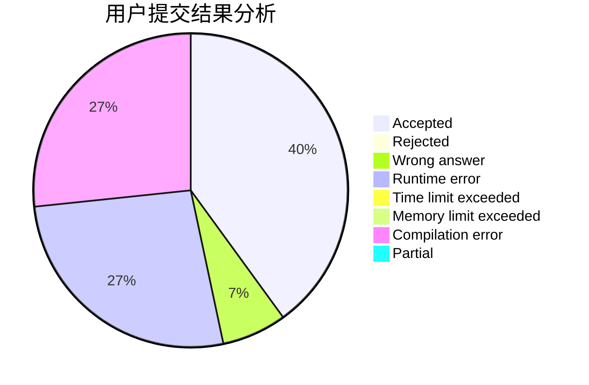
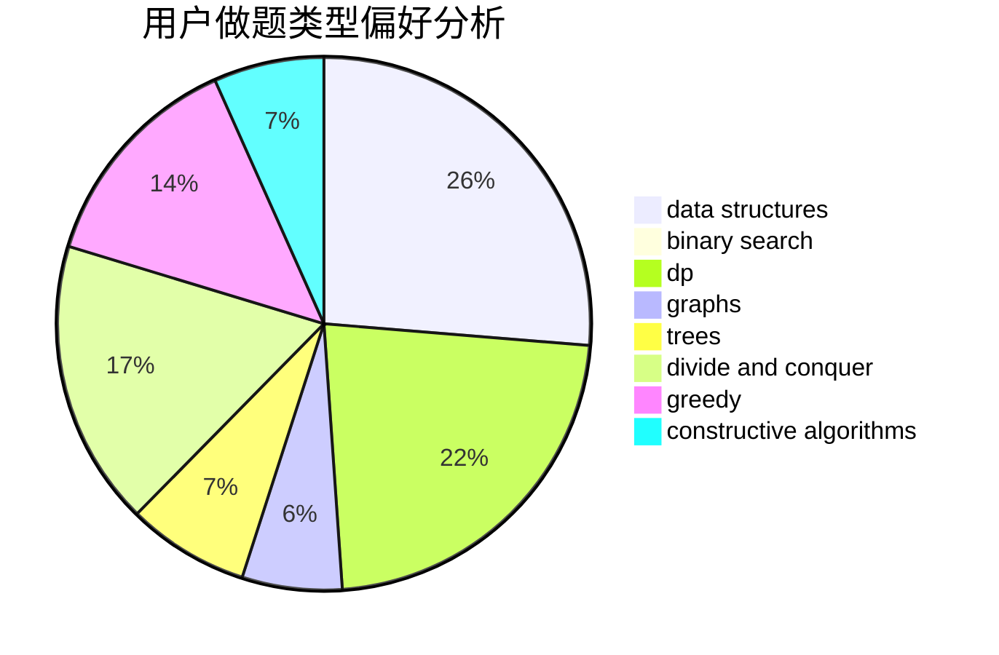

# KQFLMY

<!-- tabs:start -->

#### **用户提交结果分析**

#### **用户做题类型偏好分析**

#### **用户错题知识点分析**

<!-- tabs:end -->
# 推荐题目
[1383F](https://codeforces.com/contest/1383/problem/F)		flows,
                        graphs		  
[1444D](https://codeforces.com/contest/1444/problem/D)		constructive algorithms,
                        dp,
                        geometry		  
[1396E](https://codeforces.com/contest/1396/problem/E)		constructive algorithms,
                        dfs and similar,
                        trees		  
[485D](https://codeforces.com/contest/485/problem/D)		dsu,graphs,sortings,trees		  
[318A](https://codeforces.com/contest/318/problem/A)		math		  
[101D](https://codeforces.com/contest/101/problem/D)		dp,
                        greedy,
                        probabilities,
                        sortings,
                        trees		  
[1164F](https://codeforces.com/contest/1164/problem/F)		dsu,graphs,sortings,trees		  
[1080B](https://codeforces.com/contest/1080/problem/B)		math		  
[840A](https://codeforces.com/contest/840/problem/A)		combinatorics,
                        greedy,
                        math,
                        number theory,
                        sortings		  
[507E](https://codeforces.com/contest/507/problem/E)		dfs and similar,
                        dp,
                        graphs,
                        shortest paths		  
