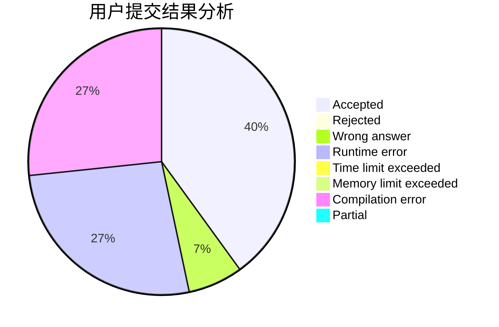
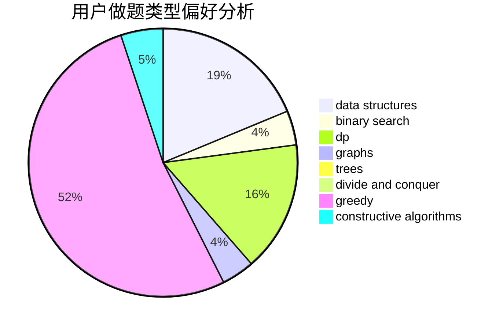

# KQFLMY

<!-- tabs:start -->

#### **用户提交结果分析**

#### **用户做题类型偏好分析**

#### **用户错题知识点分析**

<!-- tabs:end -->
# 推荐题目
[1393C](https://codeforces.com/contest/1393/problem/C)		constructive algorithms,
                        greedy,
                        math,
                        sortings		  
[1454B](https://codeforces.com/contest/1454/problem/B)		implementation		  
[1405D](https://codeforces.com/contest/1405/problem/D)		dsu,graphs,sortings,trees		  
[506C](https://codeforces.com/contest/506/problem/C)		dsu,graphs,sortings,trees		  
[348B](https://codeforces.com/contest/348/problem/B)		dfs and similar,
                        number theory,
                        trees		  
[1020C](https://codeforces.com/contest/1020/problem/C)		dsu,graphs,sortings,trees		  
[1165C](https://codeforces.com/contest/1165/problem/C)		greedy		  
[1080E](https://codeforces.com/contest/1080/problem/E)		strings		  
[859E](https://codeforces.com/contest/859/problem/E)		combinatorics,
                        dfs and similar,
                        dsu,
                        graphs,
                        trees		  
[527E](https://codeforces.com/contest/527/problem/E)		dfs and similar,
                        graphs		  
