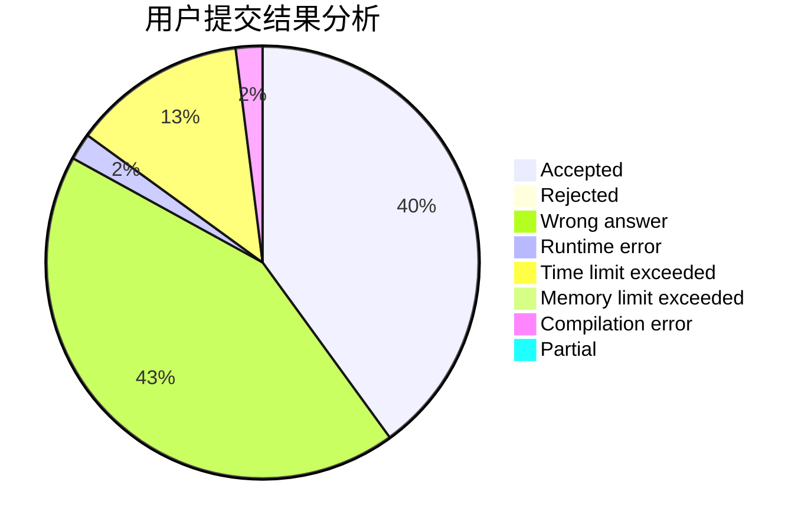
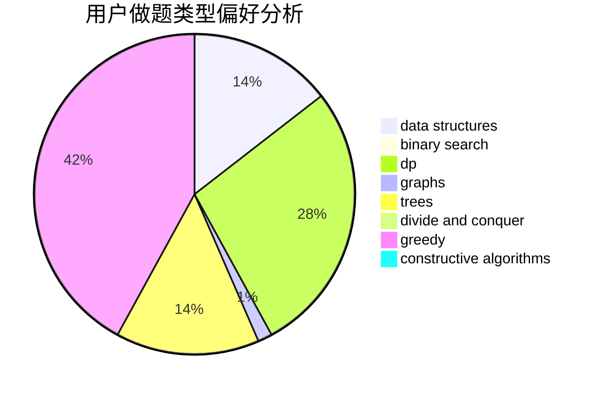
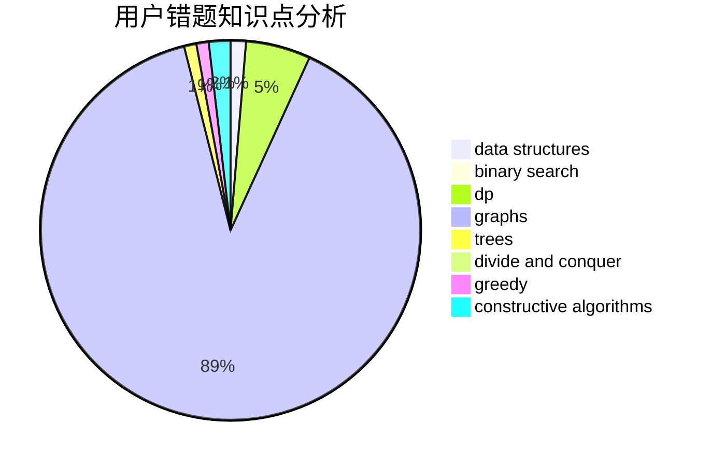

# K_T_O

<!-- tabs:start -->

#### **用户提交结果分析**

#### **用户做题类型偏好分析**

#### **用户错题知识点分析**

<!-- tabs:end -->
# 推荐题目
[1220B](https://codeforces.com/contest/1220/problem/B)		math,
                        number theory		  
[776A](https://codeforces.com/contest/776/problem/A)		brute force,
                        implementation,
                        strings		  
[1404A](https://codeforces.com/contest/1404/problem/A)		implementation,
                        strings		  
[1237G](https://codeforces.com/contest/1237/problem/G)		data structures,
                        dp,
                        greedy		  
[587C](https://codeforces.com/contest/587/problem/C)		data structures,
                        trees		  
[784B](https://codeforces.com/contest/784/problem/B)		*special problem		  
[453B](https://codeforces.com/contest/453/problem/B)		bitmasks,
                        brute force,
                        dp		  
[1186D](https://codeforces.com/contest/1186/problem/D)		constructive algorithms,
                        greedy,
                        math		  
[295D](https://codeforces.com/contest/295/problem/D)		combinatorics,
                        dp		  
[1278D](https://codeforces.com/contest/1278/problem/D)		data structures,
                        dsu,
                        graphs,
                        trees		  
