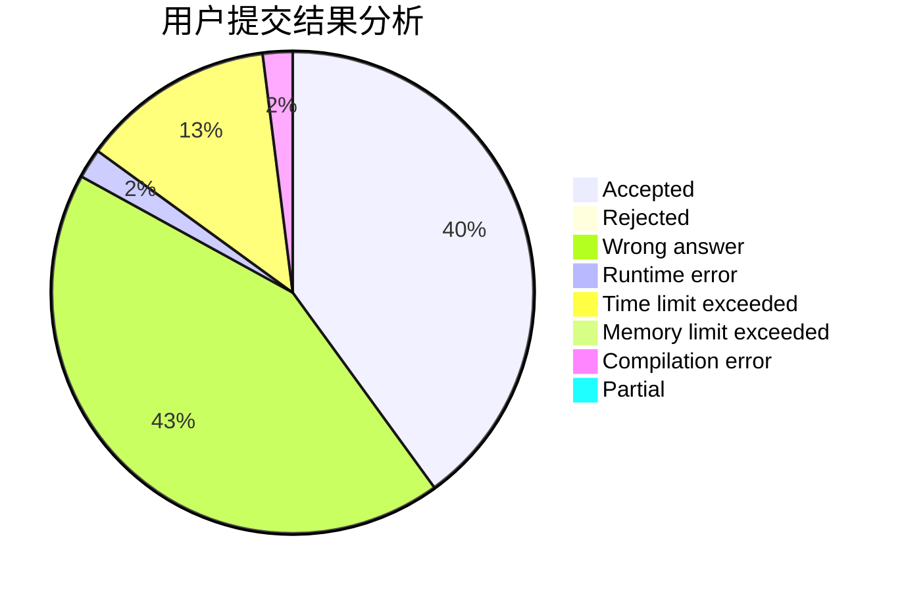
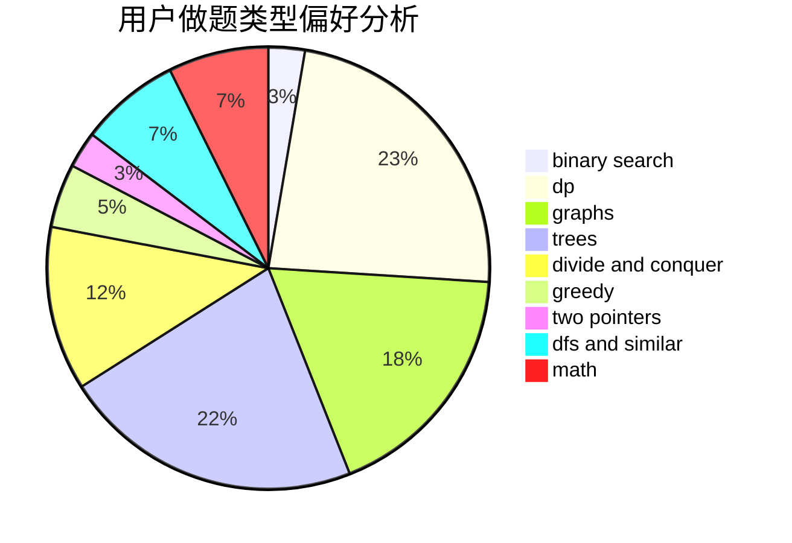

# K_T_O

<!-- tabs:start -->

#### **用户提交结果分析**

#### **用户做题类型偏好分析**

<!-- tabs:end -->
# 推荐题目
[1228B](https://codeforces.com/contest/1228/problem/B)
[793G](https://codeforces.com/contest/793/problem/G)
[1415C](https://codeforces.com/contest/1415/problem/C)
[1242E](https://codeforces.com/contest/1242/problem/E)
[607D](https://codeforces.com/contest/607/problem/D)
[801B](https://codeforces.com/contest/801/problem/B)
[475A](https://codeforces.com/contest/475/problem/A)
[1190A](https://codeforces.com/contest/1190/problem/A)
[312B](https://codeforces.com/contest/312/problem/B)
[1284F](https://codeforces.com/contest/1284/problem/F)
