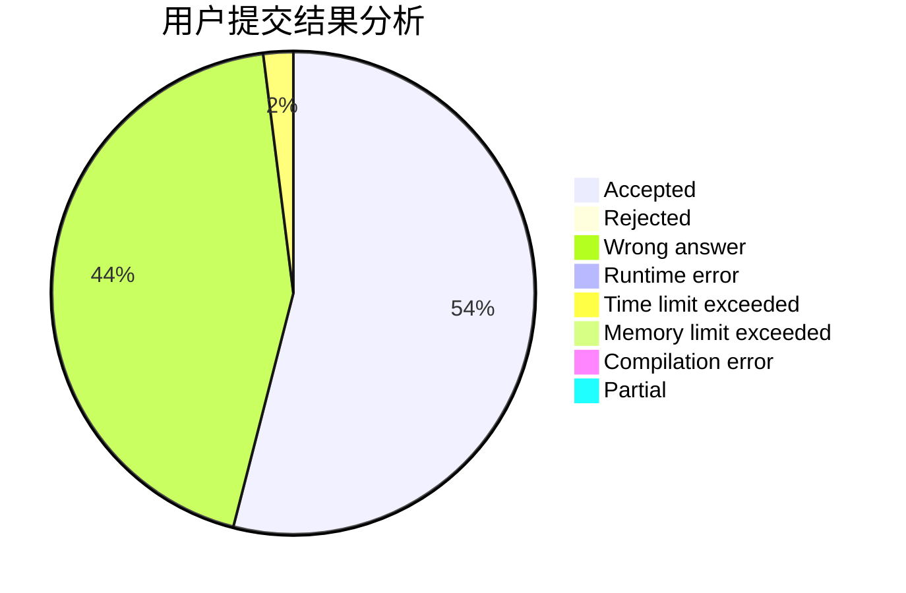
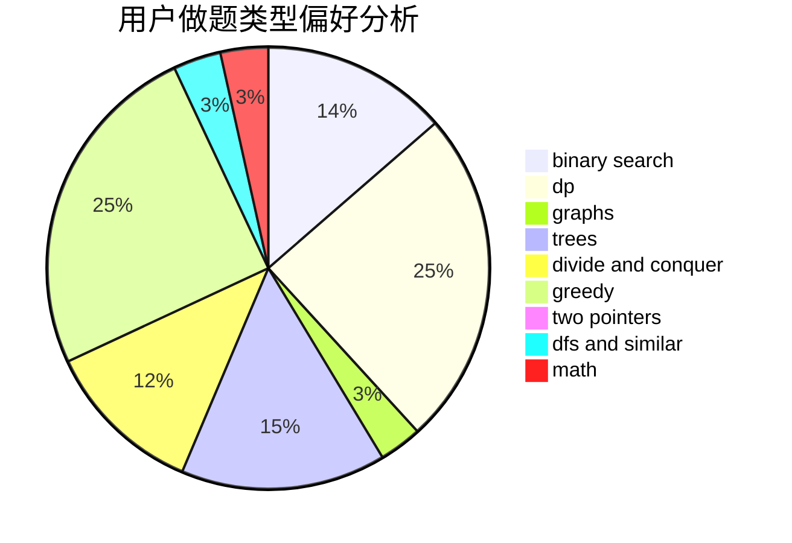

# KagamineRin

<!-- tabs:start -->

#### **用户提交结果分析**

#### **用户做题类型偏好分析**

<!-- tabs:end -->
# 推荐题目
[579A](https://codeforces.com/contest/579/problem/A)
[219D](https://codeforces.com/contest/219/problem/D)
[1033F](https://codeforces.com/contest/1033/problem/F)
[26D](https://codeforces.com/contest/26/problem/D)
[215C](https://codeforces.com/contest/215/problem/C)
[845D](https://codeforces.com/contest/845/problem/D)
[557B](https://codeforces.com/contest/557/problem/B)
[13782](https://codeforces.com/contest/1378/problem/2)
[1165C](https://codeforces.com/contest/1165/problem/C)
[357B](https://codeforces.com/contest/357/problem/B)
