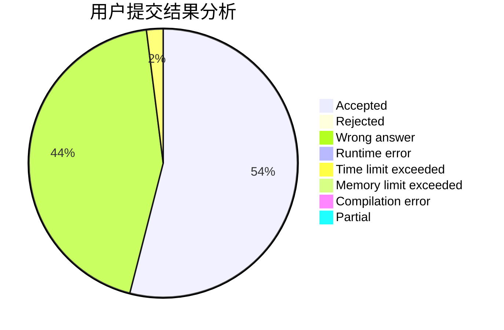
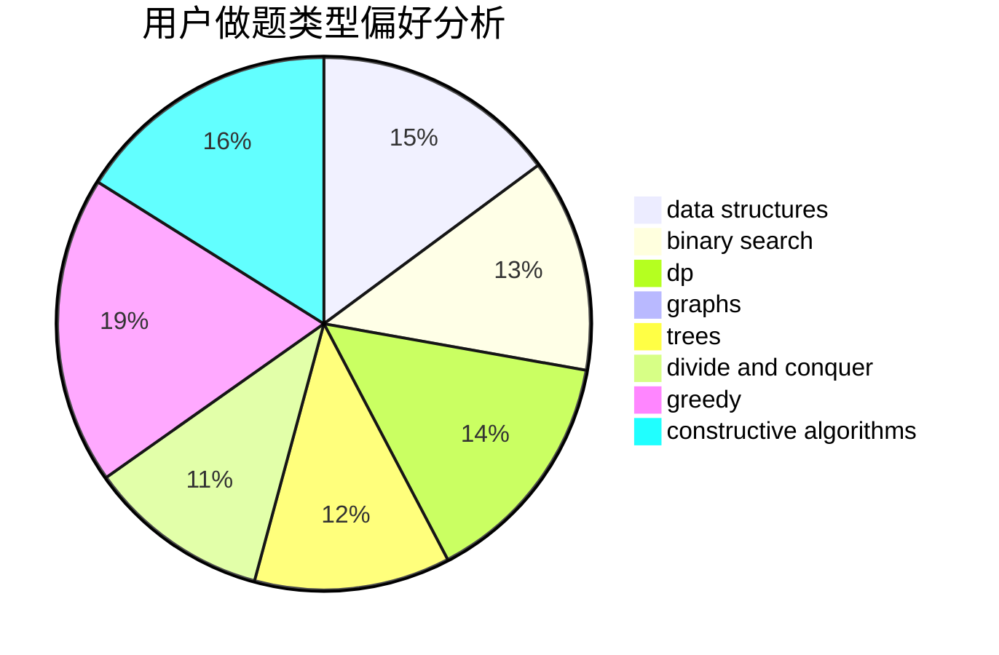
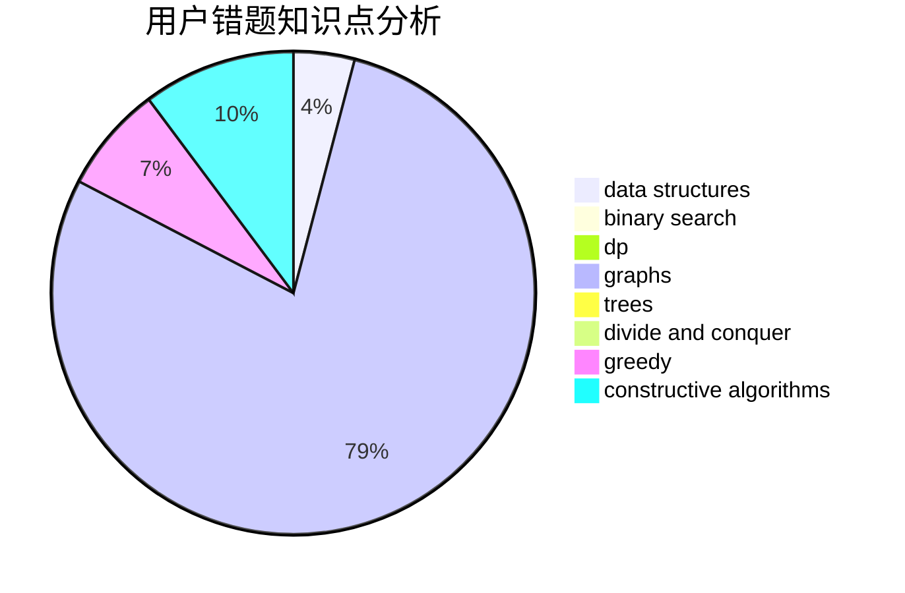

# KagamineRin

<!-- tabs:start -->

#### **用户提交结果分析**

#### **用户做题类型偏好分析**

#### **用户错题知识点分析**

<!-- tabs:end -->
# 推荐题目
[579A](https://codeforces.com/contest/579/problem/A)		bitmasks		  
[219D](https://codeforces.com/contest/219/problem/D)		dfs and similar,
                        dp,
                        graphs,
                        trees		  
[1033F](https://codeforces.com/contest/1033/problem/F)		bitmasks,
                        brute force,
                        fft,
                        math		  
[26D](https://codeforces.com/contest/26/problem/D)		combinatorics,
                        math,
                        probabilities		  
[215C](https://codeforces.com/contest/215/problem/C)		brute force,
                        implementation		  
[845D](https://codeforces.com/contest/845/problem/D)		data structures,
                        dp,
                        greedy		  
[557B](https://codeforces.com/contest/557/problem/B)		constructive algorithms,
                        implementation,
                        math,
                        sortings		  
[13782](https://codeforces.com/contest/1378/problem/2)		dsu,graphs,sortings,trees		  
[1165C](https://codeforces.com/contest/1165/problem/C)		greedy		  
[357B](https://codeforces.com/contest/357/problem/B)		constructive algorithms,
                        implementation		  
