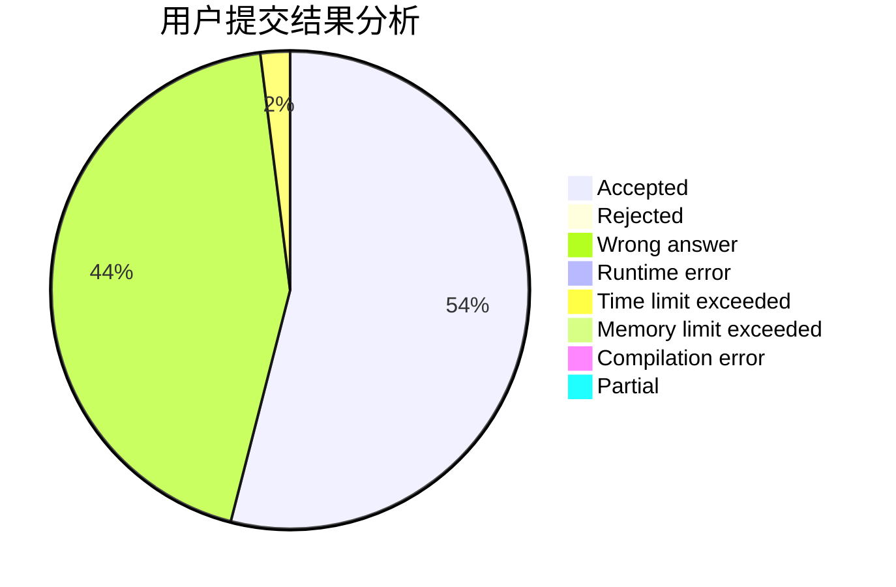
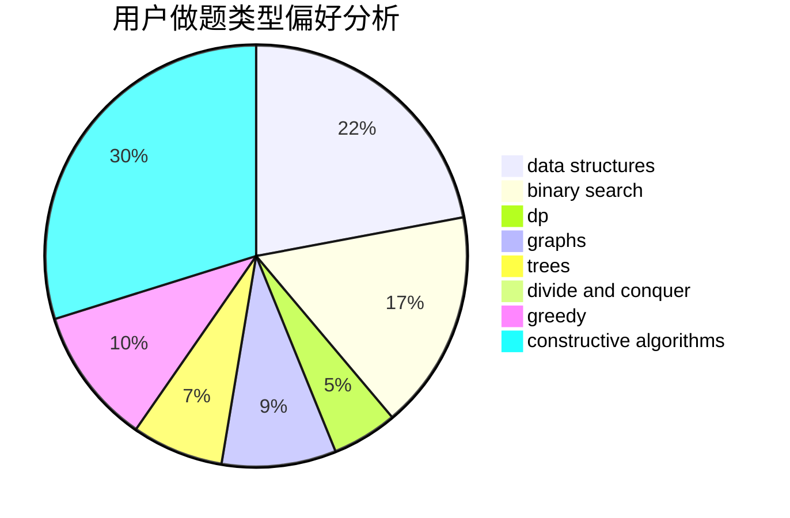
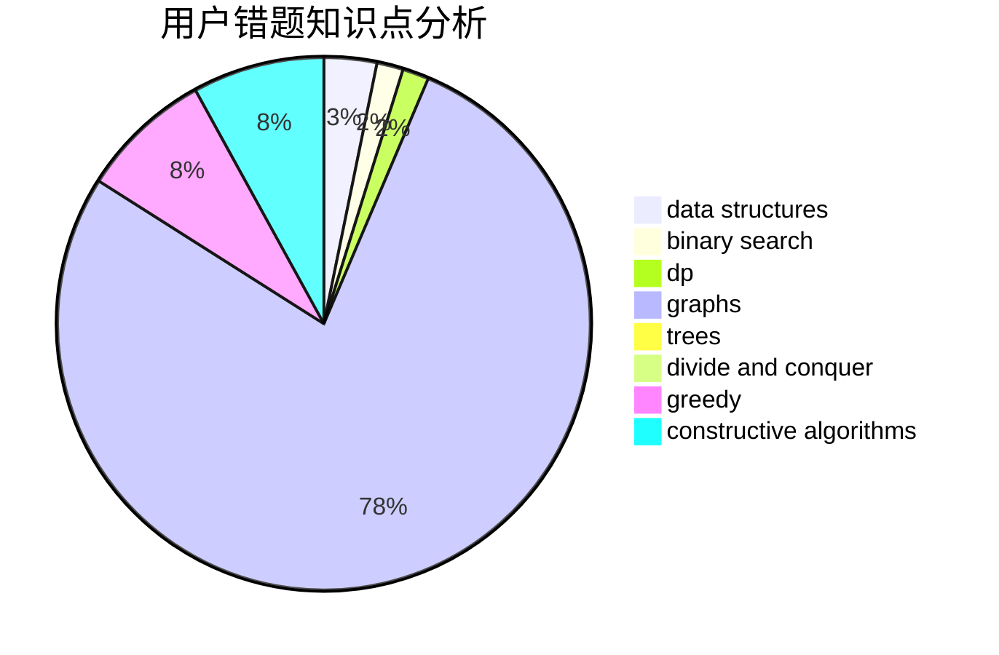

# KagamineRin
<!-- tabs:start -->
#### **用户提交结果分析**

#### **用户做题类型偏好分析**

#### **用户错题知识点分析**

<!-- tabs:end -->
# 推荐题目
[Kyoya and Train](http://codeforces.com/problemset/problem/553/E)		dp,
                        fft,
                        graphs,
                        math,
                        probabilities		  
[Boys and Girls](http://codeforces.com/problemset/problem/253/A)		greedy		  
[Identify the Operations](http://codeforces.com/problemset/problem/1442/B)		combinatorics,
                        data structures,
                        dsu,
                        greedy,
                        implementation		  
[Regular Polygon (1 point)](https://codeforces.com/contest/1164/problem/F)		nan		  
[Simplified Nonogram](http://codeforces.com/problemset/problem/534/F)		bitmasks,
                        dp,
                        hashing,
                        meet-in-the-middle		  
[Keyboard Layouts](http://codeforces.com/problemset/problem/831/B)		implementation,
                        strings		  
[Vicious Keyboard](http://codeforces.com/problemset/problem/801/A)		brute force		  
[Rectangle and Square](https://codeforces.com/contest/136/problem/D)		brute force,
                        geometry,
                        math		  
[Permutation Game](http://codeforces.com/problemset/problem/1033/C)		brute force,
                        dp,
                        games		  
[Beauty Pageant](http://codeforces.com/problemset/problem/246/C)		brute force,
                        constructive algorithms,
                        greedy		  
<!-- tabs:start -->
#### **data structures**
[Kyoya and Train](http://codeforces.com/problemset/problem/1442/B)		combinatorics,
                        data structures,
                        dsu,
                        greedy,
                        implementation		  
[Boys and Girls](http://codeforces.com/problemset/problem/15/D)		data structures,
                        implementation,
                        sortings		  
[Identify the Operations](http://codeforces.com/problemset/problem/1332/G)		data structures		  
[Regular Polygon (1 point)](http://codeforces.com/problemset/problem/555/B)		data structures,
                        greedy,
                        sortings		  
[Simplified Nonogram](http://codeforces.com/problemset/problem/827/A)		data structures,
                        greedy,
                        sortings,
                        strings		  
[Keyboard Layouts](http://codeforces.com/problemset/problem/1190/D)		data structures,
                        divide and conquer,
                        sortings,
                        two pointers		  
[Vicious Keyboard](http://codeforces.com/problemset/problem/1257/E)		data structures,
                        dp,
                        greedy		  
[Rectangle and Square](http://codeforces.com/problemset/problem/1492/C)		binary search,
                        data structures,
                        dp,
                        greedy,
                        two pointers		  
[Permutation Game](http://codeforces.com/problemset/problem/1490/G)		binary search,
                        data structures,
                        math		  
[Beauty Pageant](http://codeforces.com/problemset/problem/1479/D)		binary search,
                        bitmasks,
                        brute force,
                        data structures,
                        probabilities,
                        trees		  
#### **binary search**
[Kyoya and Train](http://codeforces.com/problemset/problem/1119/B)		binary search,
                        flows,
                        greedy,
                        sortings		  
[Boys and Girls](http://codeforces.com/problemset/problem/702/C)		binary search,
                        implementation,
                        two pointers		  
[Identify the Operations](http://codeforces.com/problemset/problem/551/C)		binary search,
                        greedy		  
[Regular Polygon (1 point)](http://codeforces.com/problemset/problem/1066/D)		binary search,
                        implementation		  
[Simplified Nonogram](http://codeforces.com/problemset/problem/889/E)		binary search,
                        dp,
                        math		  
[Keyboard Layouts](http://codeforces.com/problemset/problem/1492/C)		binary search,
                        data structures,
                        dp,
                        greedy,
                        two pointers		  
[Vicious Keyboard](http://codeforces.com/problemset/problem/1463/D)		binary search,
                        constructive algorithms,
                        greedy,
                        two pointers		  
[Rectangle and Square](http://codeforces.com/problemset/problem/1490/G)		binary search,
                        data structures,
                        math		  
[Permutation Game](http://codeforces.com/problemset/problem/1479/D)		binary search,
                        bitmasks,
                        brute force,
                        data structures,
                        probabilities,
                        trees		  
[Beauty Pageant](http://codeforces.com/problemset/problem/1436/E)		binary search,
                        data structures,
                        two pointers		  
#### **dp**
[Kyoya and Train](http://codeforces.com/problemset/problem/553/E)		dp,
                        fft,
                        graphs,
                        math,
                        probabilities		  
[Boys and Girls](http://codeforces.com/problemset/problem/534/F)		bitmasks,
                        dp,
                        hashing,
                        meet-in-the-middle		  
[Identify the Operations](http://codeforces.com/problemset/problem/1033/C)		brute force,
                        dp,
                        games		  
[Regular Polygon (1 point)](http://codeforces.com/problemset/problem/18/E)		dp		  
[Simplified Nonogram](http://codeforces.com/problemset/problem/650/C)		dfs and similar,
                        dp,
                        dsu,
                        graphs,
                        greedy		  
[Keyboard Layouts](http://codeforces.com/problemset/problem/910/A)		dfs and similar,
                        dp,
                        greedy,
                        implementation		  
[Vicious Keyboard](http://codeforces.com/problemset/problem/1081/C)		combinatorics,
                        dp,
                        math		  
[Rectangle and Square](http://codeforces.com/problemset/problem/1208/F)		bitmasks,
                        dfs and similar,
                        dp,
                        greedy		  
[Permutation Game](https://codeforces.com/contest/1150/problem/D)		dp,
                        implementation,
                        strings		  
[Beauty Pageant](http://codeforces.com/problemset/problem/889/E)		binary search,
                        dp,
                        math		  
#### **graph**
[Kyoya and Train](http://codeforces.com/problemset/problem/553/E)		dp,
                        fft,
                        graphs,
                        math,
                        probabilities		  
[Boys and Girls](http://codeforces.com/problemset/problem/1340/E)		graphs,
                        interactive,
                        probabilities		  
[Identify the Operations](http://codeforces.com/problemset/problem/650/C)		dfs and similar,
                        dp,
                        dsu,
                        graphs,
                        greedy		  
[Regular Polygon (1 point)](http://codeforces.com/problemset/problem/732/F)		dfs and similar,
                        graphs		  
[Simplified Nonogram](http://codeforces.com/problemset/problem/1487/C)		brute force,
                        constructive algorithms,
                        dfs and similar,
                        graphs,
                        greedy,
                        implementation,
                        math		  
[Keyboard Layouts](http://codeforces.com/problemset/problem/1437/C)		dp,
                        flows,
                        graph matchings,
                        greedy,
                        math,
                        sortings		  
[Vicious Keyboard](http://codeforces.com/problemset/problem/1470/D)		constructive algorithms,
                        dfs and similar,
                        graph matchings,
                        graphs,
                        greedy		  
[Rectangle and Square](http://codeforces.com/problemset/problem/1476/C)		dp,
                        graphs,
                        greedy		  
[Permutation Game](http://codeforces.com/problemset/problem/1304/D)		constructive algorithms,
                        graphs,
                        greedy,
                        two pointers		  
[Beauty Pageant](http://codeforces.com/problemset/problem/1475/C)		combinatorics,
                        graphs,
                        math		  
#### **trees**
[Kyoya and Train](http://codeforces.com/problemset/problem/1276/D)		dp,
                        trees		  
[Boys and Girls](http://codeforces.com/problemset/problem/1479/D)		binary search,
                        bitmasks,
                        brute force,
                        data structures,
                        probabilities,
                        trees		  
[Identify the Operations](http://codeforces.com/problemset/problem/1511/C)		brute force,
                        data structures,
                        implementation,
                        trees		  
[Regular Polygon (1 point)](http://codeforces.com/problemset/problem/1499/F)		combinatorics,
                        dfs and similar,
                        dp,
                        trees		  
[Simplified Nonogram](http://codeforces.com/problemset/problem/1491/E)		brute force,
                        dfs and similar,
                        divide and conquer,
                        number theory,
                        trees		  
[Keyboard Layouts](http://codeforces.com/problemset/problem/1466/D)		data structures,
                        greedy,
                        sortings,
                        trees		  
[Vicious Keyboard](http://codeforces.com/problemset/problem/1495/D)		combinatorics,
                        dfs and similar,
                        graphs,
                        math,
                        shortest paths,
                        trees		  
[Rectangle and Square](http://codeforces.com/problemset/problem/1303/G)		data structures,
                        divide and conquer,
                        geometry,
                        trees		  
[Permutation Game](http://codeforces.com/problemset/problem/1454/E)		combinatorics,
                        dfs and similar,
                        graphs,
                        trees		  
[Beauty Pageant](http://codeforces.com/problemset/problem/1494/D)		constructive algorithms,
                        data structures,
                        dfs and similar,
                        divide and conquer,
                        dsu,
                        greedy,
                        sortings,
                        trees		  
#### **divide and conquer**
[Kyoya and Train](http://codeforces.com/problemset/problem/1190/D)		data structures,
                        divide and conquer,
                        sortings,
                        two pointers		  
[Boys and Girls](http://codeforces.com/problemset/problem/1461/D)		binary search,
                        brute force,
                        data structures,
                        divide and conquer,
                        implementation,
                        sortings		  
[Identify the Operations](http://codeforces.com/problemset/problem/1466/G)		combinatorics,
                        divide and conquer,
                        hashing,
                        math,
                        string suffix structures,
                        strings		  
[Regular Polygon (1 point)](http://codeforces.com/problemset/problem/1490/D)		dfs and similar,
                        divide and conquer,
                        implementation		  
[Simplified Nonogram](https://codeforces.com/contest/1483/problem/C)		data structures,
                        divide and conquer,
                        dp		  
[Keyboard Layouts](http://codeforces.com/problemset/problem/1491/E)		brute force,
                        dfs and similar,
                        divide and conquer,
                        number theory,
                        trees		  
[Vicious Keyboard](http://codeforces.com/problemset/problem/1303/G)		data structures,
                        divide and conquer,
                        geometry,
                        trees		  
[Rectangle and Square](http://codeforces.com/problemset/problem/1494/D)		constructive algorithms,
                        data structures,
                        dfs and similar,
                        divide and conquer,
                        dsu,
                        greedy,
                        sortings,
                        trees		  
[Permutation Game](http://codeforces.com/problemset/problem/1482/E)		data structures,
                        divide and conquer,
                        dp		  
[Beauty Pageant](http://codeforces.com/problemset/problem/566/C)		dfs and similar,
                        divide and conquer,
                        trees		  
#### **greedy**
[Kyoya and Train](http://codeforces.com/problemset/problem/253/A)		greedy		  
[Boys and Girls](http://codeforces.com/problemset/problem/1442/B)		combinatorics,
                        data structures,
                        dsu,
                        greedy,
                        implementation		  
[Identify the Operations](http://codeforces.com/problemset/problem/246/C)		brute force,
                        constructive algorithms,
                        greedy		  
[Regular Polygon (1 point)](http://codeforces.com/problemset/problem/1119/B)		binary search,
                        flows,
                        greedy,
                        sortings		  
[Simplified Nonogram](http://codeforces.com/problemset/problem/650/C)		dfs and similar,
                        dp,
                        dsu,
                        graphs,
                        greedy		  
[Keyboard Layouts](http://codeforces.com/problemset/problem/910/A)		dfs and similar,
                        dp,
                        greedy,
                        implementation		  
[Vicious Keyboard](http://codeforces.com/problemset/problem/555/B)		data structures,
                        greedy,
                        sortings		  
[Rectangle and Square](http://codeforces.com/problemset/problem/551/C)		binary search,
                        greedy		  
[Permutation Game](http://codeforces.com/problemset/problem/827/A)		data structures,
                        greedy,
                        sortings,
                        strings		  
[Beauty Pageant](http://codeforces.com/problemset/problem/1208/F)		bitmasks,
                        dfs and similar,
                        dp,
                        greedy		  
#### **constructive algorithms**
[Kyoya and Train](http://codeforces.com/problemset/problem/246/C)		brute force,
                        constructive algorithms,
                        greedy		  
[Boys and Girls](http://codeforces.com/problemset/problem/484/A)		bitmasks,
                        constructive algorithms		  
[Identify the Operations](http://codeforces.com/problemset/problem/1067/C)		constructive algorithms		  
[Regular Polygon (1 point)](http://codeforces.com/problemset/problem/1493/A)		constructive algorithms,
                        greedy		  
[Simplified Nonogram](http://codeforces.com/problemset/problem/1463/D)		binary search,
                        constructive algorithms,
                        greedy,
                        two pointers		  
[Keyboard Layouts](https://codeforces.com/contest/1456/problem/B)		bitmasks,
                        brute force,
                        constructive algorithms		  
[Vicious Keyboard](http://codeforces.com/problemset/problem/1492/D)		bitmasks,
                        constructive algorithms,
                        greedy,
                        math		  
[Rectangle and Square](https://codeforces.com/contest/1504/problem/D)		constructive algorithms,
                        games,
                        interactive		  
[Permutation Game](https://codeforces.com/contest/1483/problem/A)		brute force,
                        constructive algorithms,
                        greedy,
                        implementation		  
[Beauty Pageant](https://codeforces.com/contest/1457/problem/D)		bitmasks,
                        brute force,
                        constructive algorithms		  
#### **sortings**
[Kyoya and Train](http://codeforces.com/problemset/problem/1119/B)		binary search,
                        flows,
                        greedy,
                        sortings		  
[Boys and Girls](http://codeforces.com/problemset/problem/15/D)		data structures,
                        implementation,
                        sortings		  
[Identify the Operations](http://codeforces.com/problemset/problem/555/B)		data structures,
                        greedy,
                        sortings		  
[Regular Polygon (1 point)](http://codeforces.com/problemset/problem/827/A)		data structures,
                        greedy,
                        sortings,
                        strings		  
[Simplified Nonogram](http://codeforces.com/problemset/problem/1190/D)		data structures,
                        divide and conquer,
                        sortings,
                        two pointers		  
[Keyboard Layouts](https://codeforces.com/contest/1496/problem/C)		geometry,
                        greedy,
                        math,
                        sortings		  
[Vicious Keyboard](http://codeforces.com/problemset/problem/1495/A)		geometry,
                        greedy,
                        math,
                        sortings		  
[Rectangle and Square](http://codeforces.com/problemset/problem/1497/A)		brute force,
                        data structures,
                        greedy,
                        sortings		  
[Permutation Game](http://codeforces.com/problemset/problem/1427/A)		math,
                        sortings		  
[Beauty Pageant](http://codeforces.com/problemset/problem/1461/D)		binary search,
                        brute force,
                        data structures,
                        divide and conquer,
                        implementation,
                        sortings		  
<!-- tabs:end -->
