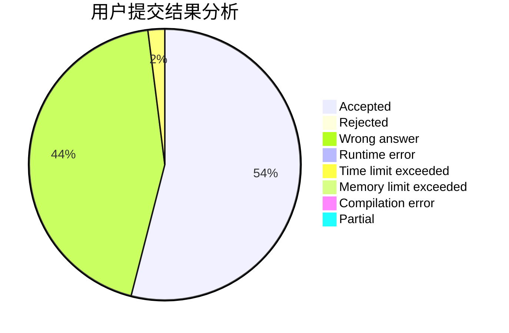
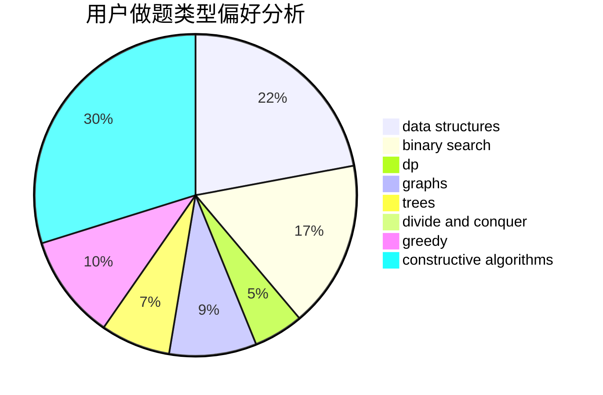
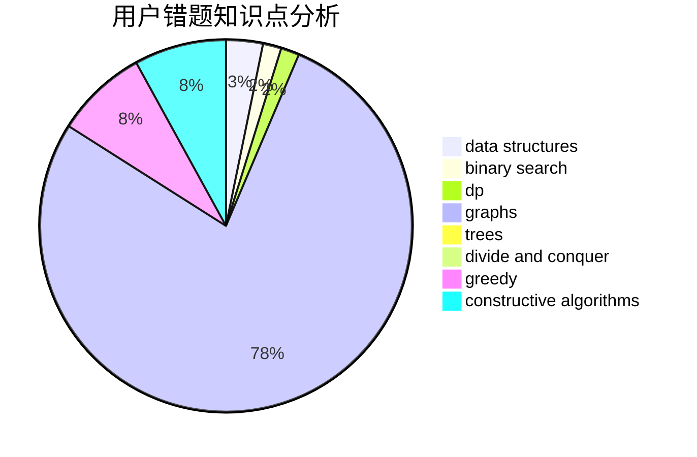

# KagamineRin

<!-- tabs:start -->

#### **用户提交结果分析**

#### **用户做题类型偏好分析**

#### **用户错题知识点分析**

<!-- tabs:end -->
# 推荐题目
[553E](https://codeforces.com/contest/553/problem/E)		dp,
                        fft,
                        graphs,
                        math,
                        probabilities		  
[198B](https://codeforces.com/contest/198/problem/B)		shortest paths		  
[1033C](https://codeforces.com/contest/1033/problem/C)		brute force,
                        dp,
                        games		  
[253A](https://codeforces.com/contest/253/problem/A)		greedy		  
[18E](https://codeforces.com/contest/18/problem/E)		dp		  
[827A](https://codeforces.com/contest/827/problem/A)		data structures,
                        greedy,
                        sortings,
                        strings		  
[534F](https://codeforces.com/contest/534/problem/F)		bitmasks,
                        dp,
                        hashing,
                        meet-in-the-middle		  
[136D](https://codeforces.com/contest/136/problem/D)		dsu,graphs,sortings,trees		  
[1164F](https://codeforces.com/contest/1164/problem/F)		dsu,graphs,sortings,trees		  
[329E](https://codeforces.com/contest/329/problem/E)		math		  
