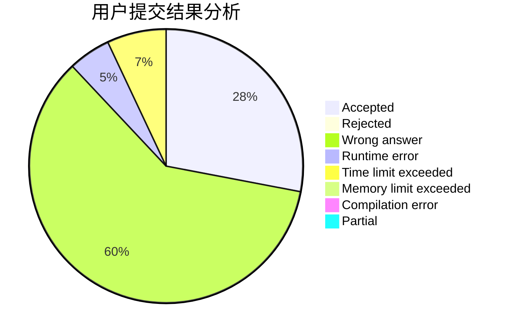
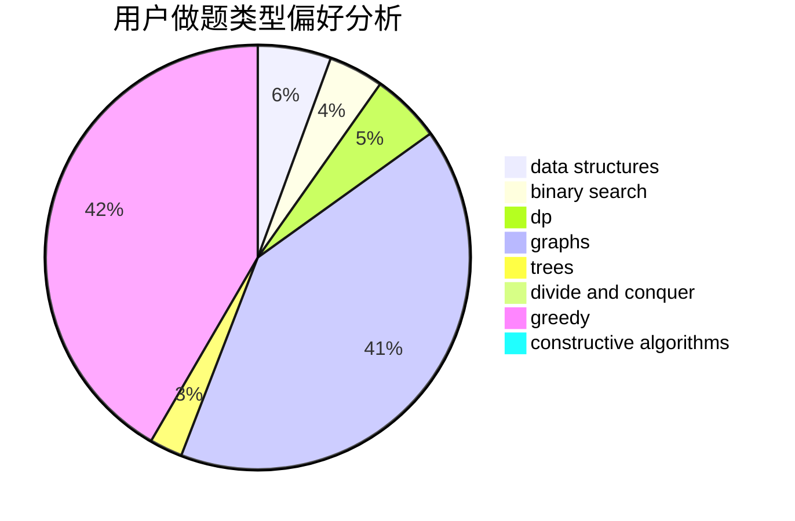
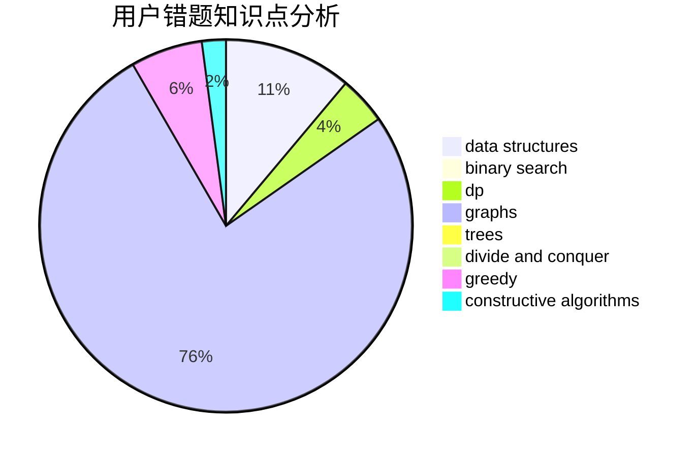

# 35point5

<!-- tabs:start -->

#### **用户提交结果分析**

#### **用户做题类型偏好分析**

#### **用户错题知识点分析**

<!-- tabs:end -->
# 推荐题目
[1370C](https://codeforces.com/contest/1370/problem/C)		games,
                        math,
                        number theory		  
[13711](https://codeforces.com/contest/1371/problem/1)		dsu,graphs,sortings,trees		  
[136C](https://codeforces.com/contest/136/problem/C)		dsu,graphs,sortings,trees		  
[136B](https://codeforces.com/contest/136/problem/B)		implementation,
                        math		  
[1167B](https://codeforces.com/contest/1167/problem/B)		brute force,
                        divide and conquer,
                        interactive,
                        math		  
[136D](https://codeforces.com/contest/136/problem/D)		dsu,graphs,sortings,trees		  
[13701](https://codeforces.com/contest/1370/problem/1)		dsu,graphs,sortings,trees		  
[1165C](https://codeforces.com/contest/1165/problem/C)		greedy		  
[1371F](https://codeforces.com/contest/1371/problem/F)		data structures,
                        divide and conquer,
                        implementation		  
[1270E](https://codeforces.com/contest/1270/problem/E)		constructive algorithms,
                        geometry,
                        math		  
