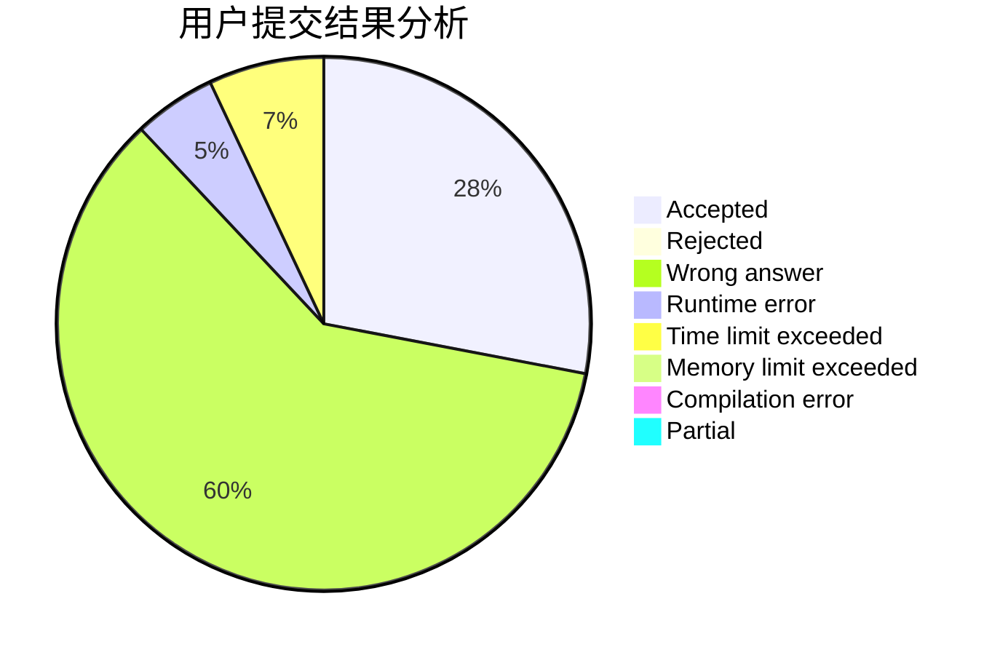
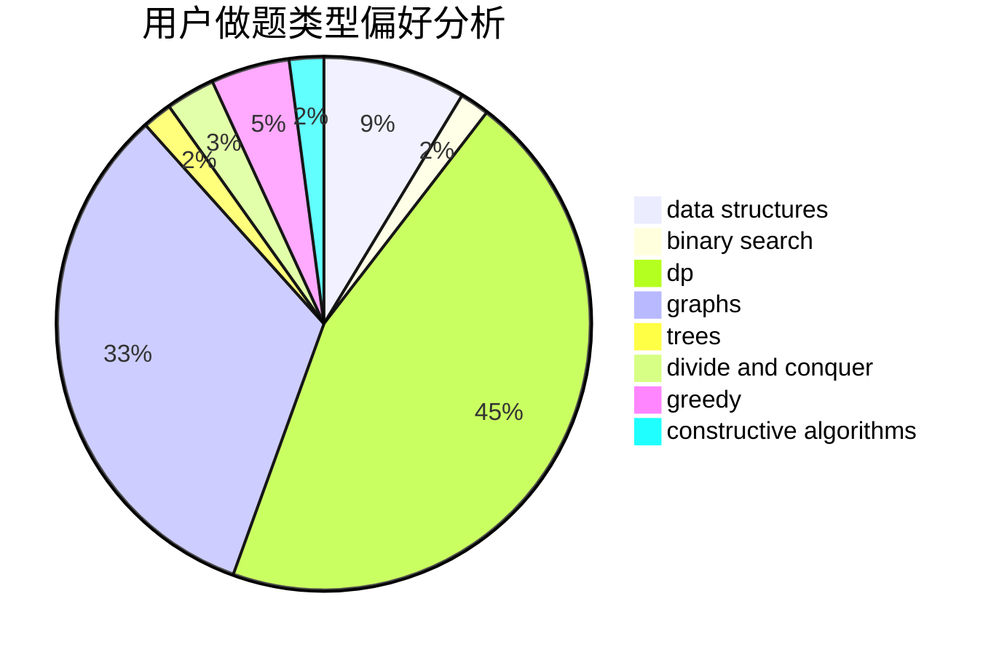
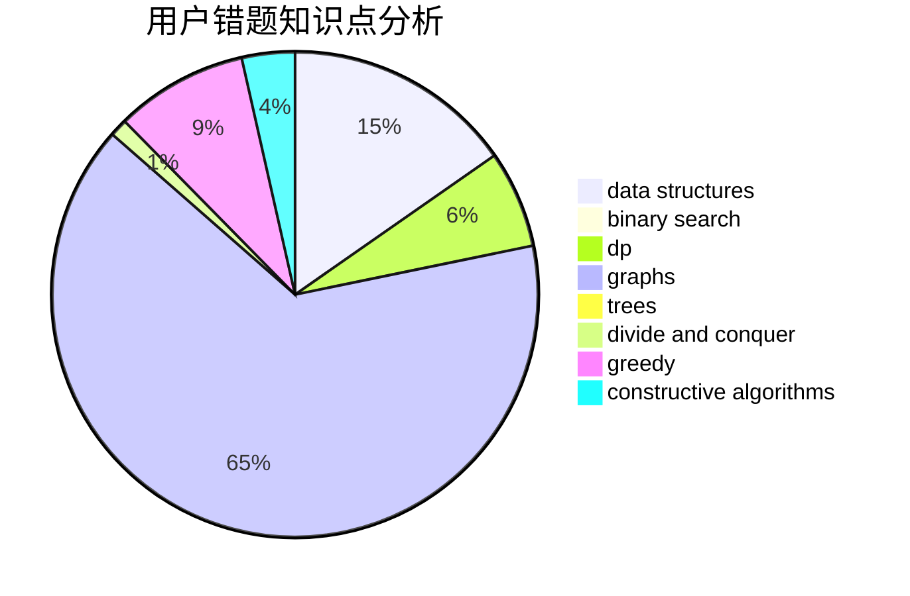

# 35point5

<!-- tabs:start -->

#### **用户提交结果分析**

#### **用户做题类型偏好分析**

#### **用户错题知识点分析**

<!-- tabs:end -->
# 推荐题目
[1363D](https://codeforces.com/contest/1363/problem/D)		binary search,
                        implementation,
                        interactive,
                        math		  
[1364A](https://codeforces.com/contest/1364/problem/A)		brute force,
                        data structures,
                        number theory,
                        two pointers		  
[1362D](https://codeforces.com/contest/1362/problem/D)		dsu,graphs,sortings,trees		  
[1362C](https://codeforces.com/contest/1362/problem/C)		bitmasks,
                        greedy,
                        math		  
[1164S](https://codeforces.com/contest/1164/problem/S)		dsu,graphs,sortings,trees		  
[1362E](https://codeforces.com/contest/1362/problem/E)		dsu,graphs,sortings,trees		  
[1362F](https://codeforces.com/contest/1362/problem/F)		dsu,graphs,sortings,trees		  
[1164F](https://codeforces.com/contest/1164/problem/F)		dsu,graphs,sortings,trees		  
[1365B](https://codeforces.com/contest/1365/problem/B)		constructive algorithms,
                        implementation		  
[1264F](https://codeforces.com/contest/1264/problem/F)		constructive algorithms,
                        number theory		  
