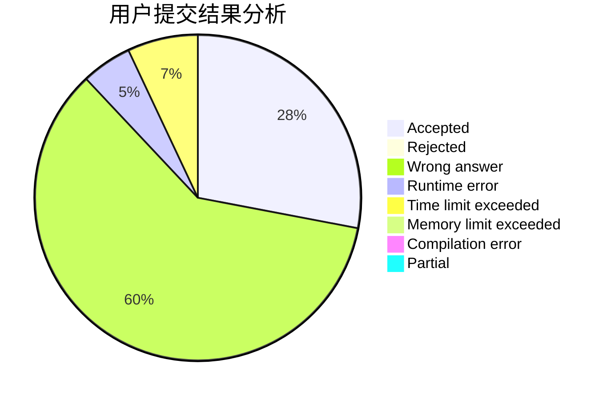
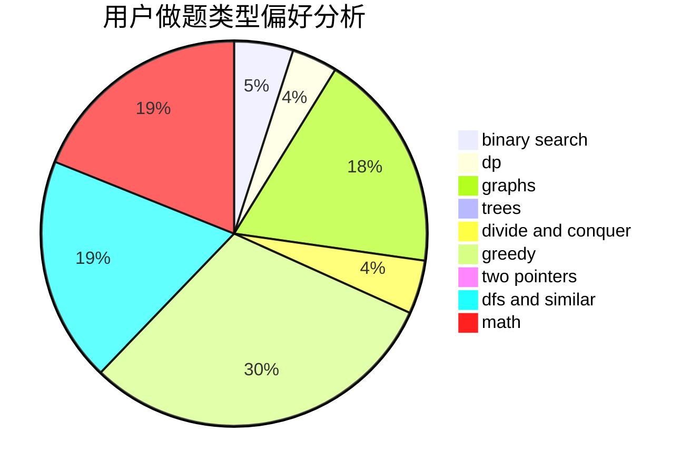

# 35point5

<!-- tabs:start -->

#### **用户提交结果分析**

#### **用户做题类型偏好分析**

<!-- tabs:end -->
# 推荐题目
[1370C](https://codeforces.com/contest/1370/problem/C)
[13711](https://codeforces.com/contest/1371/problem/1)
[136C](https://codeforces.com/contest/136/problem/C)
[136B](https://codeforces.com/contest/136/problem/B)
[1167B](https://codeforces.com/contest/1167/problem/B)
[136D](https://codeforces.com/contest/136/problem/D)
[13701](https://codeforces.com/contest/1370/problem/1)
[1165C](https://codeforces.com/contest/1165/problem/C)
[1371F](https://codeforces.com/contest/1371/problem/F)
[1270E](https://codeforces.com/contest/1270/problem/E)
