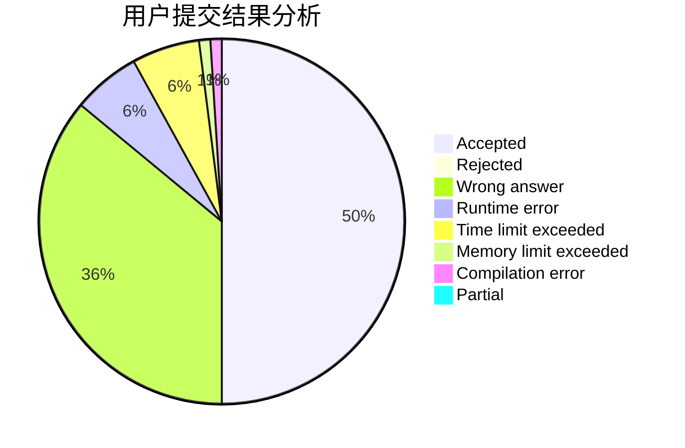
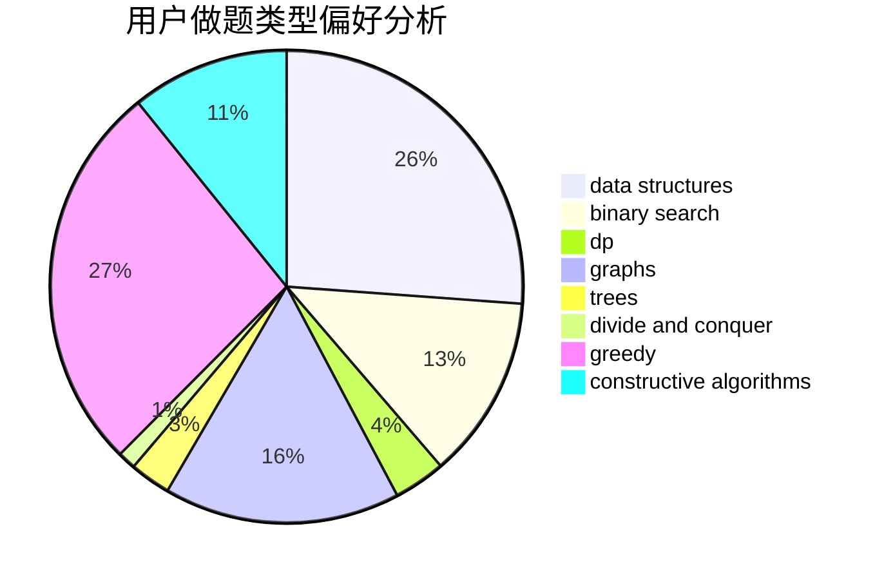
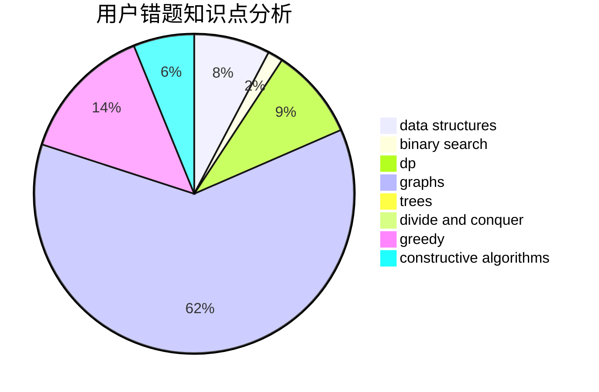

# Kaizyn

<!-- tabs:start -->

#### **用户提交结果分析**

#### **用户做题类型偏好分析**

#### **用户错题知识点分析**

<!-- tabs:end -->
# 推荐题目
[1483F](https://codeforces.com/contest/1483/problem/F)		dsu,graphs,sortings,trees		  
[1089F](https://codeforces.com/contest/1089/problem/F)		math		  
[1444A](https://codeforces.com/contest/1444/problem/A)		brute force,
                        math,
                        number theory		  
[1415F](https://codeforces.com/contest/1415/problem/F)		dp		  
[1456B](https://codeforces.com/contest/1456/problem/B)		dsu,graphs,sortings,trees		  
[477E](https://codeforces.com/contest/477/problem/E)		data structures		  
[1110C](https://codeforces.com/contest/1110/problem/C)		constructive algorithms,
                        math,
                        number theory		  
[1250M](https://codeforces.com/contest/1250/problem/M)		constructive algorithms,
                        divide and conquer		  
[1096A](https://codeforces.com/contest/1096/problem/A)		greedy,
                        implementation,
                        math		  
[809B](https://codeforces.com/contest/809/problem/B)		binary search,
                        interactive		  
