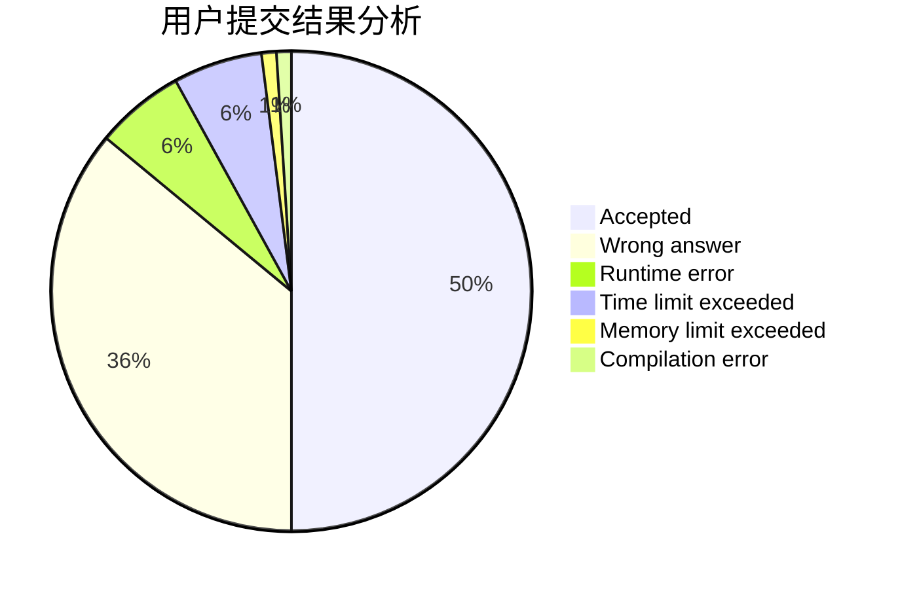
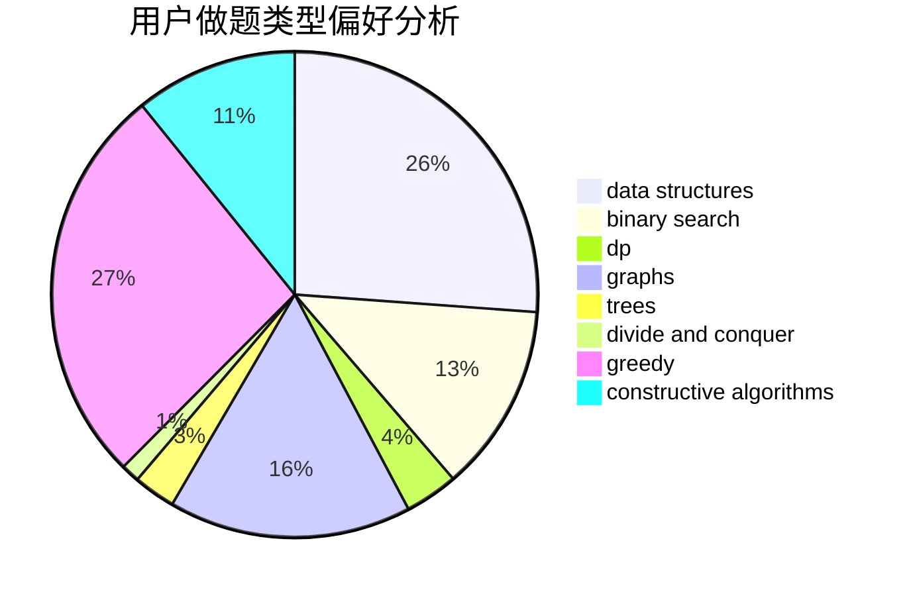
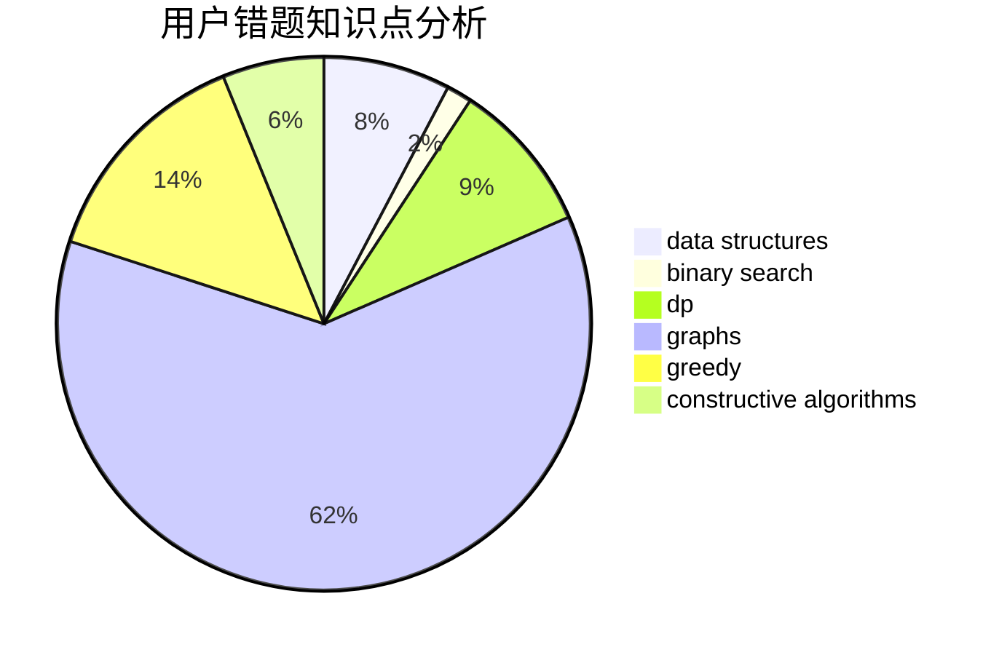

# Kaizyn
<!-- tabs:start -->
#### **用户提交结果分析**

#### **用户做题类型偏好分析**

#### **用户错题知识点分析**

<!-- tabs:end -->
# 推荐题目
[XOR-gun](https://codeforces.com/contest/1456/problem/B)		bitmasks,
                        brute force,
                        constructive algorithms		  
[Save Energy!](https://codeforces.com/contest/937/problem/C)		binary search,
                        implementation,
                        math		  
[Ehab and a Special Coloring Problem](http://codeforces.com/problemset/problem/1174/C)		constructive algorithms,
                        number theory		  
[Strange Sorting](http://codeforces.com/problemset/problem/484/C)		implementation,
                        math		  
[Cakes for Clones](http://codeforces.com/problemset/problem/1415/F)		dp		  
[Gifts](http://codeforces.com/problemset/problem/229/E)		combinatorics,
                        dp,
                        math,
                        probabilities		  
[Pie Rules](http://codeforces.com/problemset/problem/859/C)		dp,
                        games		  
[SmartGarden](http://codeforces.com/problemset/problem/1250/M)		constructive algorithms,
                        divide and conquer		  
[Zuhair and Strings](http://codeforces.com/problemset/problem/1105/B)		brute force,
                        implementation,
                        strings		  
[Prison Transfer](http://codeforces.com/problemset/problem/427/B)		data structures,
                        implementation		  
<!-- tabs:start -->
#### **data structures**
[Prison Transfer](http://codeforces.com/problemset/problem/427/B)		data structures,
                        implementation		  
[Queue in the Train](https://codeforces.com/contest/1248/problem/E)		data structures,
                        greedy,
                        implementation		  
[Dreamoon and Notepad](http://codeforces.com/problemset/problem/477/E)		data structures		  
[Design Tutorial: Increase the Constraints](http://codeforces.com/problemset/problem/472/G)		bitmasks,
                        data structures,
                        fft		  
[Sasha and Algorithm of Silence's Sounds](http://codeforces.com/problemset/problem/1109/F)		data structures,
                        trees		  
[Lanterns](http://codeforces.com/problemset/problem/1476/F)		binary search,
                        data structures,
                        dp		  
[Welfare State](http://codeforces.com/problemset/problem/1198/B)		binary search,
                        brute force,
                        data structures,
                        sortings		  
[Exam](https://codeforces.com/contest/1483/problem/F)		data structures,
                        string suffix structures,
                        trees		  
[Maximum width](http://codeforces.com/problemset/problem/1492/C)		binary search,
                        data structures,
                        dp,
                        greedy,
                        two pointers		  
[Old Floppy Drive](http://codeforces.com/problemset/problem/1490/G)		binary search,
                        data structures,
                        math		  
#### **binary search**
[Save Energy!](https://codeforces.com/contest/937/problem/C)		binary search,
                        implementation,
                        math		  
[Robot Rapping Results Report](http://codeforces.com/problemset/problem/645/D)		binary search,
                        dp,
                        graphs		  
[Parametric Circulation](http://codeforces.com/problemset/problem/925/F)		binary search,
                        flows		  
[Glad to see you!](http://codeforces.com/problemset/problem/809/B)		binary search,
                        interactive		  
[A Tale of Two Lands](http://codeforces.com/problemset/problem/1166/C)		binary search,
                        sortings,
                        two pointers		  
[Lanterns](http://codeforces.com/problemset/problem/1476/F)		binary search,
                        data structures,
                        dp		  
[Welfare State](http://codeforces.com/problemset/problem/1198/B)		binary search,
                        brute force,
                        data structures,
                        sortings		  
[Maximum width](http://codeforces.com/problemset/problem/1492/C)		binary search,
                        data structures,
                        dp,
                        greedy,
                        two pointers		  
[Pairs](http://codeforces.com/problemset/problem/1463/D)		binary search,
                        constructive algorithms,
                        greedy,
                        two pointers		  
[Old Floppy Drive](http://codeforces.com/problemset/problem/1490/G)		binary search,
                        data structures,
                        math		  
#### **dp**
[Cakes for Clones](http://codeforces.com/problemset/problem/1415/F)		dp		  
[Gifts](http://codeforces.com/problemset/problem/229/E)		combinatorics,
                        dp,
                        math,
                        probabilities		  
[Pie Rules](http://codeforces.com/problemset/problem/859/C)		dp,
                        games		  
[Robot Rapping Results Report](http://codeforces.com/problemset/problem/645/D)		binary search,
                        dp,
                        graphs		  
[Logo Turtle](http://codeforces.com/problemset/problem/132/C)		dp		  
[Salazar Slytherin's Locket](http://codeforces.com/problemset/problem/855/E)		bitmasks,
                        dp		  
[Lanterns](http://codeforces.com/problemset/problem/1476/F)		binary search,
                        data structures,
                        dp		  
[Even-Odd Game](http://codeforces.com/problemset/problem/1472/D)		dp,
                        games,
                        greedy,
                        sortings		  
[Maximum width](http://codeforces.com/problemset/problem/1492/C)		binary search,
                        data structures,
                        dp,
                        greedy,
                        two pointers		  
[Bouncing Ball](https://codeforces.com/contest/1457/problem/C)		brute force,
                        dp,
                        implementation		  
#### **graph**
[Robot Rapping Results Report](http://codeforces.com/problemset/problem/645/D)		binary search,
                        dp,
                        graphs		  
[Strictly Positive Matrix](http://codeforces.com/problemset/problem/402/E)		graphs,
                        math		  
[Time to Run](http://codeforces.com/problemset/problem/1301/D)		constructive algorithms,
                        graphs,
                        implementation		  
[Pink Floyd](http://codeforces.com/problemset/problem/1142/E)		graphs,
                        interactive		  
[Minimum Ties](http://codeforces.com/problemset/problem/1487/C)		brute force,
                        constructive algorithms,
                        dfs and similar,
                        graphs,
                        greedy,
                        implementation,
                        math		  
[Chef Monocarp](http://codeforces.com/problemset/problem/1437/C)		dp,
                        flows,
                        graph matchings,
                        greedy,
                        math,
                        sortings		  
[Strange Housing](http://codeforces.com/problemset/problem/1470/D)		constructive algorithms,
                        dfs and similar,
                        graph matchings,
                        graphs,
                        greedy		  
[Longest Simple Cycle](http://codeforces.com/problemset/problem/1476/C)		dp,
                        graphs,
                        greedy		  
[Shortest and Longest LIS](http://codeforces.com/problemset/problem/1304/D)		constructive algorithms,
                        graphs,
                        greedy,
                        two pointers		  
[Ball in Berland](http://codeforces.com/problemset/problem/1475/C)		combinatorics,
                        graphs,
                        math		  
#### **trees**
[Sasha and Algorithm of Silence's Sounds](http://codeforces.com/problemset/problem/1109/F)		data structures,
                        trees		  
[Exam](https://codeforces.com/contest/1483/problem/F)		data structures,
                        string suffix structures,
                        trees		  
[Odd Mineral Resource](http://codeforces.com/problemset/problem/1479/D)		binary search,
                        bitmasks,
                        brute force,
                        data structures,
                        probabilities,
                        trees		  
[Yet Another Card Deck](http://codeforces.com/problemset/problem/1511/C)		brute force,
                        data structures,
                        implementation,
                        trees		  
[Diameter Cuts](http://codeforces.com/problemset/problem/1499/F)		combinatorics,
                        dfs and similar,
                        dp,
                        trees		  
[Fib-tree](http://codeforces.com/problemset/problem/1491/E)		brute force,
                        dfs and similar,
                        divide and conquer,
                        number theory,
                        trees		  
[13th Labour of Heracles](http://codeforces.com/problemset/problem/1466/D)		data structures,
                        greedy,
                        sortings,
                        trees		  
[BFS Trees](http://codeforces.com/problemset/problem/1495/D)		combinatorics,
                        dfs and similar,
                        graphs,
                        math,
                        shortest paths,
                        trees		  
[Sum of Prefix Sums](http://codeforces.com/problemset/problem/1303/G)		data structures,
                        divide and conquer,
                        geometry,
                        trees		  
[Number of Simple Paths](http://codeforces.com/problemset/problem/1454/E)		combinatorics,
                        dfs and similar,
                        graphs,
                        trees		  
#### **divide and conquer**
[SmartGarden](http://codeforces.com/problemset/problem/1250/M)		constructive algorithms,
                        divide and conquer		  
[Fairy](http://codeforces.com/problemset/problem/19/E)		dfs and similar,
                        divide and conquer,
                        dsu		  
[Divide and Summarize](http://codeforces.com/problemset/problem/1461/D)		binary search,
                        brute force,
                        data structures,
                        divide and conquer,
                        implementation,
                        sortings		  
[Song of the Sirens](http://codeforces.com/problemset/problem/1466/G)		combinatorics,
                        divide and conquer,
                        hashing,
                        math,
                        string suffix structures,
                        strings		  
[Permutation Transformation](http://codeforces.com/problemset/problem/1490/D)		dfs and similar,
                        divide and conquer,
                        implementation		  
[Skyline Photo](https://codeforces.com/contest/1483/problem/C)		data structures,
                        divide and conquer,
                        dp		  
[Fib-tree](http://codeforces.com/problemset/problem/1491/E)		brute force,
                        dfs and similar,
                        divide and conquer,
                        number theory,
                        trees		  
[Sum of Prefix Sums](http://codeforces.com/problemset/problem/1303/G)		data structures,
                        divide and conquer,
                        geometry,
                        trees		  
[Dogeforces](http://codeforces.com/problemset/problem/1494/D)		constructive algorithms,
                        data structures,
                        dfs and similar,
                        divide and conquer,
                        dsu,
                        greedy,
                        sortings,
                        trees		  
[Logistical Questions](http://codeforces.com/problemset/problem/566/C)		dfs and similar,
                        divide and conquer,
                        trees		  
#### **greedy**
[Pillars](http://codeforces.com/problemset/problem/1197/B)		greedy,
                        implementation		  
[Toy Sum](http://codeforces.com/problemset/problem/405/D)		greedy,
                        implementation,
                        math		  
[Queue in the Train](https://codeforces.com/contest/1248/problem/E)		data structures,
                        greedy,
                        implementation		  
[Sockets](http://codeforces.com/problemset/problem/732/E)		greedy,
                        sortings		  
[Find Divisible](http://codeforces.com/problemset/problem/1096/A)		greedy,
                        implementation,
                        math		  
[Deletion of Repeats](http://codeforces.com/problemset/problem/19/C)		greedy,
                        hashing,
                        string suffix structures		  
[Hexagons](http://codeforces.com/problemset/problem/1421/D)		brute force,
                        constructive algorithms,
                        greedy,
                        implementation,
                        math,
                        shortest paths		  
[Even-Odd Game](http://codeforces.com/problemset/problem/1472/D)		dp,
                        games,
                        greedy,
                        sortings		  
[Maximum width](http://codeforces.com/problemset/problem/1492/C)		binary search,
                        data structures,
                        dp,
                        greedy,
                        two pointers		  
[Diamond Miner](https://codeforces.com/contest/1496/problem/C)		geometry,
                        greedy,
                        math,
                        sortings		  
#### **constructive algorithms**
[XOR-gun](https://codeforces.com/contest/1456/problem/B)		bitmasks,
                        brute force,
                        constructive algorithms		  
[Ehab and a Special Coloring Problem](http://codeforces.com/problemset/problem/1174/C)		constructive algorithms,
                        number theory		  
[SmartGarden](http://codeforces.com/problemset/problem/1250/M)		constructive algorithms,
                        divide and conquer		  
[Time to Run](http://codeforces.com/problemset/problem/1301/D)		constructive algorithms,
                        graphs,
                        implementation		  
[Hexagons](http://codeforces.com/problemset/problem/1421/D)		brute force,
                        constructive algorithms,
                        greedy,
                        implementation,
                        math,
                        shortest paths		  
[Meaningless Operations](http://codeforces.com/problemset/problem/1110/C)		constructive algorithms,
                        math,
                        number theory		  
[Anti-knapsack](http://codeforces.com/problemset/problem/1493/A)		constructive algorithms,
                        greedy		  
[Pairs](http://codeforces.com/problemset/problem/1463/D)		binary search,
                        constructive algorithms,
                        greedy,
                        two pointers		  
[Genius's Gambit](http://codeforces.com/problemset/problem/1492/D)		bitmasks,
                        constructive algorithms,
                        greedy,
                        math		  
[3-Coloring](https://codeforces.com/contest/1504/problem/D)		constructive algorithms,
                        games,
                        interactive		  
#### **sortings**
[Sockets](http://codeforces.com/problemset/problem/732/E)		greedy,
                        sortings		  
[A Tale of Two Lands](http://codeforces.com/problemset/problem/1166/C)		binary search,
                        sortings,
                        two pointers		  
[Welfare State](http://codeforces.com/problemset/problem/1198/B)		binary search,
                        brute force,
                        data structures,
                        sortings		  
[Even-Odd Game](http://codeforces.com/problemset/problem/1472/D)		dp,
                        games,
                        greedy,
                        sortings		  
[Diamond Miner](https://codeforces.com/contest/1496/problem/C)		geometry,
                        greedy,
                        math,
                        sortings		  
[Meximization](http://codeforces.com/problemset/problem/1497/A)		brute force,
                        data structures,
                        greedy,
                        sortings		  
[Avoiding Zero](http://codeforces.com/problemset/problem/1427/A)		math,
                        sortings		  
[Divide and Summarize](http://codeforces.com/problemset/problem/1461/D)		binary search,
                        brute force,
                        data structures,
                        divide and conquer,
                        implementation,
                        sortings		  
[Chef Monocarp](http://codeforces.com/problemset/problem/1437/C)		dp,
                        flows,
                        graph matchings,
                        greedy,
                        math,
                        sortings		  
[Replacing Elements](http://codeforces.com/problemset/problem/1473/A)		greedy,
                        implementation,
                        math,
                        sortings		  
<!-- tabs:end -->
