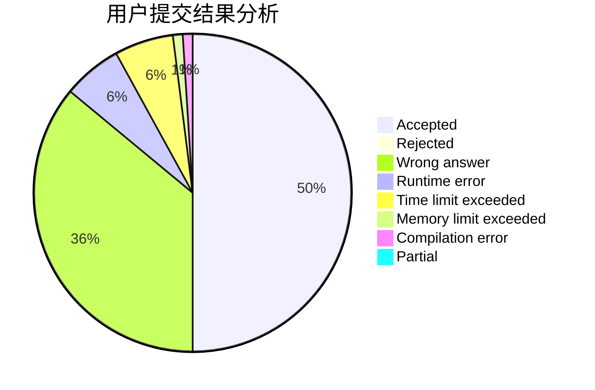
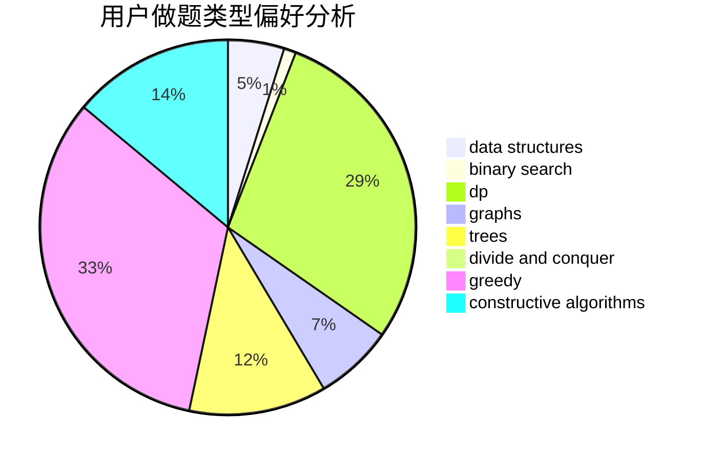

# Kaizyn

<!-- tabs:start -->

#### **用户提交结果分析**

#### **用户做题类型偏好分析**

#### **用户错题知识点分析**

<!-- tabs:end -->
# 推荐题目
[1491D](https://codeforces.com/contest/1491/problem/D)		bitmasks,
                        constructive algorithms,
                        dp,
                        greedy,
                        math		  
[1089K](https://codeforces.com/contest/1089/problem/K)		data structures		  
[1453E](https://codeforces.com/contest/1453/problem/E)		binary search,
                        dfs and similar,
                        dp,
                        greedy,
                        trees		  
[1423J](https://codeforces.com/contest/1423/problem/J)		bitmasks,
                        constructive algorithms,
                        dp,
                        math		  
[1465F](https://codeforces.com/contest/1465/problem/F)		dsu,graphs,sortings,trees		  
[497E](https://codeforces.com/contest/497/problem/E)		dp,
                        matrices		  
[1110F](https://codeforces.com/contest/1110/problem/F)		data structures,
                        trees		  
[1255D](https://codeforces.com/contest/1255/problem/D)		dsu,graphs,sortings,trees		  
[1096D](https://codeforces.com/contest/1096/problem/D)		dp		  
[827A](https://codeforces.com/contest/827/problem/A)		data structures,
                        greedy,
                        sortings,
                        strings		  
