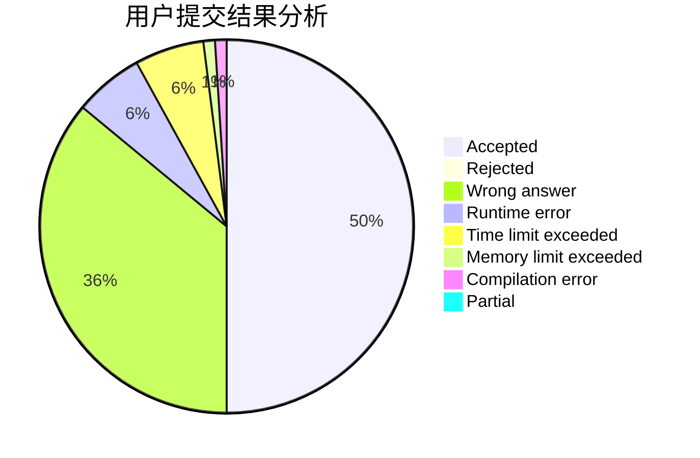
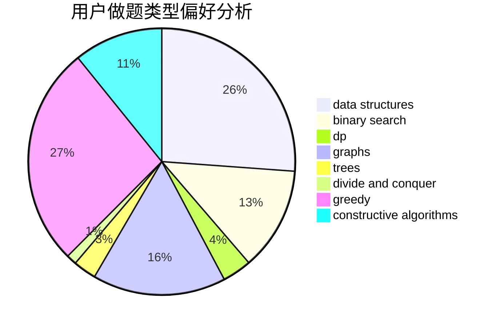
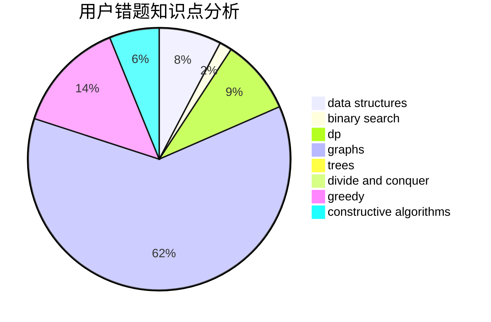

# Kaizyn
<!-- tabs:start -->
#### **用户提交结果分析**

#### **用户做题类型偏好分析**

#### **用户错题知识点分析**

<!-- tabs:end -->
# 推荐题目
[XOR-gun](https://codeforces.com/contest/1456/problem/B)		bitmasks,
                        brute force,
                        constructive algorithms		  
[Save Energy!](https://codeforces.com/contest/937/problem/C)		binary search,
                        implementation,
                        math		  
[Ehab and a Special Coloring Problem](http://codeforces.com/problemset/problem/1174/C)		constructive algorithms,
                        number theory		  
[Strange Sorting](http://codeforces.com/problemset/problem/484/C)		implementation,
                        math		  
[Cakes for Clones](http://codeforces.com/problemset/problem/1415/F)		dp		  
[Gifts](http://codeforces.com/problemset/problem/229/E)		combinatorics,
                        dp,
                        math,
                        probabilities		  
[Pie Rules](http://codeforces.com/problemset/problem/859/C)		dp,
                        games		  
[SmartGarden](http://codeforces.com/problemset/problem/1250/M)		constructive algorithms,
                        divide and conquer		  
[Zuhair and Strings](http://codeforces.com/problemset/problem/1105/B)		brute force,
                        implementation,
                        strings		  
[Prison Transfer](http://codeforces.com/problemset/problem/427/B)		data structures,
                        implementation		  
<!-- tabs:start -->
#### **data structures**
[XOR-gun](http://codeforces.com/problemset/problem/427/B)		data structures,
                        implementation		  
[Save Energy!](https://codeforces.com/contest/1248/problem/E)		data structures,
                        greedy,
                        implementation		  
[Ehab and a Special Coloring Problem](http://codeforces.com/problemset/problem/477/E)		data structures		  
[Strange Sorting](http://codeforces.com/problemset/problem/472/G)		bitmasks,
                        data structures,
                        fft		  
[Cakes for Clones](http://codeforces.com/problemset/problem/1109/F)		data structures,
                        trees		  
[Gifts](http://codeforces.com/problemset/problem/1476/F)		binary search,
                        data structures,
                        dp		  
[Pie Rules](http://codeforces.com/problemset/problem/1198/B)		binary search,
                        brute force,
                        data structures,
                        sortings		  
[SmartGarden](https://codeforces.com/contest/1483/problem/F)		data structures,
                        string suffix structures,
                        trees		  
[Zuhair and Strings](http://codeforces.com/problemset/problem/1492/C)		binary search,
                        data structures,
                        dp,
                        greedy,
                        two pointers		  
[Prison Transfer](http://codeforces.com/problemset/problem/1490/G)		binary search,
                        data structures,
                        math		  
#### **binary search**
[XOR-gun](https://codeforces.com/contest/937/problem/C)		binary search,
                        implementation,
                        math		  
[Save Energy!](http://codeforces.com/problemset/problem/645/D)		binary search,
                        dp,
                        graphs		  
[Ehab and a Special Coloring Problem](http://codeforces.com/problemset/problem/925/F)		binary search,
                        flows		  
[Strange Sorting](http://codeforces.com/problemset/problem/809/B)		binary search,
                        interactive		  
[Cakes for Clones](http://codeforces.com/problemset/problem/1166/C)		binary search,
                        sortings,
                        two pointers		  
[Gifts](http://codeforces.com/problemset/problem/1476/F)		binary search,
                        data structures,
                        dp		  
[Pie Rules](http://codeforces.com/problemset/problem/1198/B)		binary search,
                        brute force,
                        data structures,
                        sortings		  
[SmartGarden](http://codeforces.com/problemset/problem/1492/C)		binary search,
                        data structures,
                        dp,
                        greedy,
                        two pointers		  
[Zuhair and Strings](http://codeforces.com/problemset/problem/1463/D)		binary search,
                        constructive algorithms,
                        greedy,
                        two pointers		  
[Prison Transfer](http://codeforces.com/problemset/problem/1490/G)		binary search,
                        data structures,
                        math		  
#### **dp**
[XOR-gun](http://codeforces.com/problemset/problem/1415/F)		dp		  
[Save Energy!](http://codeforces.com/problemset/problem/229/E)		combinatorics,
                        dp,
                        math,
                        probabilities		  
[Ehab and a Special Coloring Problem](http://codeforces.com/problemset/problem/859/C)		dp,
                        games		  
[Strange Sorting](http://codeforces.com/problemset/problem/645/D)		binary search,
                        dp,
                        graphs		  
[Cakes for Clones](http://codeforces.com/problemset/problem/132/C)		dp		  
[Gifts](http://codeforces.com/problemset/problem/855/E)		bitmasks,
                        dp		  
[Pie Rules](http://codeforces.com/problemset/problem/1476/F)		binary search,
                        data structures,
                        dp		  
[SmartGarden](http://codeforces.com/problemset/problem/1472/D)		dp,
                        games,
                        greedy,
                        sortings		  
[Zuhair and Strings](http://codeforces.com/problemset/problem/1492/C)		binary search,
                        data structures,
                        dp,
                        greedy,
                        two pointers		  
[Prison Transfer](https://codeforces.com/contest/1457/problem/C)		brute force,
                        dp,
                        implementation		  
#### **graph**
[XOR-gun](http://codeforces.com/problemset/problem/645/D)		binary search,
                        dp,
                        graphs		  
[Save Energy!](http://codeforces.com/problemset/problem/402/E)		graphs,
                        math		  
[Ehab and a Special Coloring Problem](http://codeforces.com/problemset/problem/1301/D)		constructive algorithms,
                        graphs,
                        implementation		  
[Strange Sorting](http://codeforces.com/problemset/problem/1142/E)		graphs,
                        interactive		  
[Cakes for Clones](http://codeforces.com/problemset/problem/1487/C)		brute force,
                        constructive algorithms,
                        dfs and similar,
                        graphs,
                        greedy,
                        implementation,
                        math		  
[Gifts](http://codeforces.com/problemset/problem/1437/C)		dp,
                        flows,
                        graph matchings,
                        greedy,
                        math,
                        sortings		  
[Pie Rules](http://codeforces.com/problemset/problem/1470/D)		constructive algorithms,
                        dfs and similar,
                        graph matchings,
                        graphs,
                        greedy		  
[SmartGarden](http://codeforces.com/problemset/problem/1476/C)		dp,
                        graphs,
                        greedy		  
[Zuhair and Strings](http://codeforces.com/problemset/problem/1304/D)		constructive algorithms,
                        graphs,
                        greedy,
                        two pointers		  
[Prison Transfer](http://codeforces.com/problemset/problem/1475/C)		combinatorics,
                        graphs,
                        math		  
#### **trees**
[XOR-gun](http://codeforces.com/problemset/problem/1109/F)		data structures,
                        trees		  
[Save Energy!](https://codeforces.com/contest/1483/problem/F)		data structures,
                        string suffix structures,
                        trees		  
[Ehab and a Special Coloring Problem](http://codeforces.com/problemset/problem/1479/D)		binary search,
                        bitmasks,
                        brute force,
                        data structures,
                        probabilities,
                        trees		  
[Strange Sorting](http://codeforces.com/problemset/problem/1511/C)		brute force,
                        data structures,
                        implementation,
                        trees		  
[Cakes for Clones](http://codeforces.com/problemset/problem/1499/F)		combinatorics,
                        dfs and similar,
                        dp,
                        trees		  
[Gifts](http://codeforces.com/problemset/problem/1491/E)		brute force,
                        dfs and similar,
                        divide and conquer,
                        number theory,
                        trees		  
[Pie Rules](http://codeforces.com/problemset/problem/1466/D)		data structures,
                        greedy,
                        sortings,
                        trees		  
[SmartGarden](http://codeforces.com/problemset/problem/1495/D)		combinatorics,
                        dfs and similar,
                        graphs,
                        math,
                        shortest paths,
                        trees		  
[Zuhair and Strings](http://codeforces.com/problemset/problem/1303/G)		data structures,
                        divide and conquer,
                        geometry,
                        trees		  
[Prison Transfer](http://codeforces.com/problemset/problem/1454/E)		combinatorics,
                        dfs and similar,
                        graphs,
                        trees		  
#### **divide and conquer**
[XOR-gun](http://codeforces.com/problemset/problem/1250/M)		constructive algorithms,
                        divide and conquer		  
[Save Energy!](http://codeforces.com/problemset/problem/19/E)		dfs and similar,
                        divide and conquer,
                        dsu		  
[Ehab and a Special Coloring Problem](http://codeforces.com/problemset/problem/1461/D)		binary search,
                        brute force,
                        data structures,
                        divide and conquer,
                        implementation,
                        sortings		  
[Strange Sorting](http://codeforces.com/problemset/problem/1466/G)		combinatorics,
                        divide and conquer,
                        hashing,
                        math,
                        string suffix structures,
                        strings		  
[Cakes for Clones](http://codeforces.com/problemset/problem/1490/D)		dfs and similar,
                        divide and conquer,
                        implementation		  
[Gifts](https://codeforces.com/contest/1483/problem/C)		data structures,
                        divide and conquer,
                        dp		  
[Pie Rules](http://codeforces.com/problemset/problem/1491/E)		brute force,
                        dfs and similar,
                        divide and conquer,
                        number theory,
                        trees		  
[SmartGarden](http://codeforces.com/problemset/problem/1303/G)		data structures,
                        divide and conquer,
                        geometry,
                        trees		  
[Zuhair and Strings](http://codeforces.com/problemset/problem/1494/D)		constructive algorithms,
                        data structures,
                        dfs and similar,
                        divide and conquer,
                        dsu,
                        greedy,
                        sortings,
                        trees		  
[Prison Transfer](http://codeforces.com/problemset/problem/1482/E)		data structures,
                        divide and conquer,
                        dp		  
#### **greedy**
[XOR-gun](http://codeforces.com/problemset/problem/1197/B)		greedy,
                        implementation		  
[Save Energy!](http://codeforces.com/problemset/problem/405/D)		greedy,
                        implementation,
                        math		  
[Ehab and a Special Coloring Problem](https://codeforces.com/contest/1248/problem/E)		data structures,
                        greedy,
                        implementation		  
[Strange Sorting](http://codeforces.com/problemset/problem/732/E)		greedy,
                        sortings		  
[Cakes for Clones](http://codeforces.com/problemset/problem/1096/A)		greedy,
                        implementation,
                        math		  
[Gifts](http://codeforces.com/problemset/problem/19/C)		greedy,
                        hashing,
                        string suffix structures		  
[Pie Rules](http://codeforces.com/problemset/problem/1421/D)		brute force,
                        constructive algorithms,
                        greedy,
                        implementation,
                        math,
                        shortest paths		  
[SmartGarden](http://codeforces.com/problemset/problem/1472/D)		dp,
                        games,
                        greedy,
                        sortings		  
[Zuhair and Strings](http://codeforces.com/problemset/problem/1492/C)		binary search,
                        data structures,
                        dp,
                        greedy,
                        two pointers		  
[Prison Transfer](https://codeforces.com/contest/1496/problem/C)		geometry,
                        greedy,
                        math,
                        sortings		  
#### **constructive algorithms**
[XOR-gun](https://codeforces.com/contest/1456/problem/B)		bitmasks,
                        brute force,
                        constructive algorithms		  
[Save Energy!](http://codeforces.com/problemset/problem/1174/C)		constructive algorithms,
                        number theory		  
[Ehab and a Special Coloring Problem](http://codeforces.com/problemset/problem/1250/M)		constructive algorithms,
                        divide and conquer		  
[Strange Sorting](http://codeforces.com/problemset/problem/1301/D)		constructive algorithms,
                        graphs,
                        implementation		  
[Cakes for Clones](http://codeforces.com/problemset/problem/1421/D)		brute force,
                        constructive algorithms,
                        greedy,
                        implementation,
                        math,
                        shortest paths		  
[Gifts](http://codeforces.com/problemset/problem/1110/C)		constructive algorithms,
                        math,
                        number theory		  
[Pie Rules](http://codeforces.com/problemset/problem/1493/A)		constructive algorithms,
                        greedy		  
[SmartGarden](http://codeforces.com/problemset/problem/1463/D)		binary search,
                        constructive algorithms,
                        greedy,
                        two pointers		  
[Zuhair and Strings](https://codeforces.com/contest/1456/problem/B)		bitmasks,
                        brute force,
                        constructive algorithms		  
[Prison Transfer](http://codeforces.com/problemset/problem/1492/D)		bitmasks,
                        constructive algorithms,
                        greedy,
                        math		  
#### **sortings**
[XOR-gun](http://codeforces.com/problemset/problem/732/E)		greedy,
                        sortings		  
[Save Energy!](http://codeforces.com/problemset/problem/1166/C)		binary search,
                        sortings,
                        two pointers		  
[Ehab and a Special Coloring Problem](http://codeforces.com/problemset/problem/1198/B)		binary search,
                        brute force,
                        data structures,
                        sortings		  
[Strange Sorting](http://codeforces.com/problemset/problem/1472/D)		dp,
                        games,
                        greedy,
                        sortings		  
[Cakes for Clones](https://codeforces.com/contest/1496/problem/C)		geometry,
                        greedy,
                        math,
                        sortings		  
[Gifts](http://codeforces.com/problemset/problem/1495/A)		geometry,
                        greedy,
                        math,
                        sortings		  
[Pie Rules](http://codeforces.com/problemset/problem/1497/A)		brute force,
                        data structures,
                        greedy,
                        sortings		  
[SmartGarden](http://codeforces.com/problemset/problem/1427/A)		math,
                        sortings		  
[Zuhair and Strings](http://codeforces.com/problemset/problem/1461/D)		binary search,
                        brute force,
                        data structures,
                        divide and conquer,
                        implementation,
                        sortings		  
[Prison Transfer](http://codeforces.com/problemset/problem/1437/C)		dp,
                        flows,
                        graph matchings,
                        greedy,
                        math,
                        sortings		  
<!-- tabs:end -->
