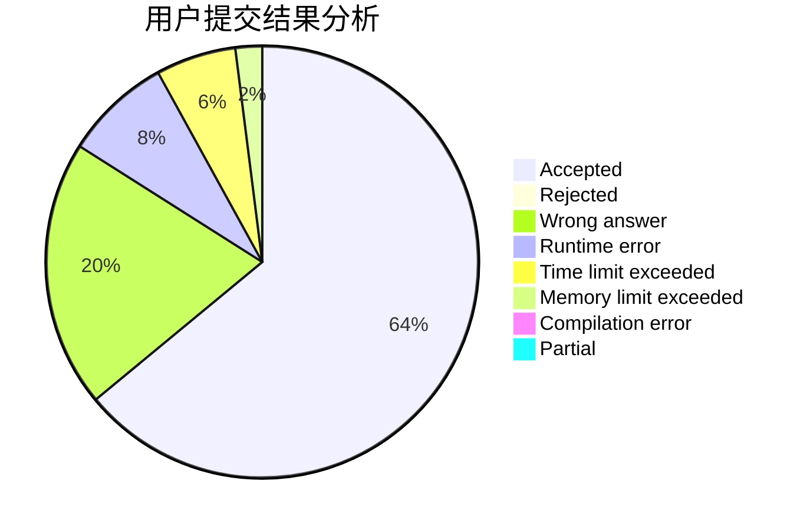
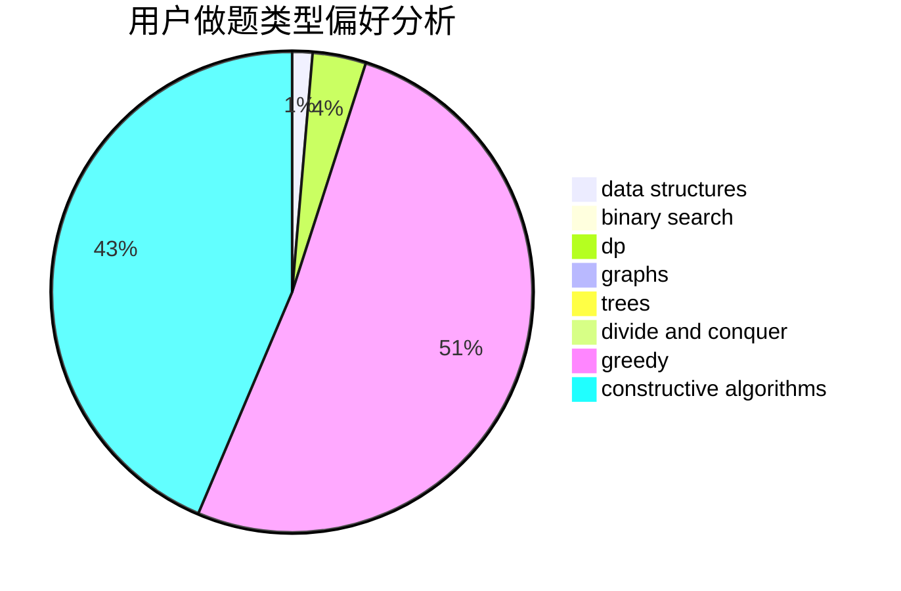

# KaladinStormblessed

<!-- tabs:start -->

#### **用户提交结果分析**

#### **用户做题类型偏好分析**

#### **用户错题知识点分析**

<!-- tabs:end -->
# 推荐题目
[11D](https://codeforces.com/contest/11/problem/D)		bitmasks,
                        dp,
                        graphs		  
[1312C](https://codeforces.com/contest/1312/problem/C)		bitmasks,
                        greedy,
                        implementation,
                        math,
                        number theory,
                        ternary search		  
[290C](https://codeforces.com/contest/290/problem/C)		*special problem,
                        graph matchings,
                        implementation,
                        trees		  
[856C](https://codeforces.com/contest/856/problem/C)		combinatorics,
                        dp,
                        math		  
[605A](https://codeforces.com/contest/605/problem/A)		constructive algorithms,
                        greedy		  
[899E](https://codeforces.com/contest/899/problem/E)		data structures,
                        dsu,
                        flows,
                        implementation,
                        two pointers		  
[631D](https://codeforces.com/contest/631/problem/D)		data structures,
                        hashing,
                        implementation,
                        string suffix structures,
                        strings		  
[754C](https://codeforces.com/contest/754/problem/C)		brute force,
                        constructive algorithms,
                        dp,
                        implementation,
                        strings		  
[534F](https://codeforces.com/contest/534/problem/F)		bitmasks,
                        dp,
                        hashing,
                        meet-in-the-middle		  
[94B](https://codeforces.com/contest/94/problem/B)		graphs,
                        implementation,
                        math		  
