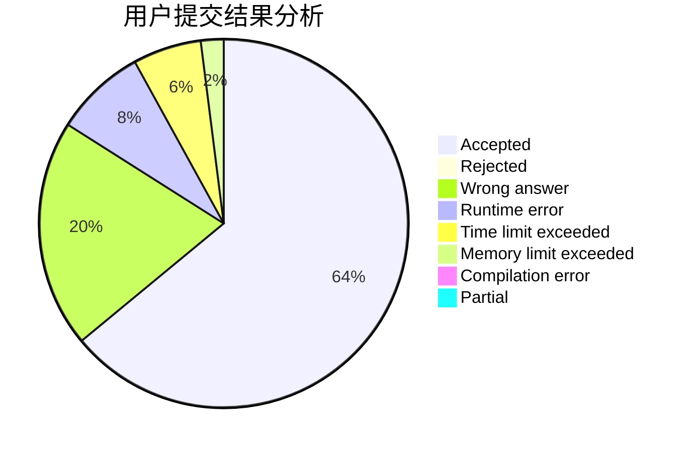
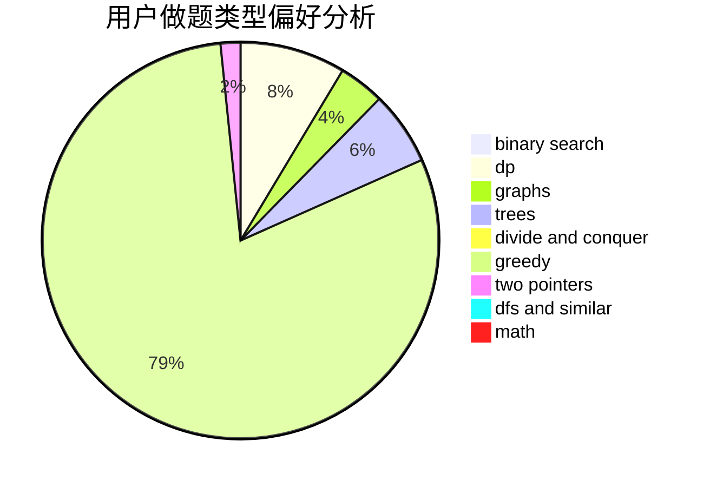

# KaladinStormblessed

<!-- tabs:start -->

#### **用户提交结果分析**

#### **用户做题类型偏好分析**

<!-- tabs:end -->
# 推荐题目
[11D](https://codeforces.com/contest/11/problem/D)
[1312C](https://codeforces.com/contest/1312/problem/C)
[290C](https://codeforces.com/contest/290/problem/C)
[856C](https://codeforces.com/contest/856/problem/C)
[605A](https://codeforces.com/contest/605/problem/A)
[899E](https://codeforces.com/contest/899/problem/E)
[631D](https://codeforces.com/contest/631/problem/D)
[754C](https://codeforces.com/contest/754/problem/C)
[534F](https://codeforces.com/contest/534/problem/F)
[94B](https://codeforces.com/contest/94/problem/B)
