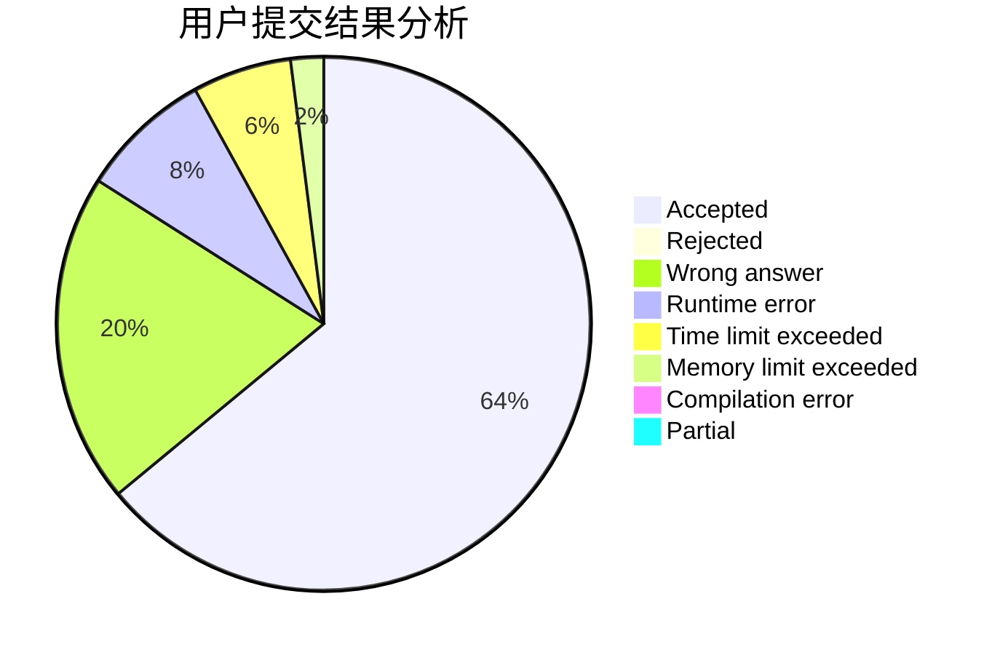
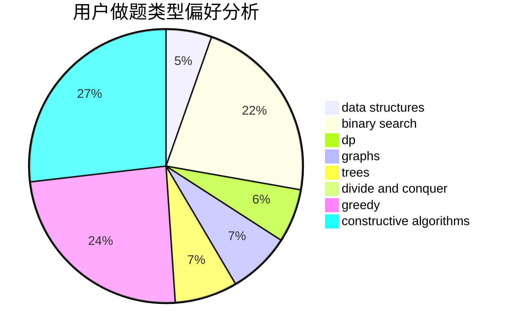

# KaladinStormblessed

<!-- tabs:start -->

#### **用户提交结果分析**

#### **用户做题类型偏好分析**

#### **用户错题知识点分析**

<!-- tabs:end -->
# 推荐题目
[1196C](https://codeforces.com/contest/1196/problem/C)		implementation		  
[1303E](https://codeforces.com/contest/1303/problem/E)		dp,
                        strings		  
[276C](https://codeforces.com/contest/276/problem/C)		data structures,
                        greedy,
                        implementation,
                        sortings		  
[838C](https://codeforces.com/contest/838/problem/C)		dp,
                        games		  
[584D](https://codeforces.com/contest/584/problem/D)		brute force,
                        math,
                        number theory		  
[879A](https://codeforces.com/contest/879/problem/A)		implementation		  
[612B](https://codeforces.com/contest/612/problem/B)		implementation,
                        math		  
[734A](https://codeforces.com/contest/734/problem/A)		implementation,
                        strings		  
[510E](https://codeforces.com/contest/510/problem/E)		flows		  
[92B](https://codeforces.com/contest/92/problem/B)		greedy		  
