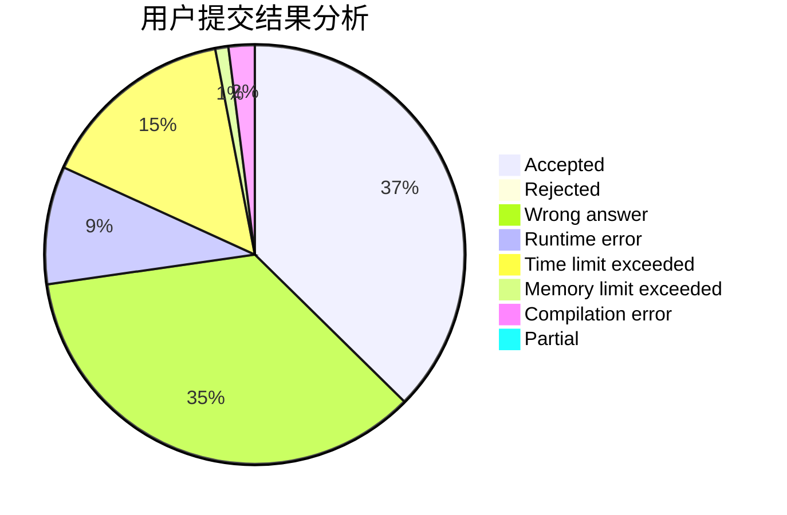
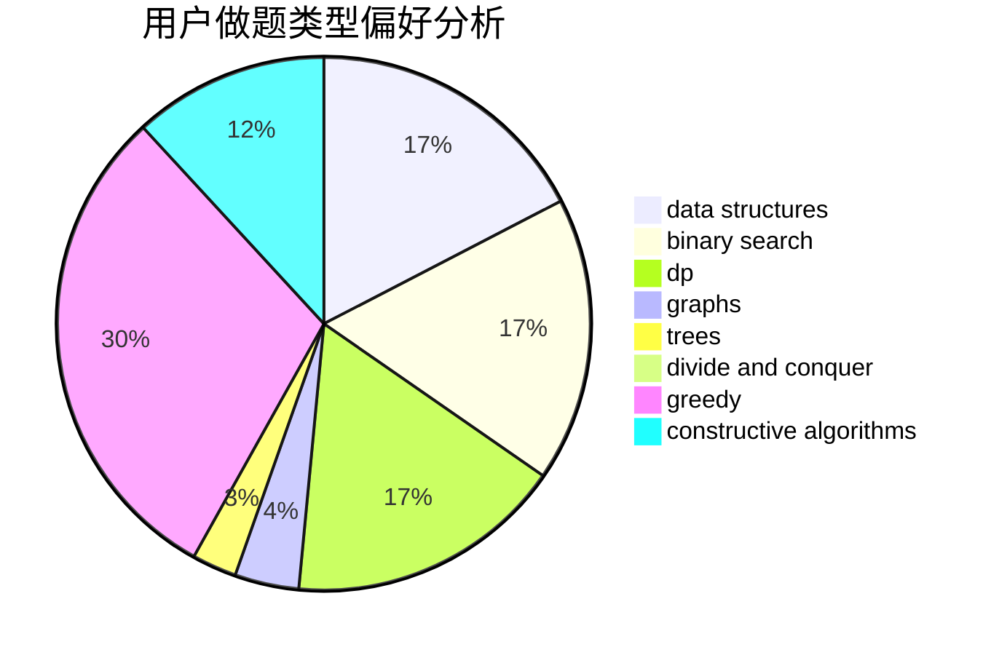
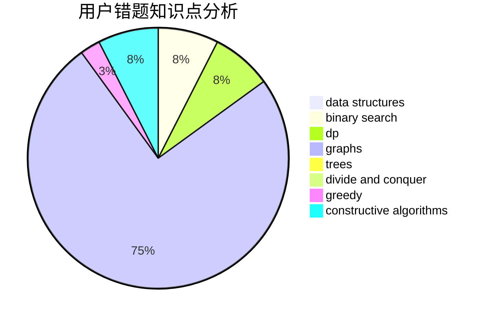

# Kaltsit
<!-- tabs:start -->
#### **用户提交结果分析**

#### **用户做题类型偏好分析**

#### **用户错题知识点分析**

<!-- tabs:end -->
# 推荐题目
[Nanosoft](http://codeforces.com/problemset/problem/1301/E)		binary search,
                        data structures,
                        dp,
                        implementation		  
[Replace To Make Regular Bracket Sequence](http://codeforces.com/problemset/problem/612/C)		data structures,
                        expression parsing,
                        math		  
[Vacations](https://codeforces.com/contest/699/problem/C)		dp		  
[ZgukistringZ](http://codeforces.com/problemset/problem/551/B)		brute force,
                        constructive algorithms,
                        implementation,
                        strings		  
[Roads](http://codeforces.com/problemset/problem/1402/B)		*special problem,
                        geometry,
                        sortings		  
[Cubes](https://codeforces.com/contest/521/problem/B)		games,
                        greedy,
                        implementation		  
[Restore Graph](http://codeforces.com/problemset/problem/404/C)		dfs and similar,
                        graphs,
                        sortings		  
[Niyaz and Small Degrees](http://codeforces.com/problemset/problem/1119/F)		data structures,
                        dp,
                        trees		  
[Snake](http://codeforces.com/problemset/problem/225/D)		bitmasks,
                        dfs and similar,
                        graphs,
                        implementation		  
[Almost Regular Bracket Sequence](http://codeforces.com/problemset/problem/1095/E)		implementation		  
<!-- tabs:start -->
#### **data structures**
[Nanosoft](http://codeforces.com/problemset/problem/1301/E)		binary search,
                        data structures,
                        dp,
                        implementation		  
[Replace To Make Regular Bracket Sequence](http://codeforces.com/problemset/problem/612/C)		data structures,
                        expression parsing,
                        math		  
[Vacations](http://codeforces.com/problemset/problem/1119/F)		data structures,
                        dp,
                        trees		  
[ZgukistringZ](http://codeforces.com/problemset/problem/580/E)		data structures,
                        hashing,
                        strings		  
[Roads](http://codeforces.com/problemset/problem/768/G)		binary search,
                        data structures		  
[Cubes](https://codeforces.com/contest/860/problem/B)		data structures,
                        implementation,
                        sortings		  
[Restore Graph](http://codeforces.com/problemset/problem/208/E)		binary search,
                        data structures,
                        dfs and similar,
                        trees		  
[Niyaz and Small Degrees](http://codeforces.com/problemset/problem/1364/A)		brute force,
                        data structures,
                        number theory,
                        two pointers		  
[Snake](http://codeforces.com/problemset/problem/1257/E)		data structures,
                        dp,
                        greedy		  
[Almost Regular Bracket Sequence](http://codeforces.com/problemset/problem/1430/C)		constructive algorithms,
                        data structures,
                        greedy,
                        implementation,
                        math		  
#### **binary search**
[Nanosoft](http://codeforces.com/problemset/problem/1301/E)		binary search,
                        data structures,
                        dp,
                        implementation		  
[Replace To Make Regular Bracket Sequence](http://codeforces.com/problemset/problem/1413/C)		binary search,
                        brute force,
                        dp,
                        implementation,
                        sortings,
                        two pointers		  
[Vacations](http://codeforces.com/problemset/problem/768/G)		binary search,
                        data structures		  
[ZgukistringZ](http://codeforces.com/problemset/problem/208/E)		binary search,
                        data structures,
                        dfs and similar,
                        trees		  
[Roads](http://codeforces.com/problemset/problem/1119/D)		binary search,
                        sortings		  
[Cubes](http://codeforces.com/problemset/problem/1492/C)		binary search,
                        data structures,
                        dp,
                        greedy,
                        two pointers		  
[Restore Graph](http://codeforces.com/problemset/problem/1463/D)		binary search,
                        constructive algorithms,
                        greedy,
                        two pointers		  
[Niyaz and Small Degrees](http://codeforces.com/problemset/problem/1490/G)		binary search,
                        data structures,
                        math		  
[Snake](http://codeforces.com/problemset/problem/1479/D)		binary search,
                        bitmasks,
                        brute force,
                        data structures,
                        probabilities,
                        trees		  
[Almost Regular Bracket Sequence](http://codeforces.com/problemset/problem/1436/E)		binary search,
                        data structures,
                        two pointers		  
#### **dp**
[Nanosoft](http://codeforces.com/problemset/problem/1301/E)		binary search,
                        data structures,
                        dp,
                        implementation		  
[Replace To Make Regular Bracket Sequence](https://codeforces.com/contest/699/problem/C)		dp		  
[Vacations](http://codeforces.com/problemset/problem/1119/F)		data structures,
                        dp,
                        trees		  
[ZgukistringZ](http://codeforces.com/problemset/problem/1413/C)		binary search,
                        brute force,
                        dp,
                        implementation,
                        sortings,
                        two pointers		  
[Roads](http://codeforces.com/problemset/problem/432/D)		dp,
                        string suffix structures,
                        strings,
                        two pointers		  
[Cubes](http://codeforces.com/problemset/problem/696/C)		combinatorics,
                        dp,
                        implementation,
                        math,
                        matrices		  
[Restore Graph](http://codeforces.com/problemset/problem/1257/E)		data structures,
                        dp,
                        greedy		  
[Niyaz and Small Degrees](http://codeforces.com/problemset/problem/1492/C)		binary search,
                        data structures,
                        dp,
                        greedy,
                        two pointers		  
[Snake](https://codeforces.com/contest/1457/problem/C)		brute force,
                        dp,
                        implementation		  
[Almost Regular Bracket Sequence](http://codeforces.com/problemset/problem/1491/C)		brute force,
                        data structures,
                        dp,
                        greedy,
                        implementation		  
#### **graph**
[Nanosoft](http://codeforces.com/problemset/problem/404/C)		dfs and similar,
                        graphs,
                        sortings		  
[Replace To Make Regular Bracket Sequence](http://codeforces.com/problemset/problem/225/D)		bitmasks,
                        dfs and similar,
                        graphs,
                        implementation		  
[Vacations](https://codeforces.com/contest/1464/problem/A)		dfs and similar,
                        dsu,
                        graphs		  
[ZgukistringZ](http://codeforces.com/problemset/problem/1381/C)		constructive algorithms,
                        graph matchings,
                        greedy,
                        implementation,
                        sortings,
                        two pointers		  
[Roads](http://codeforces.com/problemset/problem/1487/C)		brute force,
                        constructive algorithms,
                        dfs and similar,
                        graphs,
                        greedy,
                        implementation,
                        math		  
[Cubes](http://codeforces.com/problemset/problem/1437/C)		dp,
                        flows,
                        graph matchings,
                        greedy,
                        math,
                        sortings		  
[Restore Graph](http://codeforces.com/problemset/problem/1470/D)		constructive algorithms,
                        dfs and similar,
                        graph matchings,
                        graphs,
                        greedy		  
[Niyaz and Small Degrees](http://codeforces.com/problemset/problem/1476/C)		dp,
                        graphs,
                        greedy		  
[Snake](http://codeforces.com/problemset/problem/1304/D)		constructive algorithms,
                        graphs,
                        greedy,
                        two pointers		  
[Almost Regular Bracket Sequence](http://codeforces.com/problemset/problem/1475/C)		combinatorics,
                        graphs,
                        math		  
#### **trees**
[Nanosoft](http://codeforces.com/problemset/problem/1119/F)		data structures,
                        dp,
                        trees		  
[Replace To Make Regular Bracket Sequence](http://codeforces.com/problemset/problem/208/E)		binary search,
                        data structures,
                        dfs and similar,
                        trees		  
[Vacations](http://codeforces.com/problemset/problem/1479/D)		binary search,
                        bitmasks,
                        brute force,
                        data structures,
                        probabilities,
                        trees		  
[ZgukistringZ](http://codeforces.com/problemset/problem/1511/C)		brute force,
                        data structures,
                        implementation,
                        trees		  
[Roads](http://codeforces.com/problemset/problem/1499/F)		combinatorics,
                        dfs and similar,
                        dp,
                        trees		  
[Cubes](http://codeforces.com/problemset/problem/1491/E)		brute force,
                        dfs and similar,
                        divide and conquer,
                        number theory,
                        trees		  
[Restore Graph](http://codeforces.com/problemset/problem/1466/D)		data structures,
                        greedy,
                        sortings,
                        trees		  
[Niyaz and Small Degrees](http://codeforces.com/problemset/problem/1495/D)		combinatorics,
                        dfs and similar,
                        graphs,
                        math,
                        shortest paths,
                        trees		  
[Snake](http://codeforces.com/problemset/problem/1303/G)		data structures,
                        divide and conquer,
                        geometry,
                        trees		  
[Almost Regular Bracket Sequence](http://codeforces.com/problemset/problem/1454/E)		combinatorics,
                        dfs and similar,
                        graphs,
                        trees		  
#### **divide and conquer**
[Nanosoft](http://codeforces.com/problemset/problem/1461/D)		binary search,
                        brute force,
                        data structures,
                        divide and conquer,
                        implementation,
                        sortings		  
[Replace To Make Regular Bracket Sequence](http://codeforces.com/problemset/problem/1466/G)		combinatorics,
                        divide and conquer,
                        hashing,
                        math,
                        string suffix structures,
                        strings		  
[Vacations](http://codeforces.com/problemset/problem/1490/D)		dfs and similar,
                        divide and conquer,
                        implementation		  
[ZgukistringZ](https://codeforces.com/contest/1483/problem/C)		data structures,
                        divide and conquer,
                        dp		  
[Roads](http://codeforces.com/problemset/problem/1491/E)		brute force,
                        dfs and similar,
                        divide and conquer,
                        number theory,
                        trees		  
[Cubes](http://codeforces.com/problemset/problem/1303/G)		data structures,
                        divide and conquer,
                        geometry,
                        trees		  
[Restore Graph](http://codeforces.com/problemset/problem/1494/D)		constructive algorithms,
                        data structures,
                        dfs and similar,
                        divide and conquer,
                        dsu,
                        greedy,
                        sortings,
                        trees		  
[Niyaz and Small Degrees](http://codeforces.com/problemset/problem/1482/E)		data structures,
                        divide and conquer,
                        dp		  
[Snake](http://codeforces.com/problemset/problem/566/C)		dfs and similar,
                        divide and conquer,
                        trees		  
[Almost Regular Bracket Sequence](http://codeforces.com/problemset/problem/1428/F)		binary search,
                        data structures,
                        divide and conquer,
                        dp,
                        two pointers		  
#### **greedy**
[Nanosoft](https://codeforces.com/contest/521/problem/B)		games,
                        greedy,
                        implementation		  
[Replace To Make Regular Bracket Sequence](http://codeforces.com/problemset/problem/708/B)		constructive algorithms,
                        greedy,
                        implementation,
                        math		  
[Vacations](http://codeforces.com/problemset/problem/1189/B)		greedy,
                        math,
                        sortings		  
[ZgukistringZ](http://codeforces.com/problemset/problem/1257/E)		data structures,
                        dp,
                        greedy		  
[Roads](http://codeforces.com/problemset/problem/1430/C)		constructive algorithms,
                        data structures,
                        greedy,
                        implementation,
                        math		  
[Cubes](http://codeforces.com/problemset/problem/1178/C)		combinatorics,
                        greedy,
                        math		  
[Restore Graph](http://codeforces.com/problemset/problem/1381/C)		constructive algorithms,
                        graph matchings,
                        greedy,
                        implementation,
                        sortings,
                        two pointers		  
[Niyaz and Small Degrees](http://codeforces.com/problemset/problem/1492/C)		binary search,
                        data structures,
                        dp,
                        greedy,
                        two pointers		  
[Snake](https://codeforces.com/contest/1496/problem/C)		geometry,
                        greedy,
                        math,
                        sortings		  
[Almost Regular Bracket Sequence](http://codeforces.com/problemset/problem/1493/A)		constructive algorithms,
                        greedy		  
#### **constructive algorithms**
[Nanosoft](http://codeforces.com/problemset/problem/551/B)		brute force,
                        constructive algorithms,
                        implementation,
                        strings		  
[Replace To Make Regular Bracket Sequence](http://codeforces.com/problemset/problem/708/B)		constructive algorithms,
                        greedy,
                        implementation,
                        math		  
[Vacations](http://codeforces.com/problemset/problem/802/H)		constructive algorithms,
                        strings		  
[ZgukistringZ](http://codeforces.com/problemset/problem/1391/A)		constructive algorithms,
                        math		  
[Roads](http://codeforces.com/problemset/problem/1430/C)		constructive algorithms,
                        data structures,
                        greedy,
                        implementation,
                        math		  
[Cubes](http://codeforces.com/problemset/problem/1381/C)		constructive algorithms,
                        graph matchings,
                        greedy,
                        implementation,
                        sortings,
                        two pointers		  
[Restore Graph](http://codeforces.com/problemset/problem/1493/A)		constructive algorithms,
                        greedy		  
[Niyaz and Small Degrees](http://codeforces.com/problemset/problem/1463/D)		binary search,
                        constructive algorithms,
                        greedy,
                        two pointers		  
[Snake](https://codeforces.com/contest/1456/problem/B)		bitmasks,
                        brute force,
                        constructive algorithms		  
[Almost Regular Bracket Sequence](http://codeforces.com/problemset/problem/1492/D)		bitmasks,
                        constructive algorithms,
                        greedy,
                        math		  
#### **sortings**
[Nanosoft](http://codeforces.com/problemset/problem/1402/B)		*special problem,
                        geometry,
                        sortings		  
[Replace To Make Regular Bracket Sequence](http://codeforces.com/problemset/problem/404/C)		dfs and similar,
                        graphs,
                        sortings		  
[Vacations](http://codeforces.com/problemset/problem/1413/C)		binary search,
                        brute force,
                        dp,
                        implementation,
                        sortings,
                        two pointers		  
[ZgukistringZ](http://codeforces.com/problemset/problem/632/C)		sortings,
                        strings		  
[Roads](https://codeforces.com/contest/860/problem/B)		data structures,
                        implementation,
                        sortings		  
[Cubes](http://codeforces.com/problemset/problem/1189/B)		greedy,
                        math,
                        sortings		  
[Restore Graph](http://codeforces.com/problemset/problem/1119/D)		binary search,
                        sortings		  
[Niyaz and Small Degrees](http://codeforces.com/problemset/problem/1381/C)		constructive algorithms,
                        graph matchings,
                        greedy,
                        implementation,
                        sortings,
                        two pointers		  
[Snake](https://codeforces.com/contest/1496/problem/C)		geometry,
                        greedy,
                        math,
                        sortings		  
[Almost Regular Bracket Sequence](http://codeforces.com/problemset/problem/1495/A)		geometry,
                        greedy,
                        math,
                        sortings		  
<!-- tabs:end -->
