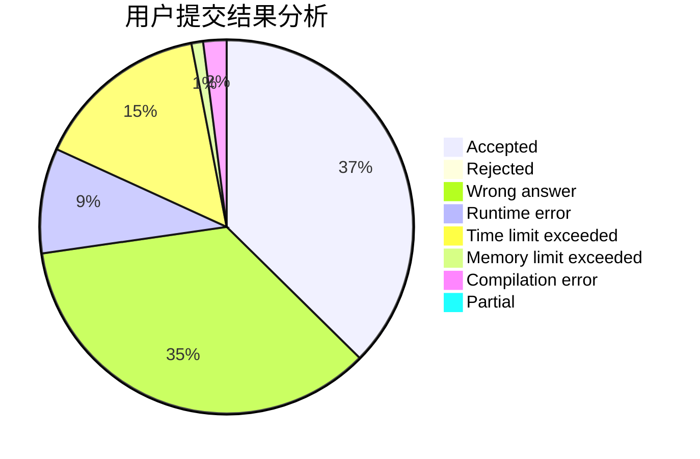
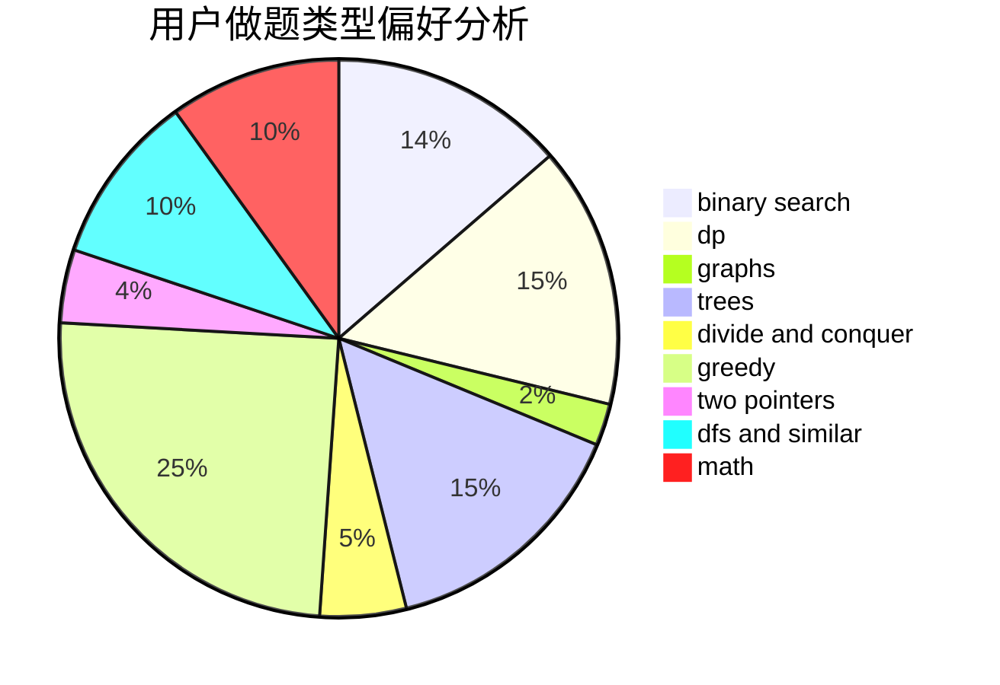

# Kaltsit

<!-- tabs:start -->

#### **用户提交结果分析**

#### **用户做题类型偏好分析**

<!-- tabs:end -->
# 推荐题目
[1422E](https://codeforces.com/contest/1422/problem/E)
[1413D](https://codeforces.com/contest/1413/problem/D)
[631E](https://codeforces.com/contest/631/problem/E)
[433B](https://codeforces.com/contest/433/problem/B)
[453D](https://codeforces.com/contest/453/problem/D)
[716B](https://codeforces.com/contest/716/problem/B)
[576C](https://codeforces.com/contest/576/problem/C)
[1129B](https://codeforces.com/contest/1129/problem/B)
[243D](https://codeforces.com/contest/243/problem/D)
[788E](https://codeforces.com/contest/788/problem/E)
