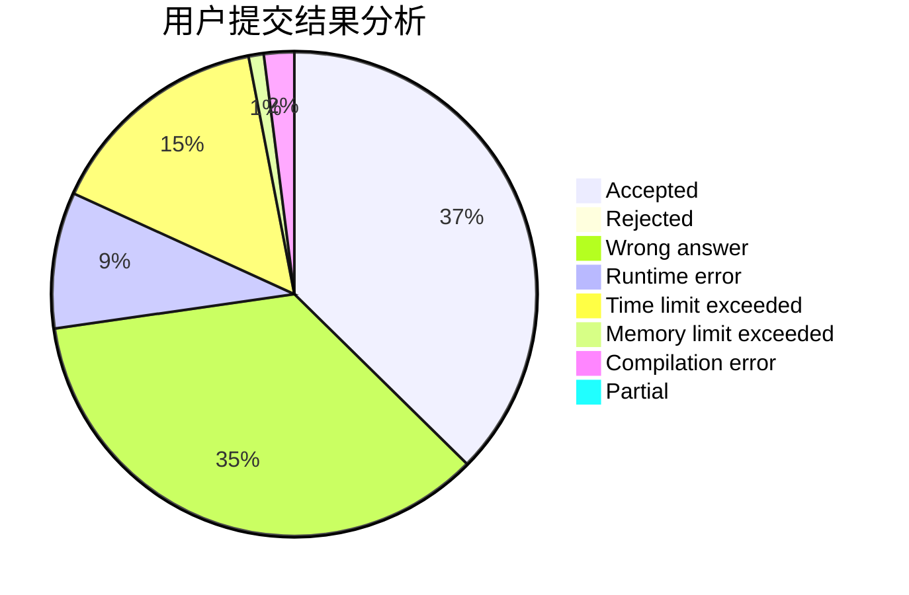
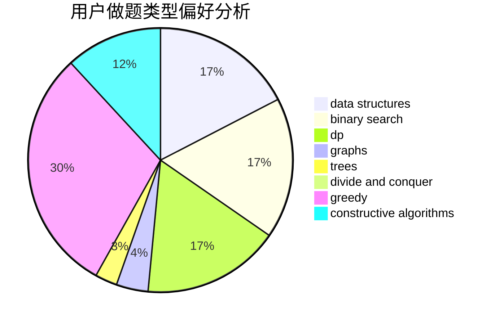
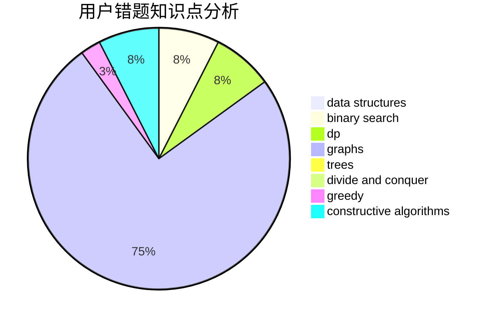

# Kaltsit

<!-- tabs:start -->

#### **用户提交结果分析**

#### **用户做题类型偏好分析**

#### **用户错题知识点分析**

<!-- tabs:end -->
# 推荐题目
[1413C](https://codeforces.com/contest/1413/problem/C)		binary search,
                        brute force,
                        dp,
                        implementation,
                        sortings,
                        two pointers		  
[1402B](https://codeforces.com/contest/1402/problem/B)		*special problem,
                        geometry,
                        sortings		  
[612C](https://codeforces.com/contest/612/problem/C)		data structures,
                        expression parsing,
                        math		  
[404C](https://codeforces.com/contest/404/problem/C)		dfs and similar,
                        graphs,
                        sortings		  
[432D](https://codeforces.com/contest/432/problem/D)		dp,
                        string suffix structures,
                        strings,
                        two pointers		  
[699C](https://codeforces.com/contest/699/problem/C)		dsu,graphs,sortings,trees		  
[551B](https://codeforces.com/contest/551/problem/B)		brute force,
                        constructive algorithms,
                        implementation,
                        strings		  
[1119F](https://codeforces.com/contest/1119/problem/F)		data structures,
                        dp,
                        trees		  
[225D](https://codeforces.com/contest/225/problem/D)		bitmasks,
                        dfs and similar,
                        graphs,
                        implementation		  
[768G](https://codeforces.com/contest/768/problem/G)		binary search,
                        data structures		  
