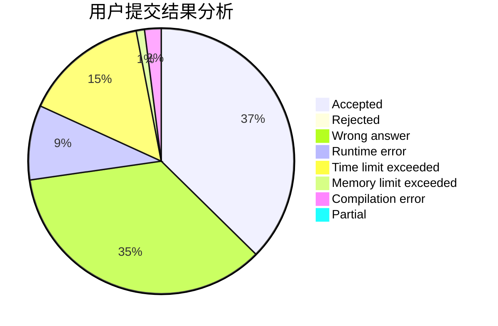
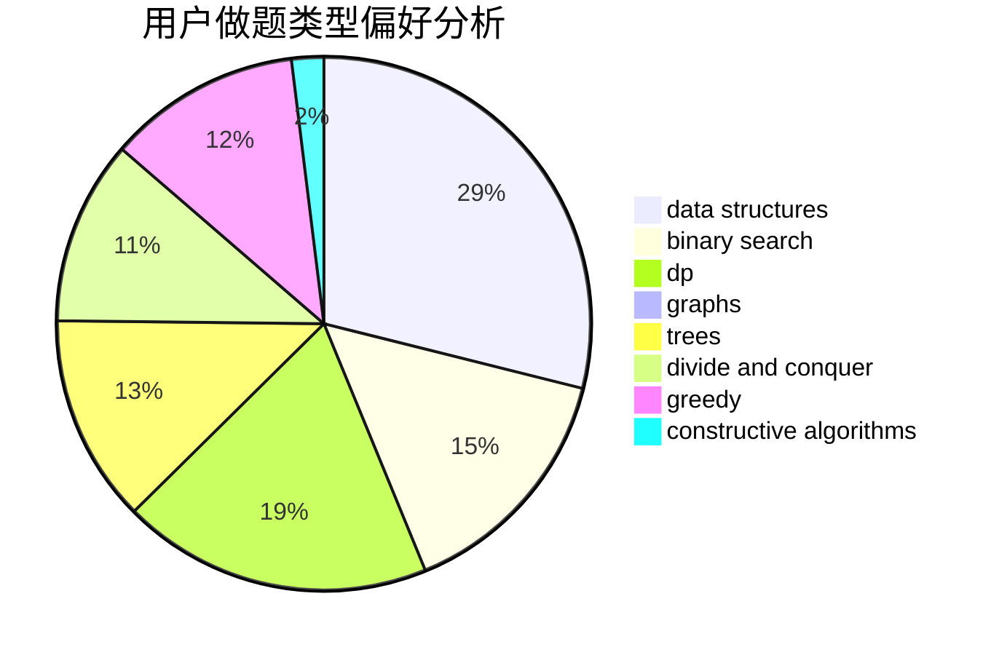
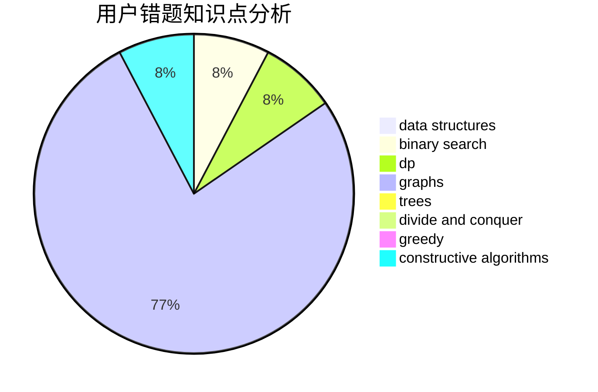

# Kaltsit

<!-- tabs:start -->

#### **用户提交结果分析**

#### **用户做题类型偏好分析**

#### **用户错题知识点分析**

<!-- tabs:end -->
# 推荐题目
[1422E](https://codeforces.com/contest/1422/problem/E)		dp,
                        greedy,
                        implementation,
                        strings		  
[1413D](https://codeforces.com/contest/1413/problem/D)		data structures,
                        greedy,
                        implementation		  
[631E](https://codeforces.com/contest/631/problem/E)		data structures,
                        dp,
                        geometry		  
[433B](https://codeforces.com/contest/433/problem/B)		dp,
                        implementation,
                        sortings		  
[453D](https://codeforces.com/contest/453/problem/D)		dp,
                        matrices		  
[716B](https://codeforces.com/contest/716/problem/B)		greedy,
                        two pointers		  
[576C](https://codeforces.com/contest/576/problem/C)		constructive algorithms,
                        divide and conquer,
                        geometry,
                        greedy,
                        sortings		  
[1129B](https://codeforces.com/contest/1129/problem/B)		constructive algorithms		  
[243D](https://codeforces.com/contest/243/problem/D)		data structures,
                        dp,
                        geometry,
                        two pointers		  
[788E](https://codeforces.com/contest/788/problem/E)		data structures		  
