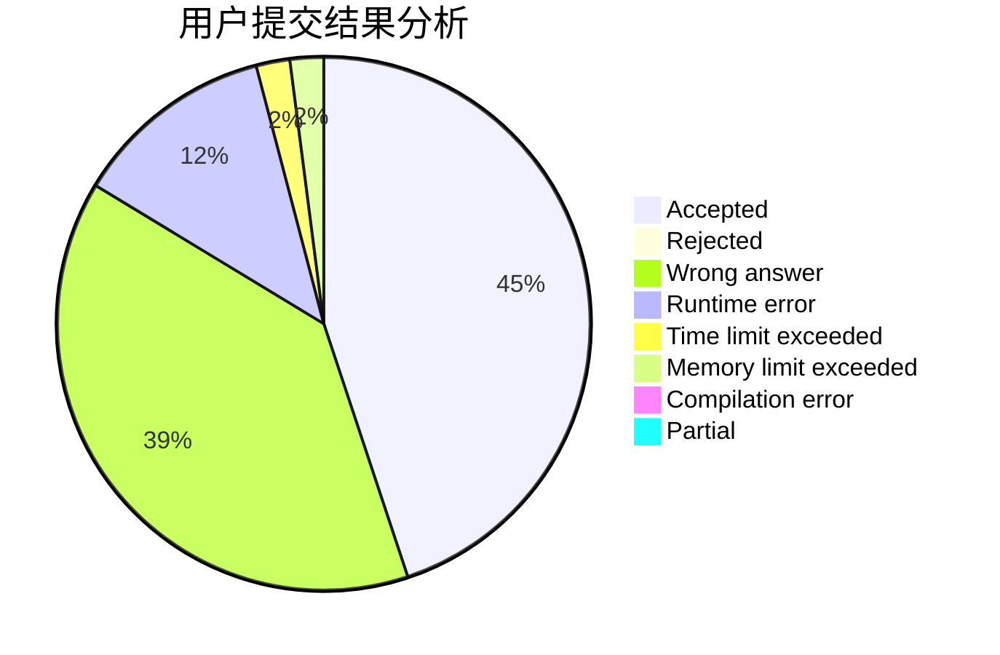
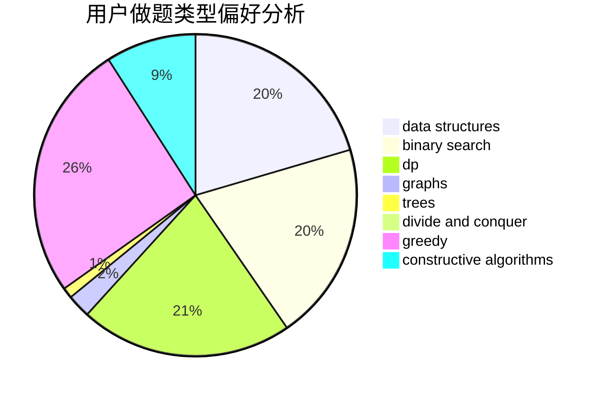
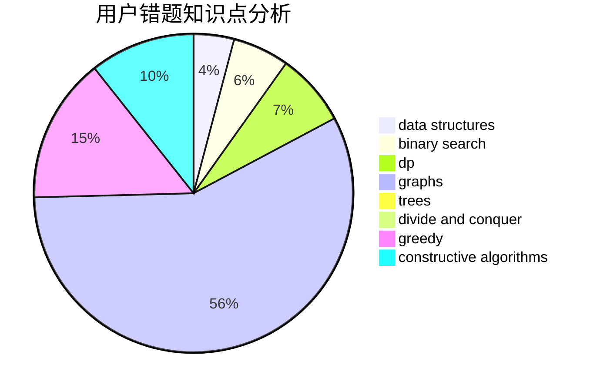

# Kaosu

<!-- tabs:start -->

#### **用户提交结果分析**

#### **用户做题类型偏好分析**

#### **用户错题知识点分析**

<!-- tabs:end -->
# 推荐题目
[664A](https://codeforces.com/contest/664/problem/A)		math,
                        number theory		  
[895B](https://codeforces.com/contest/895/problem/B)		binary search,
                        math,
                        sortings,
                        two pointers		  
[938B](https://codeforces.com/contest/938/problem/B)		brute force,
                        greedy		  
[768C](https://codeforces.com/contest/768/problem/C)		brute force,
                        dp,
                        implementation,
                        sortings		  
[256D](https://codeforces.com/contest/256/problem/D)		dp		  
[516C](https://codeforces.com/contest/516/problem/C)		dsu,graphs,sortings,trees		  
[25D](https://codeforces.com/contest/25/problem/D)		dsu,
                        graphs,
                        trees		  
[598B](https://codeforces.com/contest/598/problem/B)		implementation,
                        strings		  
[538C](https://codeforces.com/contest/538/problem/C)		binary search,
                        brute force,
                        greedy,
                        implementation,
                        math		  
[1296F](https://codeforces.com/contest/1296/problem/F)		constructive algorithms,
                        dfs and similar,
                        greedy,
                        sortings,
                        trees		  
