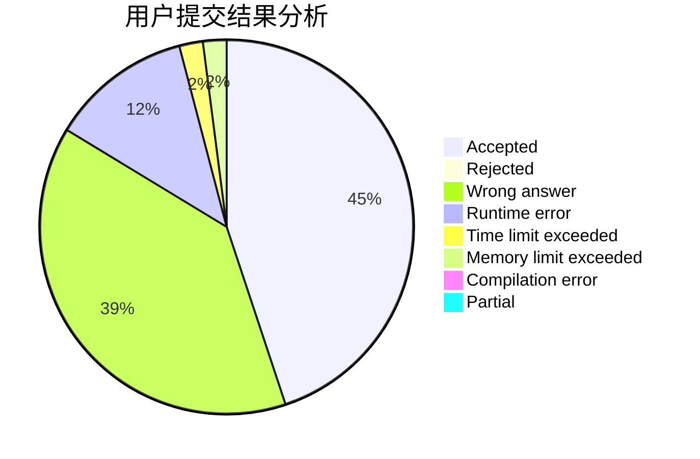
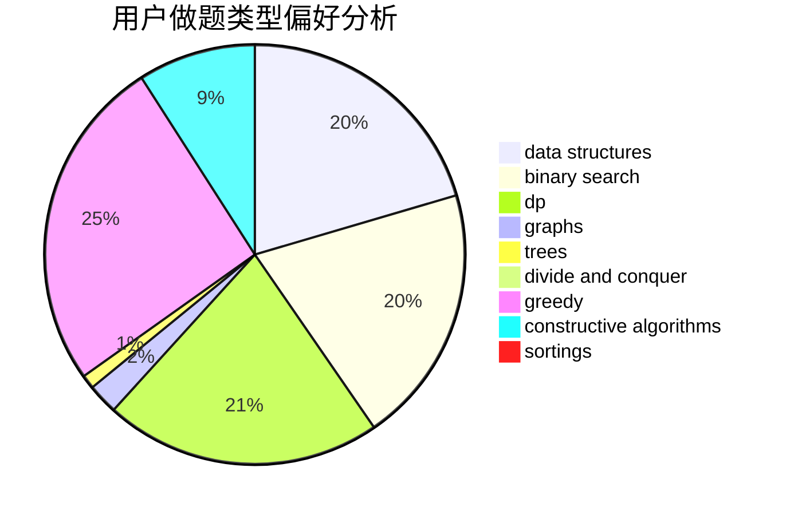
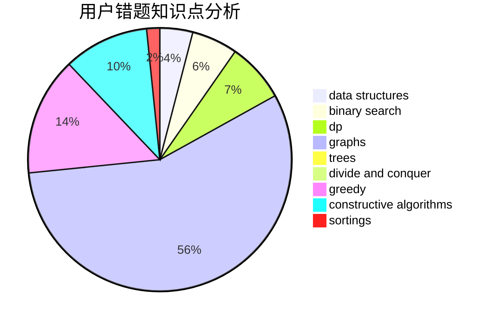

# Kaosu
<!-- tabs:start -->
#### **用户提交结果分析**

#### **用户做题类型偏好分析**

#### **用户错题知识点分析**

<!-- tabs:end -->
# 推荐题目
[1208G](http://codeforces.com/problemset/problem/1208/G)		greedy,
                        math,
                        number theory		  
[1433G](http://codeforces.com/problemset/problem/1433/G)		brute force,
                        graphs,
                        shortest paths		  
[664A](http://codeforces.com/problemset/problem/664/A)		math,
                        number theory		  
[938B](http://codeforces.com/problemset/problem/938/B)		brute force,
                        greedy		  
[895B](http://codeforces.com/problemset/problem/895/B)		binary search,
                        math,
                        sortings,
                        two pointers		  
[598B](http://codeforces.com/problemset/problem/598/B)		implementation,
                        strings		  
[4B](http://codeforces.com/problemset/problem/4/B)		constructive algorithms,
                        greedy		  
[516C](https://codeforces.com/contest/516/problem/C)		data structures		  
[1296F](http://codeforces.com/problemset/problem/1296/F)		constructive algorithms,
                        dfs and similar,
                        greedy,
                        sortings,
                        trees		  
[1113C](https://codeforces.com/contest/1113/problem/C)		dp,
                        implementation		  
<!-- tabs:start -->
#### **data structures**
[516C](https://codeforces.com/contest/516/problem/C)		data structures		  
[610E](http://codeforces.com/problemset/problem/610/E)		data structures,
                        strings		  
[749D](http://codeforces.com/problemset/problem/749/D)		binary search,
                        data structures		  
[397E](https://codeforces.com/contest/397/problem/E)		data structures,
                        graphs,
                        trees		  
[1137F](http://codeforces.com/problemset/problem/1137/F)		data structures,
                        trees		  
[766D](http://codeforces.com/problemset/problem/766/D)		data structures,
                        dfs and similar,
                        dp,
                        dsu,
                        graphs		  
[1265E](http://codeforces.com/problemset/problem/1265/E)		data structures,
                        dp,
                        math,
                        probabilities		  
[766E](http://codeforces.com/problemset/problem/766/E)		bitmasks,
                        constructive algorithms,
                        data structures,
                        dfs and similar,
                        dp,
                        math,
                        trees		  
[1382C2](https://codeforces.com/contest/1382/problem/C2)		constructive algorithms,
                        data structures,
                        implementation,
                        strings,
                        two pointers		  
[1370E](http://codeforces.com/problemset/problem/1370/E)		binary search,
                        constructive algorithms,
                        data structures,
                        greedy		  
#### **binary search**
[895B](http://codeforces.com/problemset/problem/895/B)		binary search,
                        math,
                        sortings,
                        two pointers		  
[538C](http://codeforces.com/problemset/problem/538/C)		binary search,
                        brute force,
                        greedy,
                        implementation,
                        math		  
[749D](http://codeforces.com/problemset/problem/749/D)		binary search,
                        data structures		  
[701C](http://codeforces.com/problemset/problem/701/C)		binary search,
                        strings,
                        two pointers		  
[360B](http://codeforces.com/problemset/problem/360/B)		binary search,
                        dp		  
[1370E](http://codeforces.com/problemset/problem/1370/E)		binary search,
                        constructive algorithms,
                        data structures,
                        greedy		  
[1423B](http://codeforces.com/problemset/problem/1423/B)		binary search,
                        flows,
                        graph matchings,
                        graphs		  
[1492C](http://codeforces.com/problemset/problem/1492/C)		binary search,
                        data structures,
                        dp,
                        greedy,
                        two pointers		  
[1463D](http://codeforces.com/problemset/problem/1463/D)		binary search,
                        constructive algorithms,
                        greedy,
                        two pointers		  
[1490G](http://codeforces.com/problemset/problem/1490/G)		binary search,
                        data structures,
                        math		  
#### **dp**
[1113C](https://codeforces.com/contest/1113/problem/C)		dp,
                        implementation		  
[489B](http://codeforces.com/problemset/problem/489/B)		dfs and similar,
                        dp,
                        graph matchings,
                        greedy,
                        sortings,
                        two pointers		  
[11D](http://codeforces.com/problemset/problem/11/D)		bitmasks,
                        dp,
                        graphs		  
[768C](http://codeforces.com/problemset/problem/768/C)		brute force,
                        dp,
                        implementation,
                        sortings		  
[256D](http://codeforces.com/problemset/problem/256/D)		dp		  
[1379E](http://codeforces.com/problemset/problem/1379/E)		constructive algorithms,
                        divide and conquer,
                        dp,
                        math,
                        trees		  
[766D](http://codeforces.com/problemset/problem/766/D)		data structures,
                        dfs and similar,
                        dp,
                        dsu,
                        graphs		  
[1265E](http://codeforces.com/problemset/problem/1265/E)		data structures,
                        dp,
                        math,
                        probabilities		  
[360B](http://codeforces.com/problemset/problem/360/B)		binary search,
                        dp		  
[766E](http://codeforces.com/problemset/problem/766/E)		bitmasks,
                        constructive algorithms,
                        data structures,
                        dfs and similar,
                        dp,
                        math,
                        trees		  
#### **graph**
[1433G](http://codeforces.com/problemset/problem/1433/G)		brute force,
                        graphs,
                        shortest paths		  
[489B](http://codeforces.com/problemset/problem/489/B)		dfs and similar,
                        dp,
                        graph matchings,
                        greedy,
                        sortings,
                        two pointers		  
[11D](http://codeforces.com/problemset/problem/11/D)		bitmasks,
                        dp,
                        graphs		  
[25D](http://codeforces.com/problemset/problem/25/D)		dsu,
                        graphs,
                        trees		  
[500D](http://codeforces.com/problemset/problem/500/D)		combinatorics,
                        dfs and similar,
                        graphs,
                        trees		  
[397E](https://codeforces.com/contest/397/problem/E)		data structures,
                        graphs,
                        trees		  
[1255B](http://codeforces.com/problemset/problem/1255/B)		graphs,
                        implementation		  
[1338E](http://codeforces.com/problemset/problem/1338/E)		graphs		  
[766D](http://codeforces.com/problemset/problem/766/D)		data structures,
                        dfs and similar,
                        dp,
                        dsu,
                        graphs		  
[1423B](http://codeforces.com/problemset/problem/1423/B)		binary search,
                        flows,
                        graph matchings,
                        graphs		  
#### **trees**
[1296F](http://codeforces.com/problemset/problem/1296/F)		constructive algorithms,
                        dfs and similar,
                        greedy,
                        sortings,
                        trees		  
[25D](http://codeforces.com/problemset/problem/25/D)		dsu,
                        graphs,
                        trees		  
[500D](http://codeforces.com/problemset/problem/500/D)		combinatorics,
                        dfs and similar,
                        graphs,
                        trees		  
[397E](https://codeforces.com/contest/397/problem/E)		data structures,
                        graphs,
                        trees		  
[1137F](http://codeforces.com/problemset/problem/1137/F)		data structures,
                        trees		  
[1379E](http://codeforces.com/problemset/problem/1379/E)		constructive algorithms,
                        divide and conquer,
                        dp,
                        math,
                        trees		  
[766E](http://codeforces.com/problemset/problem/766/E)		bitmasks,
                        constructive algorithms,
                        data structures,
                        dfs and similar,
                        dp,
                        math,
                        trees		  
[1479D](http://codeforces.com/problemset/problem/1479/D)		binary search,
                        bitmasks,
                        brute force,
                        data structures,
                        probabilities,
                        trees		  
[1511C](http://codeforces.com/problemset/problem/1511/C)		brute force,
                        data structures,
                        implementation,
                        trees		  
[1499F](http://codeforces.com/problemset/problem/1499/F)		combinatorics,
                        dfs and similar,
                        dp,
                        trees		  
#### **divide and conquer**
[1379E](http://codeforces.com/problemset/problem/1379/E)		constructive algorithms,
                        divide and conquer,
                        dp,
                        math,
                        trees		  
[1461D](http://codeforces.com/problemset/problem/1461/D)		binary search,
                        brute force,
                        data structures,
                        divide and conquer,
                        implementation,
                        sortings		  
[1466G](http://codeforces.com/problemset/problem/1466/G)		combinatorics,
                        divide and conquer,
                        hashing,
                        math,
                        string suffix structures,
                        strings		  
[1490D](http://codeforces.com/problemset/problem/1490/D)		dfs and similar,
                        divide and conquer,
                        implementation		  
[1483C](https://codeforces.com/contest/1483/problem/C)		data structures,
                        divide and conquer,
                        dp		  
[1491E](http://codeforces.com/problemset/problem/1491/E)		brute force,
                        dfs and similar,
                        divide and conquer,
                        number theory,
                        trees		  
[1303G](http://codeforces.com/problemset/problem/1303/G)		data structures,
                        divide and conquer,
                        geometry,
                        trees		  
[1494D](http://codeforces.com/problemset/problem/1494/D)		constructive algorithms,
                        data structures,
                        dfs and similar,
                        divide and conquer,
                        dsu,
                        greedy,
                        sortings,
                        trees		  
[1482E](http://codeforces.com/problemset/problem/1482/E)		data structures,
                        divide and conquer,
                        dp		  
[566C](http://codeforces.com/problemset/problem/566/C)		dfs and similar,
                        divide and conquer,
                        trees		  
#### **greedy**
[1208G](http://codeforces.com/problemset/problem/1208/G)		greedy,
                        math,
                        number theory		  
[938B](http://codeforces.com/problemset/problem/938/B)		brute force,
                        greedy		  
[4B](http://codeforces.com/problemset/problem/4/B)		constructive algorithms,
                        greedy		  
[1296F](http://codeforces.com/problemset/problem/1296/F)		constructive algorithms,
                        dfs and similar,
                        greedy,
                        sortings,
                        trees		  
[1061A](http://codeforces.com/problemset/problem/1061/A)		greedy,
                        implementation,
                        math		  
[489B](http://codeforces.com/problemset/problem/489/B)		dfs and similar,
                        dp,
                        graph matchings,
                        greedy,
                        sortings,
                        two pointers		  
[538C](http://codeforces.com/problemset/problem/538/C)		binary search,
                        brute force,
                        greedy,
                        implementation,
                        math		  
[115B](http://codeforces.com/problemset/problem/115/B)		greedy,
                        sortings		  
[381A](http://codeforces.com/problemset/problem/381/A)		greedy,
                        implementation,
                        two pointers		  
[1204B](http://codeforces.com/problemset/problem/1204/B)		greedy,
                        math		  
#### **constructive algorithms**
[4B](http://codeforces.com/problemset/problem/4/B)		constructive algorithms,
                        greedy		  
[1296F](http://codeforces.com/problemset/problem/1296/F)		constructive algorithms,
                        dfs and similar,
                        greedy,
                        sortings,
                        trees		  
[1379E](http://codeforces.com/problemset/problem/1379/E)		constructive algorithms,
                        divide and conquer,
                        dp,
                        math,
                        trees		  
[768A](http://codeforces.com/problemset/problem/768/A)		constructive algorithms,
                        sortings		  
[766E](http://codeforces.com/problemset/problem/766/E)		bitmasks,
                        constructive algorithms,
                        data structures,
                        dfs and similar,
                        dp,
                        math,
                        trees		  
[1382C2](https://codeforces.com/contest/1382/problem/C2)		constructive algorithms,
                        data structures,
                        implementation,
                        strings,
                        two pointers		  
[1370E](http://codeforces.com/problemset/problem/1370/E)		binary search,
                        constructive algorithms,
                        data structures,
                        greedy		  
[1469D](http://codeforces.com/problemset/problem/1469/D)		brute force,
                        constructive algorithms,
                        math,
                        number theory		  
[766A](http://codeforces.com/problemset/problem/766/A)		constructive algorithms,
                        strings		  
[1504A](http://codeforces.com/problemset/problem/1504/A)		constructive algorithms,
                        strings		  
#### **sortings**
[895B](http://codeforces.com/problemset/problem/895/B)		binary search,
                        math,
                        sortings,
                        two pointers		  
[1296F](http://codeforces.com/problemset/problem/1296/F)		constructive algorithms,
                        dfs and similar,
                        greedy,
                        sortings,
                        trees		  
[489B](http://codeforces.com/problemset/problem/489/B)		dfs and similar,
                        dp,
                        graph matchings,
                        greedy,
                        sortings,
                        two pointers		  
[768C](http://codeforces.com/problemset/problem/768/C)		brute force,
                        dp,
                        implementation,
                        sortings		  
[115B](http://codeforces.com/problemset/problem/115/B)		greedy,
                        sortings		  
[768A](http://codeforces.com/problemset/problem/768/A)		constructive algorithms,
                        sortings		  
[1496C](https://codeforces.com/contest/1496/problem/C)		geometry,
                        greedy,
                        math,
                        sortings		  
[1495A](http://codeforces.com/problemset/problem/1495/A)		geometry,
                        greedy,
                        math,
                        sortings		  
[1497A](http://codeforces.com/problemset/problem/1497/A)		brute force,
                        data structures,
                        greedy,
                        sortings		  
[1427A](http://codeforces.com/problemset/problem/1427/A)		math,
                        sortings		  
<!-- tabs:end -->
