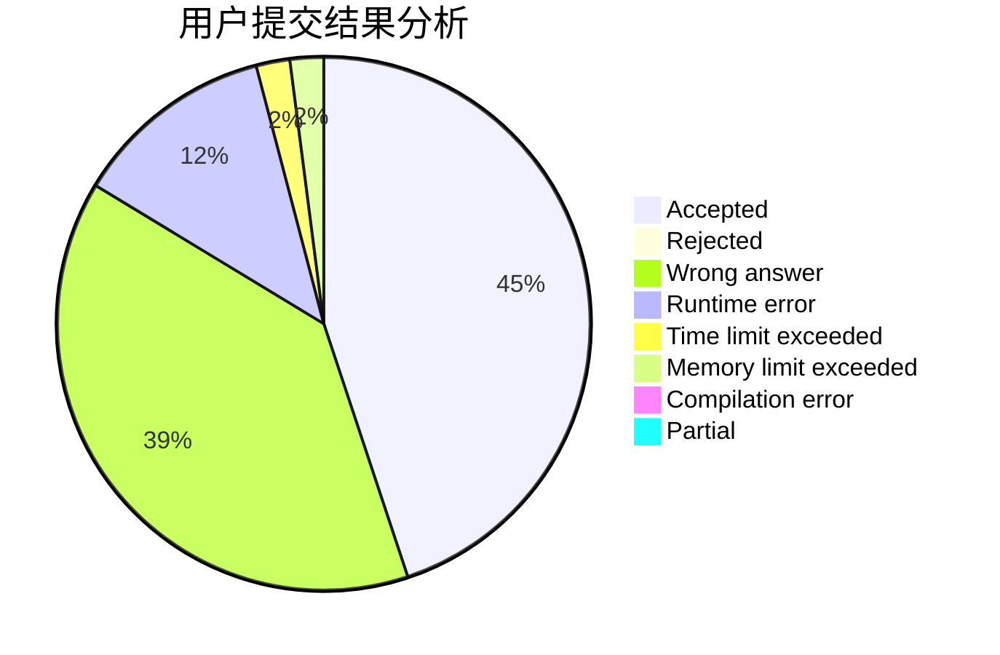
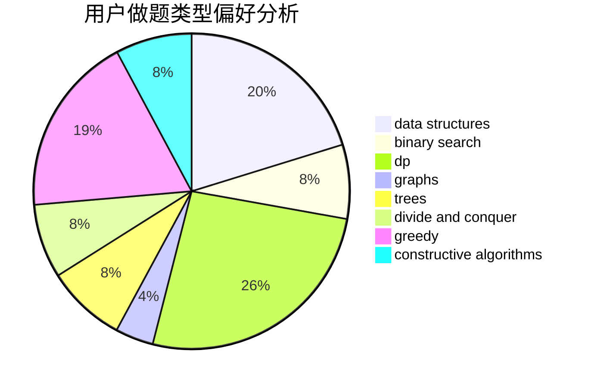
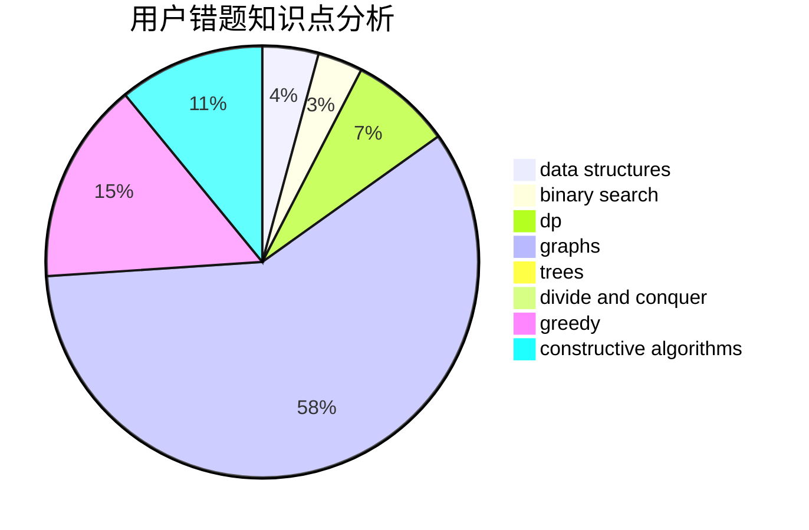

# Kaosu

<!-- tabs:start -->

#### **用户提交结果分析**

#### **用户做题类型偏好分析**

#### **用户错题知识点分析**

<!-- tabs:end -->
# 推荐题目
[683B](https://codeforces.com/contest/683/problem/B)		*special problem		  
[912E](https://codeforces.com/contest/912/problem/E)		binary search,
                        dfs and similar,
                        math,
                        meet-in-the-middle,
                        number theory,
                        two pointers		  
[95A](https://codeforces.com/contest/95/problem/A)		implementation,
                        strings		  
[788B](https://codeforces.com/contest/788/problem/B)		combinatorics,
                        constructive algorithms,
                        dfs and similar,
                        dsu,
                        graphs		  
[274C](https://codeforces.com/contest/274/problem/C)		brute force,
                        geometry		  
[543C](https://codeforces.com/contest/543/problem/C)		bitmasks,
                        dp		  
[277D](https://codeforces.com/contest/277/problem/D)		dp,
                        probabilities		  
[616A](https://codeforces.com/contest/616/problem/A)		implementation,
                        strings		  
[559D](https://codeforces.com/contest/559/problem/D)		combinatorics,
                        geometry,
                        probabilities		  
[13042](https://codeforces.com/contest/1304/problem/2)		dsu,graphs,sortings,trees		  
