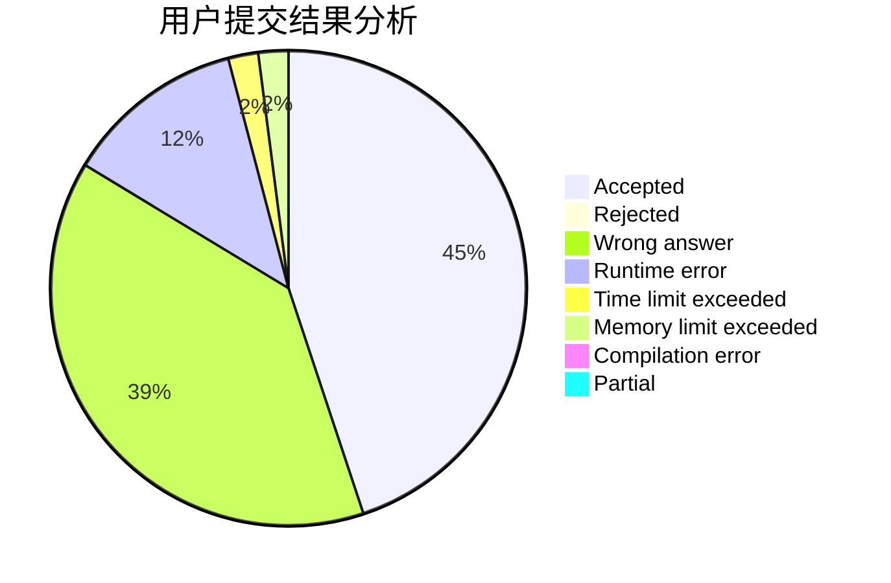
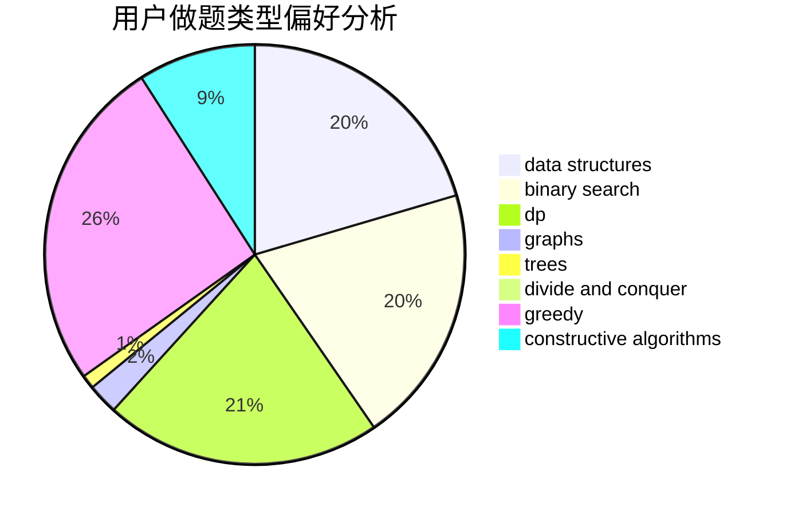
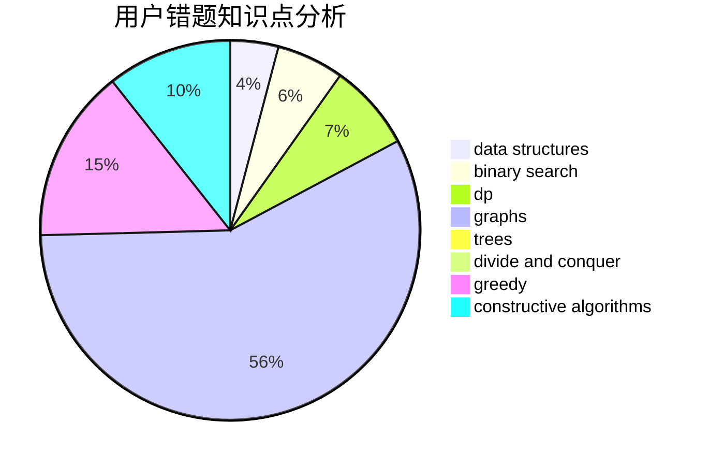

# Kaosu
<!-- tabs:start -->
#### **用户提交结果分析**

#### **用户做题类型偏好分析**

#### **用户错题知识点分析**

<!-- tabs:end -->
# 推荐题目
[Polygons](http://codeforces.com/problemset/problem/1208/G)		greedy,
                        math,
                        number theory		  
[Reducing Delivery Cost](http://codeforces.com/problemset/problem/1433/G)		brute force,
                        graphs,
                        shortest paths		  
[Complicated GCD](http://codeforces.com/problemset/problem/664/A)		math,
                        number theory		  
[Run For Your Prize](http://codeforces.com/problemset/problem/938/B)		brute force,
                        greedy		  
[XK Segments](http://codeforces.com/problemset/problem/895/B)		binary search,
                        math,
                        sortings,
                        two pointers		  
[Queries on a String](http://codeforces.com/problemset/problem/598/B)		implementation,
                        strings		  
[Before an Exam](http://codeforces.com/problemset/problem/4/B)		constructive algorithms,
                        greedy		  
[Drazil and Park](https://codeforces.com/contest/516/problem/C)		data structures		  
[Berland Beauty](http://codeforces.com/problemset/problem/1296/F)		constructive algorithms,
                        dfs and similar,
                        greedy,
                        sortings,
                        trees		  
[Sasha and a Bit of Relax](https://codeforces.com/contest/1113/problem/C)		dp,
                        implementation		  
<!-- tabs:start -->
#### **data structures**
[Drazil and Park](https://codeforces.com/contest/516/problem/C)		data structures		  
[Alphabet Permutations](http://codeforces.com/problemset/problem/610/E)		data structures,
                        strings		  
[Leaving Auction](http://codeforces.com/problemset/problem/749/D)		binary search,
                        data structures		  
[On Changing Tree](https://codeforces.com/contest/397/problem/E)		data structures,
                        graphs,
                        trees		  
[Matches Are Not a Child's Play](http://codeforces.com/problemset/problem/1137/F)		data structures,
                        trees		  
[Mahmoud and a Dictionary](http://codeforces.com/problemset/problem/766/D)		data structures,
                        dfs and similar,
                        dp,
                        dsu,
                        graphs		  
[Beautiful Mirrors](http://codeforces.com/problemset/problem/1265/E)		data structures,
                        dp,
                        math,
                        probabilities		  
[Mahmoud and a xor trip](http://codeforces.com/problemset/problem/766/E)		bitmasks,
                        constructive algorithms,
                        data structures,
                        dfs and similar,
                        dp,
                        math,
                        trees		  
[Prefix Flip (Hard Version)](https://codeforces.com/contest/1382/problem/C2)		constructive algorithms,
                        data structures,
                        implementation,
                        strings,
                        two pointers		  
[Binary Subsequence Rotation](http://codeforces.com/problemset/problem/1370/E)		binary search,
                        constructive algorithms,
                        data structures,
                        greedy		  
#### **binary search**
[XK Segments](http://codeforces.com/problemset/problem/895/B)		binary search,
                        math,
                        sortings,
                        two pointers		  
[Tourist's Notes](http://codeforces.com/problemset/problem/538/C)		binary search,
                        brute force,
                        greedy,
                        implementation,
                        math		  
[Leaving Auction](http://codeforces.com/problemset/problem/749/D)		binary search,
                        data structures		  
[They Are Everywhere](http://codeforces.com/problemset/problem/701/C)		binary search,
                        strings,
                        two pointers		  
[Levko and Array](http://codeforces.com/problemset/problem/360/B)		binary search,
                        dp		  
[Binary Subsequence Rotation](http://codeforces.com/problemset/problem/1370/E)		binary search,
                        constructive algorithms,
                        data structures,
                        greedy		  
[Valuable Paper](http://codeforces.com/problemset/problem/1423/B)		binary search,
                        flows,
                        graph matchings,
                        graphs		  
[Maximum width](http://codeforces.com/problemset/problem/1492/C)		binary search,
                        data structures,
                        dp,
                        greedy,
                        two pointers		  
[Pairs](http://codeforces.com/problemset/problem/1463/D)		binary search,
                        constructive algorithms,
                        greedy,
                        two pointers		  
[Old Floppy Drive](http://codeforces.com/problemset/problem/1490/G)		binary search,
                        data structures,
                        math		  
#### **dp**
[Sasha and a Bit of Relax](https://codeforces.com/contest/1113/problem/C)		dp,
                        implementation		  
[BerSU Ball](http://codeforces.com/problemset/problem/489/B)		dfs and similar,
                        dp,
                        graph matchings,
                        greedy,
                        sortings,
                        two pointers		  
[A Simple Task](http://codeforces.com/problemset/problem/11/D)		bitmasks,
                        dp,
                        graphs		  
[Jon Snow and his Favourite Number](http://codeforces.com/problemset/problem/768/C)		brute force,
                        dp,
                        implementation,
                        sortings		  
[Liars and Serge](http://codeforces.com/problemset/problem/256/D)		dp		  
[Inverse Genealogy](http://codeforces.com/problemset/problem/1379/E)		constructive algorithms,
                        divide and conquer,
                        dp,
                        math,
                        trees		  
[Mahmoud and a Dictionary](http://codeforces.com/problemset/problem/766/D)		data structures,
                        dfs and similar,
                        dp,
                        dsu,
                        graphs		  
[Beautiful Mirrors](http://codeforces.com/problemset/problem/1265/E)		data structures,
                        dp,
                        math,
                        probabilities		  
[Levko and Array](http://codeforces.com/problemset/problem/360/B)		binary search,
                        dp		  
[Mahmoud and a xor trip](http://codeforces.com/problemset/problem/766/E)		bitmasks,
                        constructive algorithms,
                        data structures,
                        dfs and similar,
                        dp,
                        math,
                        trees		  
#### **graph**
[Reducing Delivery Cost](http://codeforces.com/problemset/problem/1433/G)		brute force,
                        graphs,
                        shortest paths		  
[BerSU Ball](http://codeforces.com/problemset/problem/489/B)		dfs and similar,
                        dp,
                        graph matchings,
                        greedy,
                        sortings,
                        two pointers		  
[A Simple Task](http://codeforces.com/problemset/problem/11/D)		bitmasks,
                        dp,
                        graphs		  
[Roads not only in Berland](http://codeforces.com/problemset/problem/25/D)		dsu,
                        graphs,
                        trees		  
[New Year Santa Network](http://codeforces.com/problemset/problem/500/D)		combinatorics,
                        dfs and similar,
                        graphs,
                        trees		  
[On Changing Tree](https://codeforces.com/contest/397/problem/E)		data structures,
                        graphs,
                        trees		  
[Fridge Lockers](http://codeforces.com/problemset/problem/1255/B)		graphs,
                        implementation		  
[JYPnation](http://codeforces.com/problemset/problem/1338/E)		graphs		  
[Mahmoud and a Dictionary](http://codeforces.com/problemset/problem/766/D)		data structures,
                        dfs and similar,
                        dp,
                        dsu,
                        graphs		  
[Valuable Paper](http://codeforces.com/problemset/problem/1423/B)		binary search,
                        flows,
                        graph matchings,
                        graphs		  
#### **trees**
[Berland Beauty](http://codeforces.com/problemset/problem/1296/F)		constructive algorithms,
                        dfs and similar,
                        greedy,
                        sortings,
                        trees		  
[Roads not only in Berland](http://codeforces.com/problemset/problem/25/D)		dsu,
                        graphs,
                        trees		  
[New Year Santa Network](http://codeforces.com/problemset/problem/500/D)		combinatorics,
                        dfs and similar,
                        graphs,
                        trees		  
[On Changing Tree](https://codeforces.com/contest/397/problem/E)		data structures,
                        graphs,
                        trees		  
[Matches Are Not a Child's Play](http://codeforces.com/problemset/problem/1137/F)		data structures,
                        trees		  
[Inverse Genealogy](http://codeforces.com/problemset/problem/1379/E)		constructive algorithms,
                        divide and conquer,
                        dp,
                        math,
                        trees		  
[Mahmoud and a xor trip](http://codeforces.com/problemset/problem/766/E)		bitmasks,
                        constructive algorithms,
                        data structures,
                        dfs and similar,
                        dp,
                        math,
                        trees		  
[Odd Mineral Resource](http://codeforces.com/problemset/problem/1479/D)		binary search,
                        bitmasks,
                        brute force,
                        data structures,
                        probabilities,
                        trees		  
[Yet Another Card Deck](http://codeforces.com/problemset/problem/1511/C)		brute force,
                        data structures,
                        implementation,
                        trees		  
[Diameter Cuts](http://codeforces.com/problemset/problem/1499/F)		combinatorics,
                        dfs and similar,
                        dp,
                        trees		  
#### **divide and conquer**
[Inverse Genealogy](http://codeforces.com/problemset/problem/1379/E)		constructive algorithms,
                        divide and conquer,
                        dp,
                        math,
                        trees		  
[Divide and Summarize](http://codeforces.com/problemset/problem/1461/D)		binary search,
                        brute force,
                        data structures,
                        divide and conquer,
                        implementation,
                        sortings		  
[Song of the Sirens](http://codeforces.com/problemset/problem/1466/G)		combinatorics,
                        divide and conquer,
                        hashing,
                        math,
                        string suffix structures,
                        strings		  
[Permutation Transformation](http://codeforces.com/problemset/problem/1490/D)		dfs and similar,
                        divide and conquer,
                        implementation		  
[Skyline Photo](https://codeforces.com/contest/1483/problem/C)		data structures,
                        divide and conquer,
                        dp		  
[Fib-tree](http://codeforces.com/problemset/problem/1491/E)		brute force,
                        dfs and similar,
                        divide and conquer,
                        number theory,
                        trees		  
[Sum of Prefix Sums](http://codeforces.com/problemset/problem/1303/G)		data structures,
                        divide and conquer,
                        geometry,
                        trees		  
[Dogeforces](http://codeforces.com/problemset/problem/1494/D)		constructive algorithms,
                        data structures,
                        dfs and similar,
                        divide and conquer,
                        dsu,
                        greedy,
                        sortings,
                        trees		  
[Skyline Photo](http://codeforces.com/problemset/problem/1482/E)		data structures,
                        divide and conquer,
                        dp		  
[Logistical Questions](http://codeforces.com/problemset/problem/566/C)		dfs and similar,
                        divide and conquer,
                        trees		  
#### **greedy**
[Polygons](http://codeforces.com/problemset/problem/1208/G)		greedy,
                        math,
                        number theory		  
[Run For Your Prize](http://codeforces.com/problemset/problem/938/B)		brute force,
                        greedy		  
[Before an Exam](http://codeforces.com/problemset/problem/4/B)		constructive algorithms,
                        greedy		  
[Berland Beauty](http://codeforces.com/problemset/problem/1296/F)		constructive algorithms,
                        dfs and similar,
                        greedy,
                        sortings,
                        trees		  
[Coins](http://codeforces.com/problemset/problem/1061/A)		greedy,
                        implementation,
                        math		  
[BerSU Ball](http://codeforces.com/problemset/problem/489/B)		dfs and similar,
                        dp,
                        graph matchings,
                        greedy,
                        sortings,
                        two pointers		  
[Tourist's Notes](http://codeforces.com/problemset/problem/538/C)		binary search,
                        brute force,
                        greedy,
                        implementation,
                        math		  
[Lawnmower](http://codeforces.com/problemset/problem/115/B)		greedy,
                        sortings		  
[Sereja and Dima](http://codeforces.com/problemset/problem/381/A)		greedy,
                        implementation,
                        two pointers		  
[Mislove Has Lost an Array](http://codeforces.com/problemset/problem/1204/B)		greedy,
                        math		  
#### **constructive algorithms**
[Before an Exam](http://codeforces.com/problemset/problem/4/B)		constructive algorithms,
                        greedy		  
[Berland Beauty](http://codeforces.com/problemset/problem/1296/F)		constructive algorithms,
                        dfs and similar,
                        greedy,
                        sortings,
                        trees		  
[Inverse Genealogy](http://codeforces.com/problemset/problem/1379/E)		constructive algorithms,
                        divide and conquer,
                        dp,
                        math,
                        trees		  
[Oath of the Night's Watch](http://codeforces.com/problemset/problem/768/A)		constructive algorithms,
                        sortings		  
[Mahmoud and a xor trip](http://codeforces.com/problemset/problem/766/E)		bitmasks,
                        constructive algorithms,
                        data structures,
                        dfs and similar,
                        dp,
                        math,
                        trees		  
[Prefix Flip (Hard Version)](https://codeforces.com/contest/1382/problem/C2)		constructive algorithms,
                        data structures,
                        implementation,
                        strings,
                        two pointers		  
[Binary Subsequence Rotation](http://codeforces.com/problemset/problem/1370/E)		binary search,
                        constructive algorithms,
                        data structures,
                        greedy		  
[Ceil Divisions](http://codeforces.com/problemset/problem/1469/D)		brute force,
                        constructive algorithms,
                        math,
                        number theory		  
[Mahmoud and Longest Uncommon Subsequence](http://codeforces.com/problemset/problem/766/A)		constructive algorithms,
                        strings		  
[Déjà Vu](http://codeforces.com/problemset/problem/1504/A)		constructive algorithms,
                        strings		  
#### **sortings**
[XK Segments](http://codeforces.com/problemset/problem/895/B)		binary search,
                        math,
                        sortings,
                        two pointers		  
[Berland Beauty](http://codeforces.com/problemset/problem/1296/F)		constructive algorithms,
                        dfs and similar,
                        greedy,
                        sortings,
                        trees		  
[BerSU Ball](http://codeforces.com/problemset/problem/489/B)		dfs and similar,
                        dp,
                        graph matchings,
                        greedy,
                        sortings,
                        two pointers		  
[Jon Snow and his Favourite Number](http://codeforces.com/problemset/problem/768/C)		brute force,
                        dp,
                        implementation,
                        sortings		  
[Lawnmower](http://codeforces.com/problemset/problem/115/B)		greedy,
                        sortings		  
[Oath of the Night's Watch](http://codeforces.com/problemset/problem/768/A)		constructive algorithms,
                        sortings		  
[Diamond Miner](https://codeforces.com/contest/1496/problem/C)		geometry,
                        greedy,
                        math,
                        sortings		  
[Diamond Miner](http://codeforces.com/problemset/problem/1495/A)		geometry,
                        greedy,
                        math,
                        sortings		  
[Meximization](http://codeforces.com/problemset/problem/1497/A)		brute force,
                        data structures,
                        greedy,
                        sortings		  
[Avoiding Zero](http://codeforces.com/problemset/problem/1427/A)		math,
                        sortings		  
<!-- tabs:end -->
