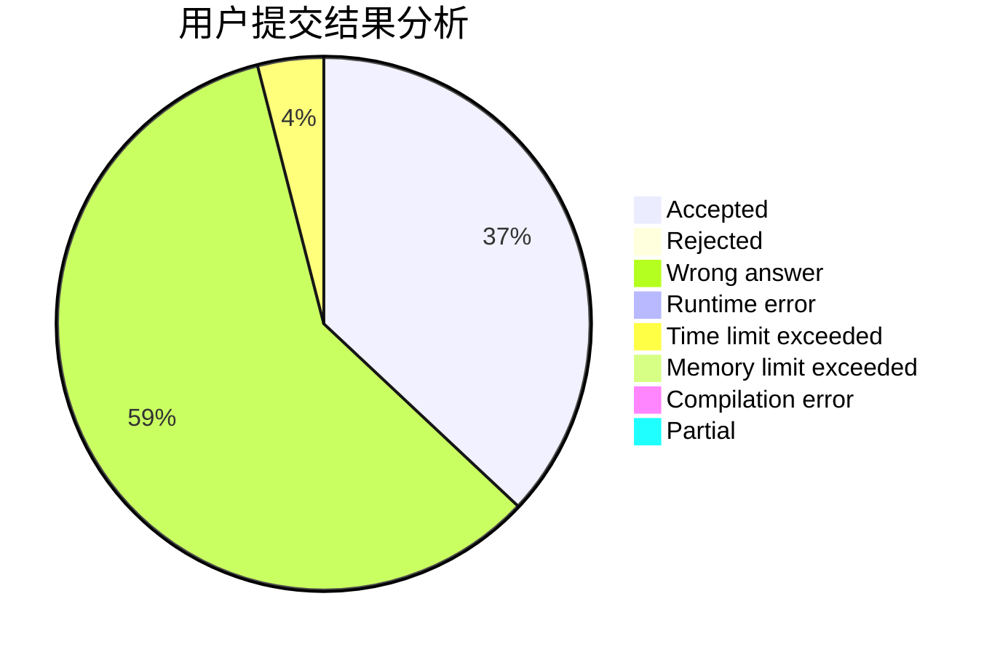
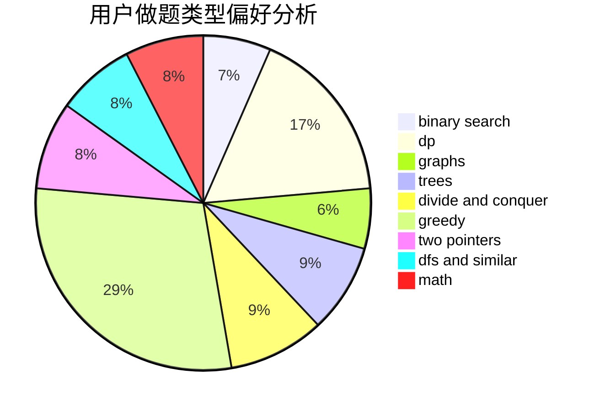

# Karlis

<!-- tabs:start -->

#### **用户提交结果分析**

#### **用户做题类型偏好分析**

<!-- tabs:end -->
# 推荐题目
[838F](https://codeforces.com/contest/838/problem/F)
[1431B](https://codeforces.com/contest/1431/problem/B)
[776D](https://codeforces.com/contest/776/problem/D)
[407B](https://codeforces.com/contest/407/problem/B)
[744C](https://codeforces.com/contest/744/problem/C)
[1207B](https://codeforces.com/contest/1207/problem/B)
[1156E](https://codeforces.com/contest/1156/problem/E)
[1040D](https://codeforces.com/contest/1040/problem/D)
[737B](https://codeforces.com/contest/737/problem/B)
[547A](https://codeforces.com/contest/547/problem/A)
