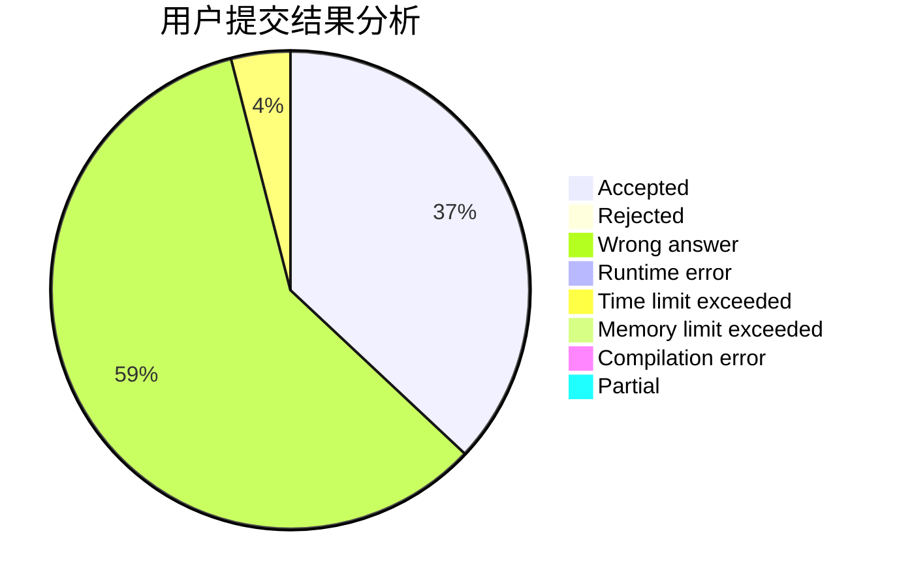
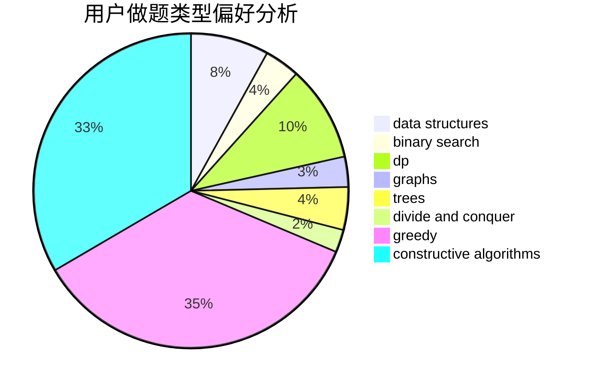
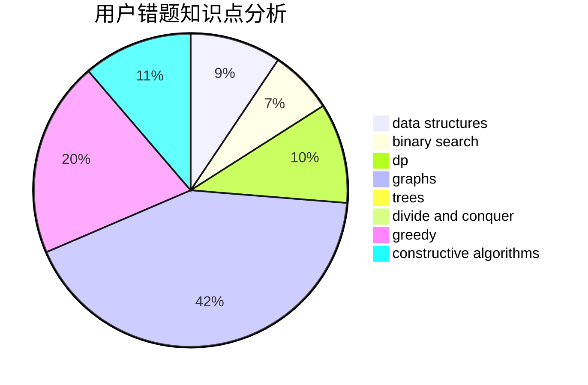

# Karlis
<!-- tabs:start -->
#### **用户提交结果分析**

#### **用户做题类型偏好分析**

#### **用户错题知识点分析**

<!-- tabs:end -->
# 推荐题目
[Bash Plays with Functions](http://codeforces.com/problemset/problem/757/E)		brute force,
                        combinatorics,
                        dp,
                        number theory		  
[Cookie Clicker](http://codeforces.com/problemset/problem/377/E)		dp,
                        geometry		  
[Four Melodies](http://codeforces.com/problemset/problem/818/G)		flows,
                        graphs		  
[Growing flowers](http://codeforces.com/problemset/problem/1423/G)		data structures		  
[Lorenzo Von Matterhorn](https://codeforces.com/contest/697/problem/C)		brute force,
                        data structures,
                        implementation,
                        trees		  
[Chladni Figure](http://codeforces.com/problemset/problem/1147/B)		brute force,
                        strings		  
[Leaf Sets](http://codeforces.com/problemset/problem/1042/F)		data structures,
                        dfs and similar,
                        dsu,
                        graphs,
                        greedy,
                        sortings,
                        trees		  
[Holes](http://codeforces.com/problemset/problem/13/E)		data structures,
                        dsu		  
[Progress Bar](http://codeforces.com/problemset/problem/71/B)		implementation,
                        math		  
[Ants](http://codeforces.com/problemset/problem/1007/D)		2-sat,
                        data structures,
                        trees		  
<!-- tabs:start -->
#### **data structures**
[Growing flowers](http://codeforces.com/problemset/problem/1423/G)		data structures		  
[Lorenzo Von Matterhorn](https://codeforces.com/contest/697/problem/C)		brute force,
                        data structures,
                        implementation,
                        trees		  
[Leaf Sets](http://codeforces.com/problemset/problem/1042/F)		data structures,
                        dfs and similar,
                        dsu,
                        graphs,
                        greedy,
                        sortings,
                        trees		  
[Holes](http://codeforces.com/problemset/problem/13/E)		data structures,
                        dsu		  
[Ants](http://codeforces.com/problemset/problem/1007/D)		2-sat,
                        data structures,
                        trees		  
[Indecisive Taxi Fee](http://codeforces.com/problemset/problem/1163/F)		data structures,
                        graphs,
                        shortest paths		  
[Two Teams](http://codeforces.com/problemset/problem/1154/E)		data structures,
                        implementation,
                        sortings		  
[Duff in the Army](http://codeforces.com/problemset/problem/587/C)		data structures,
                        trees		  
[Flip and Reverse](http://codeforces.com/problemset/problem/1458/D)		data structures,
                        graphs,
                        greedy		  
[Game with Tokens](http://codeforces.com/problemset/problem/930/D)		data structures,
                        games,
                        implementation		  
#### **binary search**
[Privatization of Roads in Treeland](http://codeforces.com/problemset/problem/1141/G)		binary search,
                        constructive algorithms,
                        dfs and similar,
                        graphs,
                        greedy,
                        trees		  
[Constructing Tests](http://codeforces.com/problemset/problem/938/C)		binary search,
                        brute force,
                        constructive algorithms		  
[Maximum width](http://codeforces.com/problemset/problem/1492/C)		binary search,
                        data structures,
                        dp,
                        greedy,
                        two pointers		  
[Pairs](http://codeforces.com/problemset/problem/1463/D)		binary search,
                        constructive algorithms,
                        greedy,
                        two pointers		  
[Old Floppy Drive](http://codeforces.com/problemset/problem/1490/G)		binary search,
                        data structures,
                        math		  
[Odd Mineral Resource](http://codeforces.com/problemset/problem/1479/D)		binary search,
                        bitmasks,
                        brute force,
                        data structures,
                        probabilities,
                        trees		  
[Complicated Computations](http://codeforces.com/problemset/problem/1436/E)		binary search,
                        data structures,
                        two pointers		  
[Divide and Summarize](http://codeforces.com/problemset/problem/1461/D)		binary search,
                        brute force,
                        data structures,
                        divide and conquer,
                        implementation,
                        sortings		  
[K-beautiful Strings](http://codeforces.com/problemset/problem/1493/C)		binary search,
                        brute force,
                        constructive algorithms,
                        greedy,
                        strings		  
[Pythagorean Triples](http://codeforces.com/problemset/problem/1487/D)		binary search,
                        brute force,
                        math,
                        number theory		  
#### **dp**
[Bash Plays with Functions](http://codeforces.com/problemset/problem/757/E)		brute force,
                        combinatorics,
                        dp,
                        number theory		  
[Cookie Clicker](http://codeforces.com/problemset/problem/377/E)		dp,
                        geometry		  
[Beautiful Bracket Sequence (easy version)](http://codeforces.com/problemset/problem/1264/D1)		combinatorics,
                        dp,
                        probabilities		  
[Boboniu Chats with Du](https://codeforces.com/contest/1395/problem/D)		dp,
                        greedy,
                        sortings,
                        two pointers		  
[Random Events](http://codeforces.com/problemset/problem/1461/C)		dp,
                        math,
                        probabilities		  
[Maximum width](http://codeforces.com/problemset/problem/1492/C)		binary search,
                        data structures,
                        dp,
                        greedy,
                        two pointers		  
[Bouncing Ball](https://codeforces.com/contest/1457/problem/C)		brute force,
                        dp,
                        implementation		  
[Pekora and Trampoline](http://codeforces.com/problemset/problem/1491/C)		brute force,
                        data structures,
                        dp,
                        greedy,
                        implementation		  
[Chef Monocarp](http://codeforces.com/problemset/problem/1437/C)		dp,
                        flows,
                        graph matchings,
                        greedy,
                        math,
                        sortings		  
[Binary Removals](http://codeforces.com/problemset/problem/1499/B)		brute force,
                        dp,
                        greedy,
                        implementation		  
#### **graph**
[Four Melodies](http://codeforces.com/problemset/problem/818/G)		flows,
                        graphs		  
[Leaf Sets](http://codeforces.com/problemset/problem/1042/F)		data structures,
                        dfs and similar,
                        dsu,
                        graphs,
                        greedy,
                        sortings,
                        trees		  
[Sergey's problem](https://codeforces.com/contest/1020/problem/E)		constructive algorithms,
                        graphs		  
[Indecisive Taxi Fee](http://codeforces.com/problemset/problem/1163/F)		data structures,
                        graphs,
                        shortest paths		  
[Buying Sets](http://codeforces.com/problemset/problem/103/E)		flows,
                        graph matchings		  
[Flip and Reverse](http://codeforces.com/problemset/problem/1458/D)		data structures,
                        graphs,
                        greedy		  
[Mahmoud and Ehab and the bipartiteness](http://codeforces.com/problemset/problem/862/B)		dfs and similar,
                        graphs,
                        trees		  
[Privatization of Roads in Treeland](http://codeforces.com/problemset/problem/1141/G)		binary search,
                        constructive algorithms,
                        dfs and similar,
                        graphs,
                        greedy,
                        trees		  
[Two Fairs](https://codeforces.com/contest/1277/problem/E)		combinatorics,
                        dfs and similar,
                        dsu,
                        graphs		  
[Minimum Ties](http://codeforces.com/problemset/problem/1487/C)		brute force,
                        constructive algorithms,
                        dfs and similar,
                        graphs,
                        greedy,
                        implementation,
                        math		  
#### **trees**
[Lorenzo Von Matterhorn](https://codeforces.com/contest/697/problem/C)		brute force,
                        data structures,
                        implementation,
                        trees		  
[Leaf Sets](http://codeforces.com/problemset/problem/1042/F)		data structures,
                        dfs and similar,
                        dsu,
                        graphs,
                        greedy,
                        sortings,
                        trees		  
[Ants](http://codeforces.com/problemset/problem/1007/D)		2-sat,
                        data structures,
                        trees		  
[Duff in the Army](http://codeforces.com/problemset/problem/587/C)		data structures,
                        trees		  
[Mahmoud and Ehab and the bipartiteness](http://codeforces.com/problemset/problem/862/B)		dfs and similar,
                        graphs,
                        trees		  
[Privatization of Roads in Treeland](http://codeforces.com/problemset/problem/1141/G)		binary search,
                        constructive algorithms,
                        dfs and similar,
                        graphs,
                        greedy,
                        trees		  
[Odd Mineral Resource](http://codeforces.com/problemset/problem/1479/D)		binary search,
                        bitmasks,
                        brute force,
                        data structures,
                        probabilities,
                        trees		  
[Yet Another Card Deck](http://codeforces.com/problemset/problem/1511/C)		brute force,
                        data structures,
                        implementation,
                        trees		  
[Diameter Cuts](http://codeforces.com/problemset/problem/1499/F)		combinatorics,
                        dfs and similar,
                        dp,
                        trees		  
[Fib-tree](http://codeforces.com/problemset/problem/1491/E)		brute force,
                        dfs and similar,
                        divide and conquer,
                        number theory,
                        trees		  
#### **divide and conquer**
[Divide and Summarize](http://codeforces.com/problemset/problem/1461/D)		binary search,
                        brute force,
                        data structures,
                        divide and conquer,
                        implementation,
                        sortings		  
[Song of the Sirens](http://codeforces.com/problemset/problem/1466/G)		combinatorics,
                        divide and conquer,
                        hashing,
                        math,
                        string suffix structures,
                        strings		  
[Permutation Transformation](http://codeforces.com/problemset/problem/1490/D)		dfs and similar,
                        divide and conquer,
                        implementation		  
[Skyline Photo](https://codeforces.com/contest/1483/problem/C)		data structures,
                        divide and conquer,
                        dp		  
[Fib-tree](http://codeforces.com/problemset/problem/1491/E)		brute force,
                        dfs and similar,
                        divide and conquer,
                        number theory,
                        trees		  
[Sum of Prefix Sums](http://codeforces.com/problemset/problem/1303/G)		data structures,
                        divide and conquer,
                        geometry,
                        trees		  
[Dogeforces](http://codeforces.com/problemset/problem/1494/D)		constructive algorithms,
                        data structures,
                        dfs and similar,
                        divide and conquer,
                        dsu,
                        greedy,
                        sortings,
                        trees		  
[Skyline Photo](http://codeforces.com/problemset/problem/1482/E)		data structures,
                        divide and conquer,
                        dp		  
[Logistical Questions](http://codeforces.com/problemset/problem/566/C)		dfs and similar,
                        divide and conquer,
                        trees		  
[Fruit Sequences](http://codeforces.com/problemset/problem/1428/F)		binary search,
                        data structures,
                        divide and conquer,
                        dp,
                        two pointers		  
#### **greedy**
[Leaf Sets](http://codeforces.com/problemset/problem/1042/F)		data structures,
                        dfs and similar,
                        dsu,
                        graphs,
                        greedy,
                        sortings,
                        trees		  
[Flip and Reverse](http://codeforces.com/problemset/problem/1458/D)		data structures,
                        graphs,
                        greedy		  
[Privatization of Roads in Treeland](http://codeforces.com/problemset/problem/1141/G)		binary search,
                        constructive algorithms,
                        dfs and similar,
                        graphs,
                        greedy,
                        trees		  
[Cubes](https://codeforces.com/contest/521/problem/B)		games,
                        greedy,
                        implementation		  
[Boboniu Chats with Du](https://codeforces.com/contest/1395/problem/D)		dp,
                        greedy,
                        sortings,
                        two pointers		  
[New Year and the Mallard Expedition](http://codeforces.com/problemset/problem/1091/F)		constructive algorithms,
                        greedy		  
[Money Transfers](http://codeforces.com/problemset/problem/675/C)		constructive algorithms,
                        data structures,
                        greedy,
                        sortings		  
[Cow and Friend](http://codeforces.com/problemset/problem/1307/B)		geometry,
                        greedy,
                        math		  
[Toy Train (Simplified)](https://codeforces.com/contest/1130/problem/D1)		brute force,
                        greedy		  
[Ilya and Matrix](http://codeforces.com/problemset/problem/313/C)		constructive algorithms,
                        greedy,
                        implementation,
                        sortings		  
#### **constructive algorithms**
[Sergey's problem](https://codeforces.com/contest/1020/problem/E)		constructive algorithms,
                        graphs		  
[Print a 1337-string...](http://codeforces.com/problemset/problem/1202/D)		combinatorics,
                        constructive algorithms,
                        math,
                        strings		  
[Privatization of Roads in Treeland](http://codeforces.com/problemset/problem/1141/G)		binary search,
                        constructive algorithms,
                        dfs and similar,
                        graphs,
                        greedy,
                        trees		  
[New Year and the Mallard Expedition](http://codeforces.com/problemset/problem/1091/F)		constructive algorithms,
                        greedy		  
[Pasha and Hamsters](http://codeforces.com/problemset/problem/421/A)		constructive algorithms,
                        implementation		  
[Money Transfers](http://codeforces.com/problemset/problem/675/C)		constructive algorithms,
                        data structures,
                        greedy,
                        sortings		  
[Ilya and Matrix](http://codeforces.com/problemset/problem/313/C)		constructive algorithms,
                        greedy,
                        implementation,
                        sortings		  
[Constructing Tests](http://codeforces.com/problemset/problem/938/C)		binary search,
                        brute force,
                        constructive algorithms		  
[Walking!](http://codeforces.com/problemset/problem/578/E)		constructive algorithms,
                        greedy		  
[Anti-knapsack](http://codeforces.com/problemset/problem/1493/A)		constructive algorithms,
                        greedy		  
#### **sortings**
[Leaf Sets](http://codeforces.com/problemset/problem/1042/F)		data structures,
                        dfs and similar,
                        dsu,
                        graphs,
                        greedy,
                        sortings,
                        trees		  
[Two Teams](http://codeforces.com/problemset/problem/1154/E)		data structures,
                        implementation,
                        sortings		  
[Boboniu Chats with Du](https://codeforces.com/contest/1395/problem/D)		dp,
                        greedy,
                        sortings,
                        two pointers		  
[Money Transfers](http://codeforces.com/problemset/problem/675/C)		constructive algorithms,
                        data structures,
                        greedy,
                        sortings		  
[Ilya and Matrix](http://codeforces.com/problemset/problem/313/C)		constructive algorithms,
                        greedy,
                        implementation,
                        sortings		  
[Median on Segments (General Case Edition)](http://codeforces.com/problemset/problem/1005/E2)		sortings		  
[Diamond Miner](https://codeforces.com/contest/1496/problem/C)		geometry,
                        greedy,
                        math,
                        sortings		  
[Diamond Miner](http://codeforces.com/problemset/problem/1495/A)		geometry,
                        greedy,
                        math,
                        sortings		  
[Meximization](http://codeforces.com/problemset/problem/1497/A)		brute force,
                        data structures,
                        greedy,
                        sortings		  
[Avoiding Zero](http://codeforces.com/problemset/problem/1427/A)		math,
                        sortings		  
<!-- tabs:end -->
