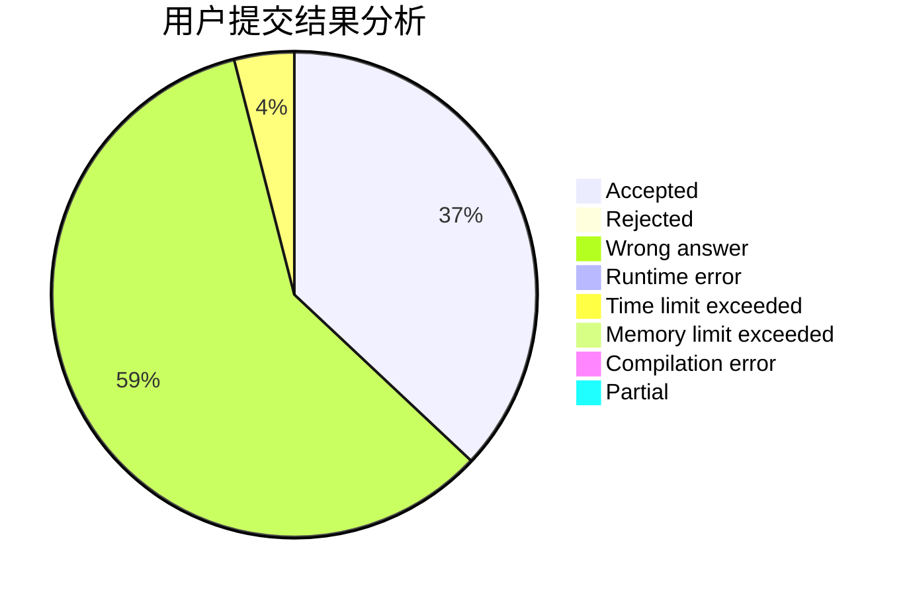
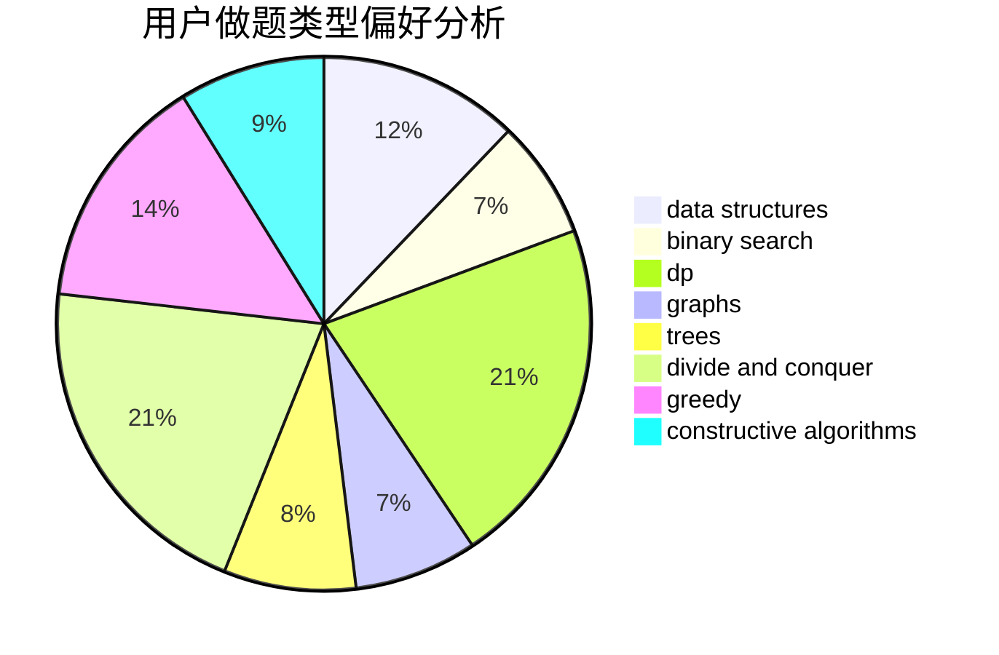
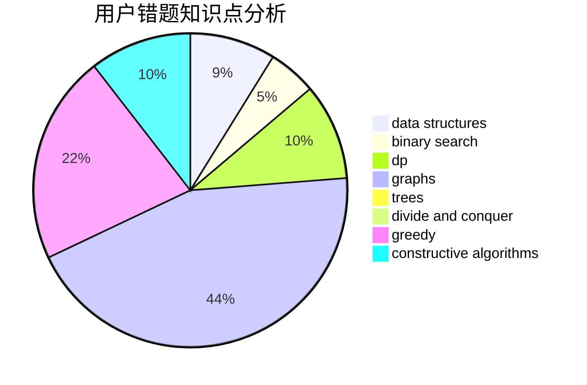

# Karlis

<!-- tabs:start -->

#### **用户提交结果分析**

#### **用户做题类型偏好分析**

#### **用户错题知识点分析**

<!-- tabs:end -->
# 推荐题目
[838F](https://codeforces.com/contest/838/problem/F)		nan		  
[1431B](https://codeforces.com/contest/1431/problem/B)		*special problem,
                        implementation,
                        two pointers		  
[776D](https://codeforces.com/contest/776/problem/D)		2-sat,
                        dfs and similar,
                        dsu,
                        graphs		  
[407B](https://codeforces.com/contest/407/problem/B)		dp,
                        implementation		  
[744C](https://codeforces.com/contest/744/problem/C)		bitmasks,
                        brute force,
                        dp		  
[1207B](https://codeforces.com/contest/1207/problem/B)		constructive algorithms,
                        greedy,
                        implementation		  
[1156E](https://codeforces.com/contest/1156/problem/E)		data structures,
                        divide and conquer,
                        dsu,
                        two pointers		  
[1040D](https://codeforces.com/contest/1040/problem/D)		dsu,graphs,sortings,trees		  
[737B](https://codeforces.com/contest/737/problem/B)		dsu,graphs,sortings,trees		  
[547A](https://codeforces.com/contest/547/problem/A)		brute force,
                        greedy,
                        implementation,
                        math		  
