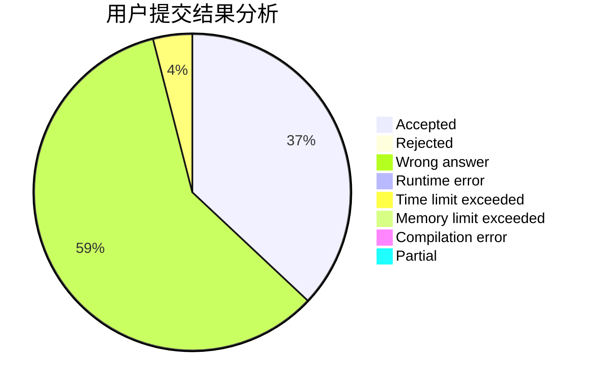
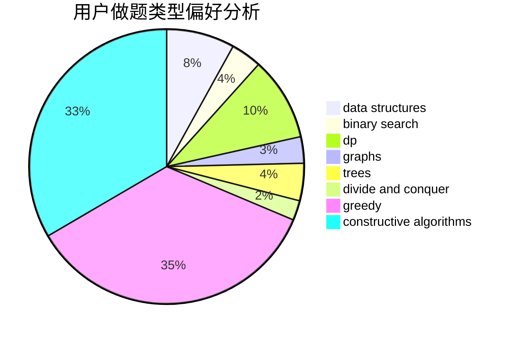
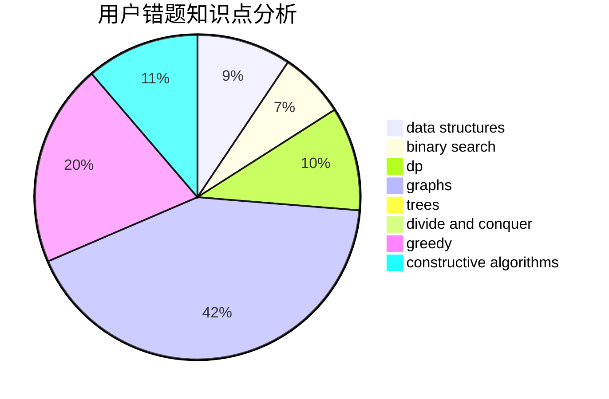

# Karlis

<!-- tabs:start -->

#### **用户提交结果分析**

#### **用户做题类型偏好分析**

#### **用户错题知识点分析**

<!-- tabs:end -->
# 推荐题目
[818G](https://codeforces.com/contest/818/problem/G)		flows,
                        graphs		  
[1423G](https://codeforces.com/contest/1423/problem/G)		data structures		  
[757E](https://codeforces.com/contest/757/problem/E)		brute force,
                        combinatorics,
                        dp,
                        number theory		  
[377E](https://codeforces.com/contest/377/problem/E)		dp,
                        geometry		  
[727A](https://codeforces.com/contest/727/problem/A)		brute force,
                        dfs and similar,
                        math		  
[1202D](https://codeforces.com/contest/1202/problem/D)		combinatorics,
                        constructive algorithms,
                        math,
                        strings		  
[1154E](https://codeforces.com/contest/1154/problem/E)		data structures,
                        implementation,
                        sortings		  
[103E](https://codeforces.com/contest/103/problem/E)		flows,
                        graph matchings		  
[71B](https://codeforces.com/contest/71/problem/B)		implementation,
                        math		  
[521B](https://codeforces.com/contest/521/problem/B)		dsu,graphs,sortings,trees		  
