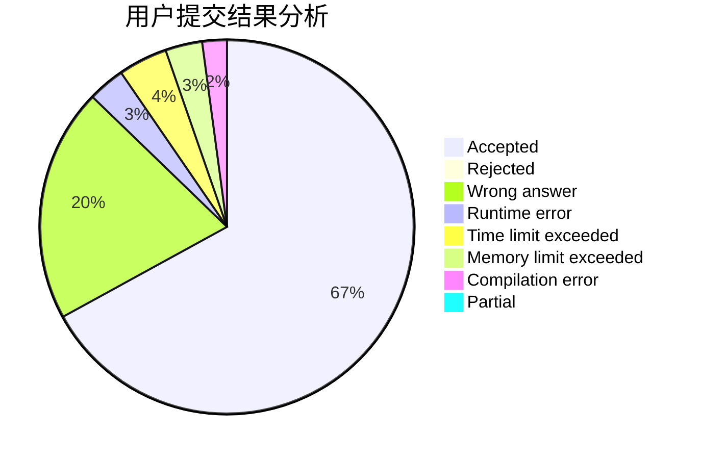
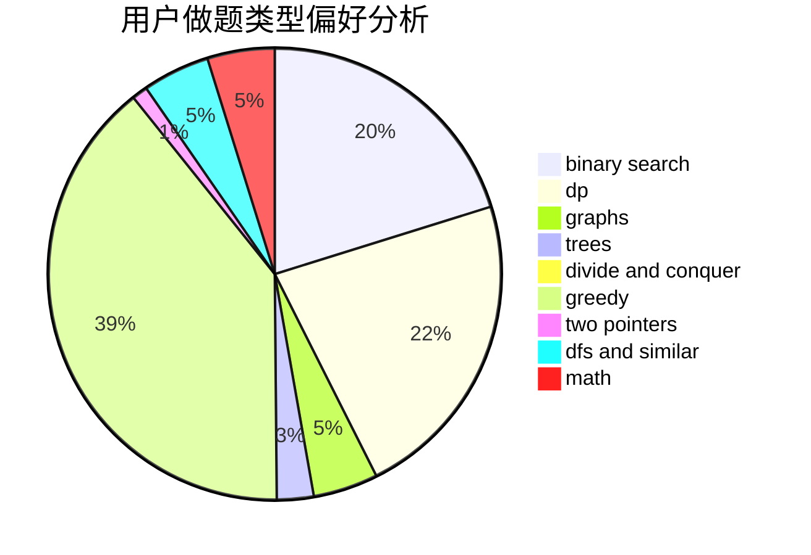

# Karry5307

<!-- tabs:start -->

#### **用户提交结果分析**

#### **用户做题类型偏好分析**

<!-- tabs:end -->
# 推荐题目
[1117C](https://codeforces.com/contest/1117/problem/C)
[626D](https://codeforces.com/contest/626/problem/D)
[1365A](https://codeforces.com/contest/1365/problem/A)
[1479A](https://codeforces.com/contest/1479/problem/A)
[808D](https://codeforces.com/contest/808/problem/D)
[584B](https://codeforces.com/contest/584/problem/B)
[917B](https://codeforces.com/contest/917/problem/B)
[1028D](https://codeforces.com/contest/1028/problem/D)
[1113A](https://codeforces.com/contest/1113/problem/A)
[224A](https://codeforces.com/contest/224/problem/A)
