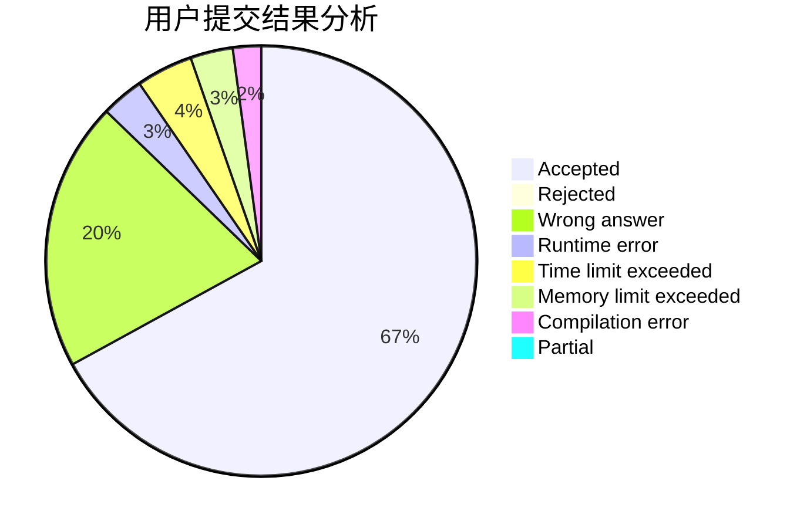
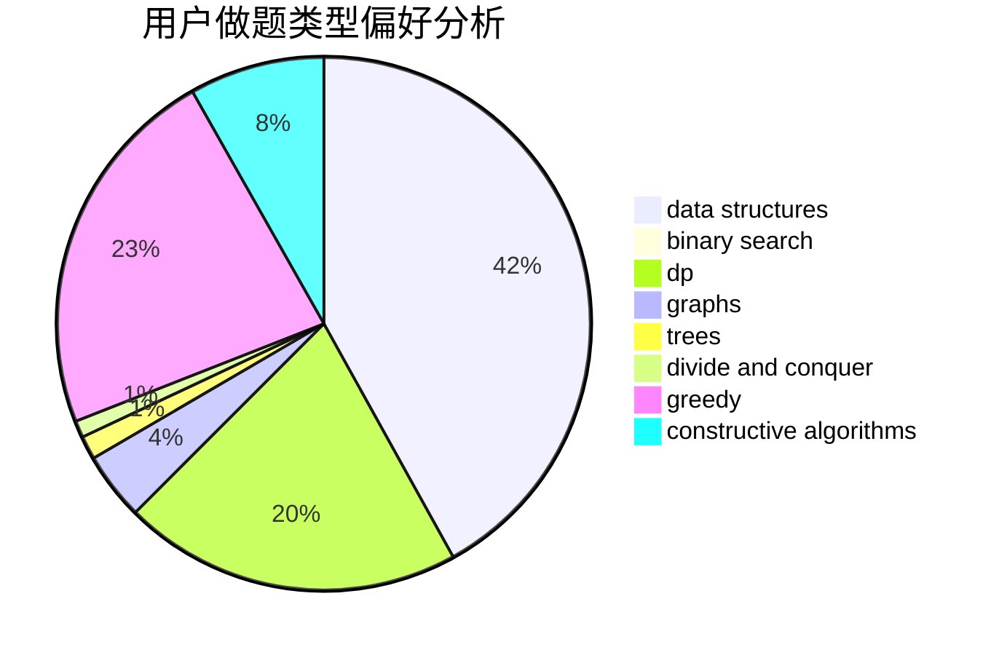
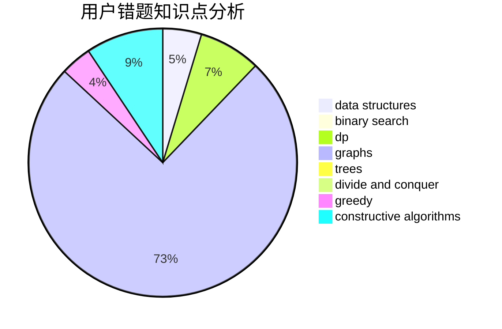

# Karry5307

<!-- tabs:start -->

#### **用户提交结果分析**

#### **用户做题类型偏好分析**

#### **用户错题知识点分析**

<!-- tabs:end -->
# 推荐题目
[1117C](https://codeforces.com/contest/1117/problem/C)		binary search		  
[626D](https://codeforces.com/contest/626/problem/D)		brute force,
                        combinatorics,
                        dp,
                        probabilities		  
[1365A](https://codeforces.com/contest/1365/problem/A)		games,
                        greedy,
                        implementation		  
[1479A](https://codeforces.com/contest/1479/problem/A)		binary search,
                        interactive,
                        ternary search		  
[808D](https://codeforces.com/contest/808/problem/D)		binary search,
                        data structures,
                        implementation		  
[584B](https://codeforces.com/contest/584/problem/B)		combinatorics		  
[917B](https://codeforces.com/contest/917/problem/B)		dfs and similar,
                        dp,
                        games,
                        graphs		  
[1028D](https://codeforces.com/contest/1028/problem/D)		combinatorics,
                        data structures,
                        greedy		  
[1113A](https://codeforces.com/contest/1113/problem/A)		dp,
                        greedy,
                        math		  
[224A](https://codeforces.com/contest/224/problem/A)		brute force,
                        geometry,
                        math		  
