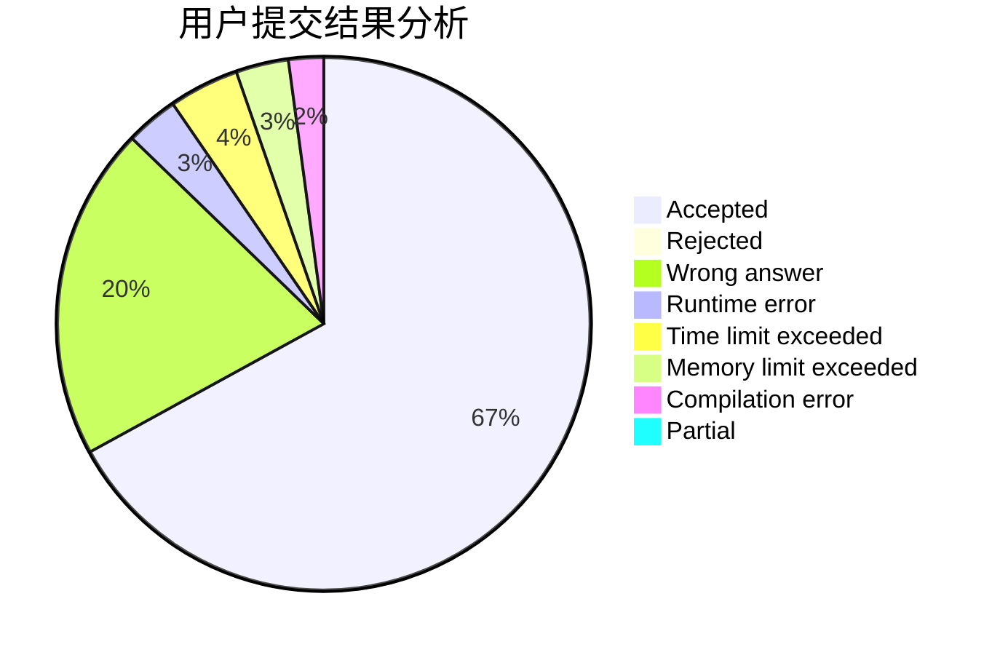
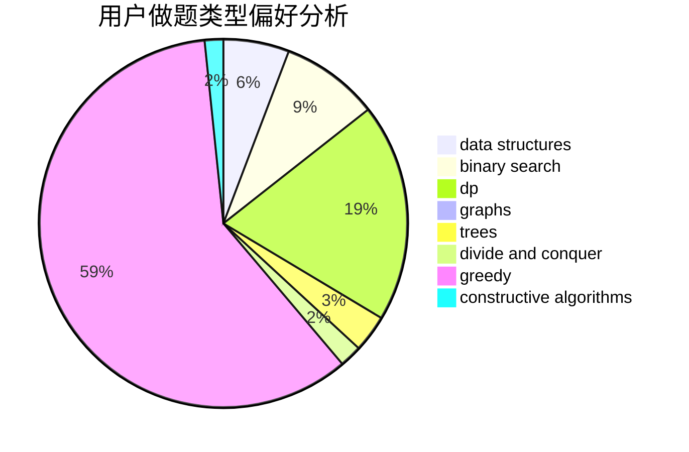
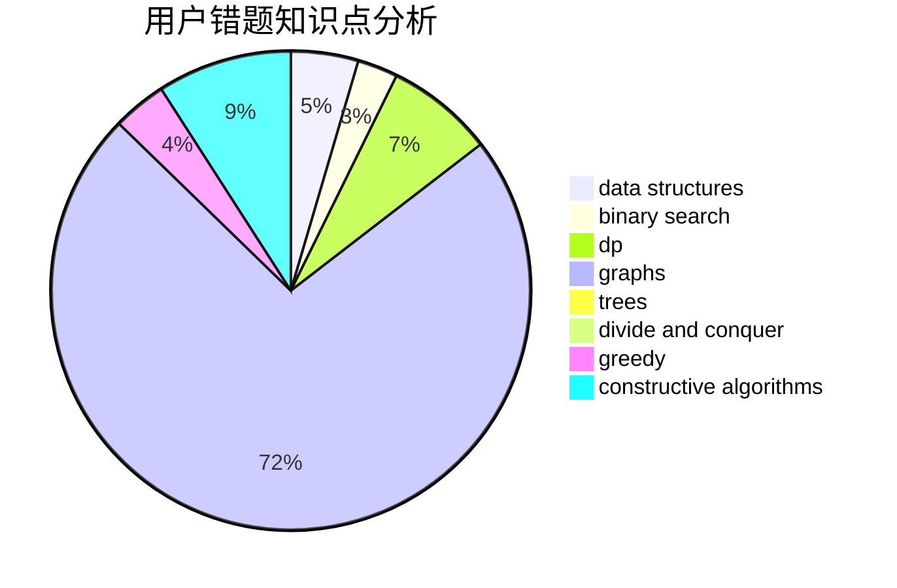

# Karry5307

<!-- tabs:start -->

#### **用户提交结果分析**

#### **用户做题类型偏好分析**

#### **用户错题知识点分析**

<!-- tabs:end -->
# 推荐题目
[1115U3](https://codeforces.com/contest/1115U/problem/3)		*special problem		  
[607B](https://codeforces.com/contest/607/problem/B)		dp		  
[1357C1](https://codeforces.com/contest/1357C/problem/1)		nan		  
[1470F](https://codeforces.com/contest/1470/problem/F)		divide and conquer		  
[792E](https://codeforces.com/contest/792/problem/E)		greedy,
                        math,
                        number theory		  
[55D](https://codeforces.com/contest/55/problem/D)		dp,
                        number theory		  
[900D](https://codeforces.com/contest/900/problem/D)		bitmasks,
                        combinatorics,
                        dp,
                        math,
                        number theory		  
[1028A](https://codeforces.com/contest/1028/problem/A)		implementation		  
[1111B](https://codeforces.com/contest/1111/problem/B)		brute force,
                        implementation,
                        math		  
[1B](https://codeforces.com/contest/1/problem/B)		implementation,
                        math		  
