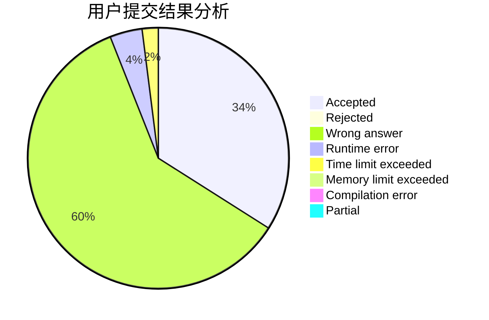
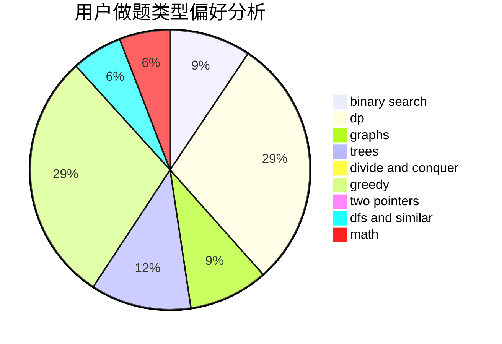

# Kato_Megumi

<!-- tabs:start -->

#### **用户提交结果分析**

#### **用户做题类型偏好分析**

<!-- tabs:end -->
# 推荐题目
[1468N](https://codeforces.com/contest/1468/problem/N)
[764A](https://codeforces.com/contest/764/problem/A)
[1349E](https://codeforces.com/contest/1349/problem/E)
[1236B](https://codeforces.com/contest/1236/problem/B)
[1459F](https://codeforces.com/contest/1459/problem/F)
[680B](https://codeforces.com/contest/680/problem/B)
[433B](https://codeforces.com/contest/433/problem/B)
[553C](https://codeforces.com/contest/553/problem/C)
[523A](https://codeforces.com/contest/523/problem/A)
[1104E](https://codeforces.com/contest/1104/problem/E)
