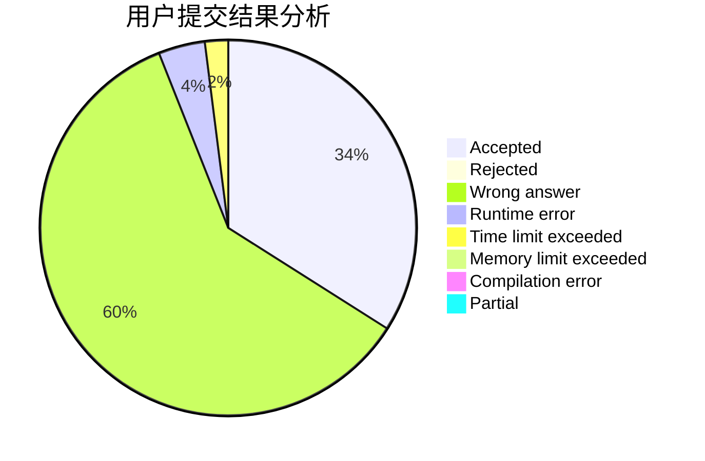
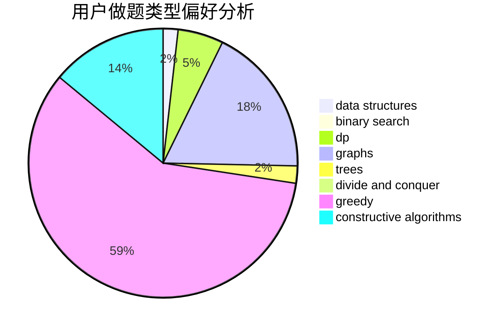
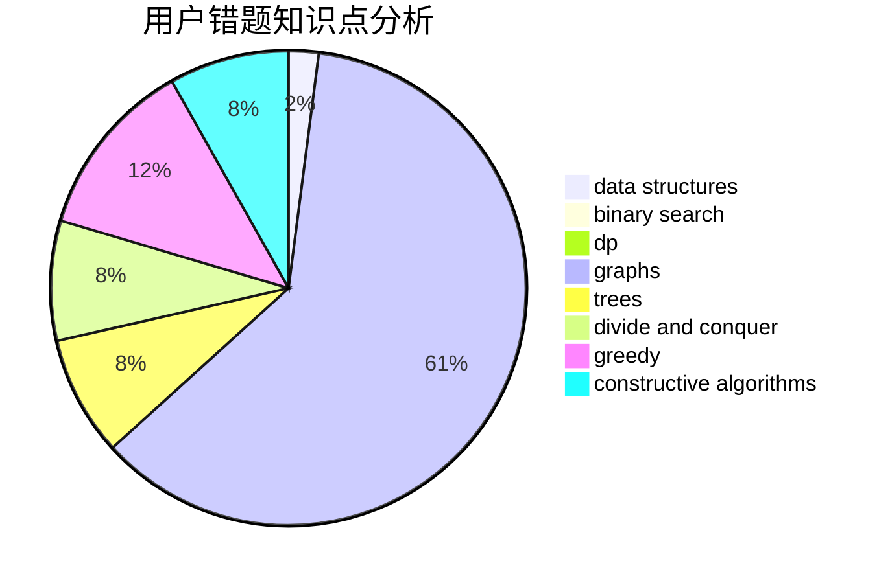

# Kato_Megumi

<!-- tabs:start -->

#### **用户提交结果分析**

#### **用户做题类型偏好分析**

#### **用户错题知识点分析**

<!-- tabs:end -->
# 推荐题目
[1461D](https://codeforces.com/contest/1461/problem/D)		binary search,
                        brute force,
                        data structures,
                        divide and conquer,
                        implementation,
                        sortings		  
[743E](https://codeforces.com/contest/743/problem/E)		binary search,
                        bitmasks,
                        brute force,
                        dp		  
[1343A](https://codeforces.com/contest/1343/problem/A)		brute force,
                        math		  
[1227D2](https://codeforces.com/contest/1227D/problem/2)		data structures,
                        greedy		  
[1450H2](https://codeforces.com/contest/1450H/problem/2)		combinatorics,
                        implementation,
                        math		  
[660A](https://codeforces.com/contest/660/problem/A)		greedy,
                        implementation,
                        math,
                        number theory		  
[404C](https://codeforces.com/contest/404/problem/C)		dfs and similar,
                        graphs,
                        sortings		  
[52B](https://codeforces.com/contest/52/problem/B)		combinatorics		  
[501C](https://codeforces.com/contest/501/problem/C)		constructive algorithms,
                        data structures,
                        greedy,
                        sortings,
                        trees		  
[1104B](https://codeforces.com/contest/1104/problem/B)		data structures,
                        implementation,
                        math		  
