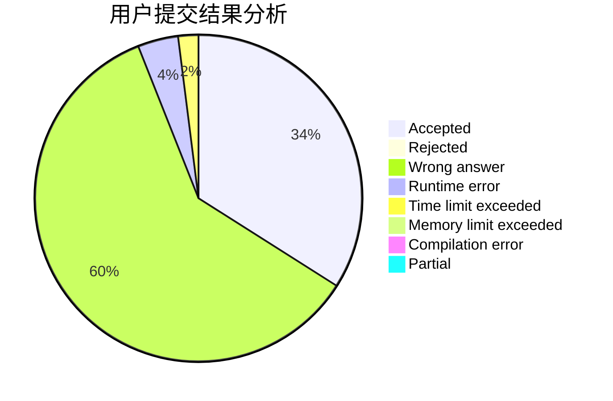
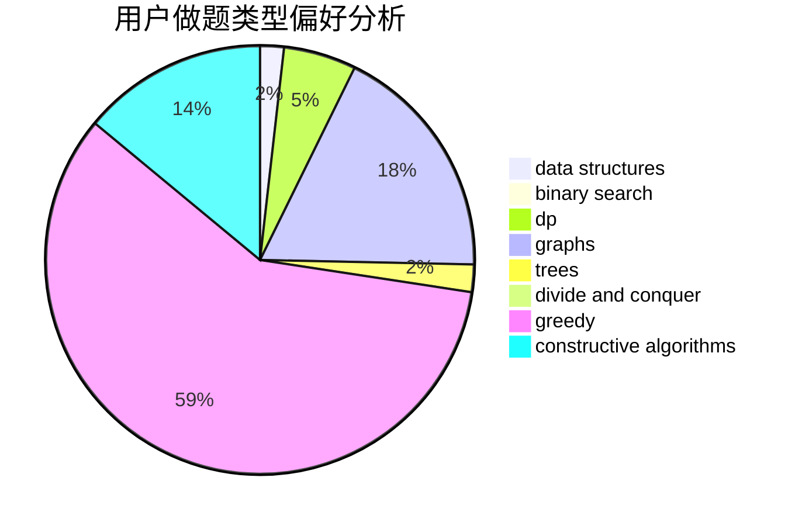
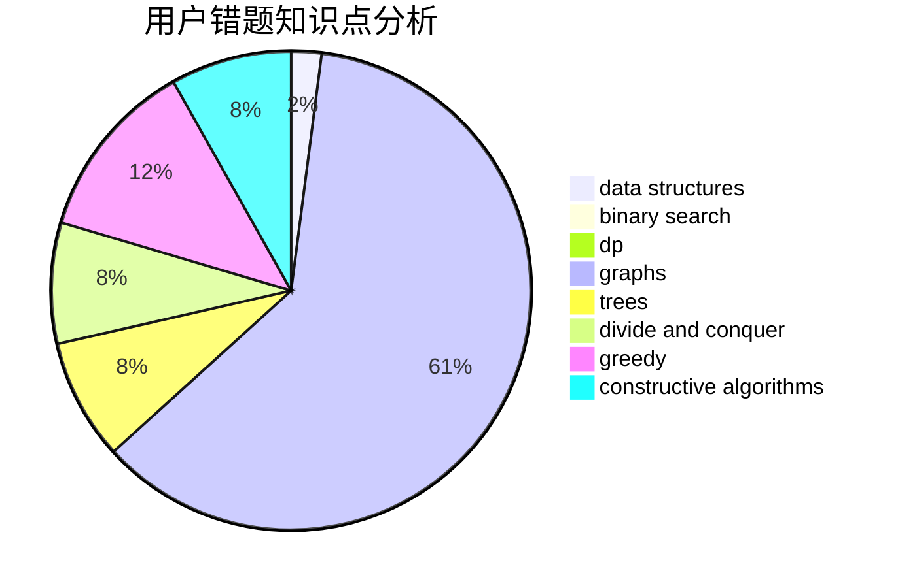

# Kato_Megumi
<!-- tabs:start -->
#### **用户提交结果分析**

#### **用户做题类型偏好分析**

#### **用户错题知识点分析**

<!-- tabs:end -->
# 推荐题目
[Divide and Summarize](http://codeforces.com/problemset/problem/1461/D)		binary search,
                        brute force,
                        data structures,
                        divide and conquer,
                        implementation,
                        sortings		  
[Vladik and cards](http://codeforces.com/problemset/problem/743/E)		binary search,
                        bitmasks,
                        brute force,
                        dp		  
[Multithreading (Hard Version)](http://codeforces.com/problemset/problem/1450/H2)		combinatorics,
                        implementation,
                        math		  
[Optimal Subsequences (Hard Version)](http://codeforces.com/problemset/problem/1227/D2)		data structures,
                        greedy		  
[Animal Observation (hard version)](http://codeforces.com/problemset/problem/1304/F2)		data structures,
                        dp,
                        greedy		  
[Restore Graph](http://codeforces.com/problemset/problem/404/C)		dfs and similar,
                        graphs,
                        sortings		  
[Almost Permutation](http://codeforces.com/problemset/problem/863/F)		flows		  
[Co-prime Array](http://codeforces.com/problemset/problem/660/A)		greedy,
                        implementation,
                        math,
                        number theory		  
[Divisibility](http://codeforces.com/problemset/problem/597/A)		math		  
[Vicious Keyboard](http://codeforces.com/problemset/problem/801/A)		brute force		  
<!-- tabs:start -->
#### **data structures**
[Divide and Summarize](http://codeforces.com/problemset/problem/1461/D)		binary search,
                        brute force,
                        data structures,
                        divide and conquer,
                        implementation,
                        sortings		  
[Vladik and cards](http://codeforces.com/problemset/problem/1227/D2)		data structures,
                        greedy		  
[Multithreading (Hard Version)](http://codeforces.com/problemset/problem/1304/F2)		data structures,
                        dp,
                        greedy		  
[Optimal Subsequences (Hard Version)](http://codeforces.com/problemset/problem/514/C)		binary search,
                        data structures,
                        hashing,
                        string suffix structures,
                        strings		  
[Animal Observation (hard version)](http://codeforces.com/problemset/problem/1104/B)		data structures,
                        implementation,
                        math		  
[Restore Graph](https://codeforces.com/contest/759/problem/C)		data structures		  
[Almost Permutation](http://codeforces.com/problemset/problem/501/C)		constructive algorithms,
                        data structures,
                        greedy,
                        sortings,
                        trees		  
[Co-prime Array](http://codeforces.com/problemset/problem/1310/A)		data structures,
                        greedy,
                        sortings		  
[Divisibility](https://codeforces.com/contest/1484/problem/D)		data structures,
                        dsu,
                        implementation,
                        shortest paths		  
[Vicious Keyboard](http://codeforces.com/problemset/problem/86/D)		data structures,
                        implementation,
                        math,
                        two pointers		  
#### **binary search**
[Divide and Summarize](http://codeforces.com/problemset/problem/1461/D)		binary search,
                        brute force,
                        data structures,
                        divide and conquer,
                        implementation,
                        sortings		  
[Vladik and cards](http://codeforces.com/problemset/problem/743/E)		binary search,
                        bitmasks,
                        brute force,
                        dp		  
[Multithreading (Hard Version)](http://codeforces.com/problemset/problem/514/C)		binary search,
                        data structures,
                        hashing,
                        string suffix structures,
                        strings		  
[Optimal Subsequences (Hard Version)](http://codeforces.com/problemset/problem/715/B)		binary search,
                        constructive algorithms,
                        graphs,
                        shortest paths		  
[Animal Observation (hard version)](http://codeforces.com/problemset/problem/1492/C)		binary search,
                        data structures,
                        dp,
                        greedy,
                        two pointers		  
[Restore Graph](http://codeforces.com/problemset/problem/1463/D)		binary search,
                        constructive algorithms,
                        greedy,
                        two pointers		  
[Almost Permutation](http://codeforces.com/problemset/problem/1490/G)		binary search,
                        data structures,
                        math		  
[Co-prime Array](http://codeforces.com/problemset/problem/1479/D)		binary search,
                        bitmasks,
                        brute force,
                        data structures,
                        probabilities,
                        trees		  
[Divisibility](http://codeforces.com/problemset/problem/1436/E)		binary search,
                        data structures,
                        two pointers		  
[Vicious Keyboard](http://codeforces.com/problemset/problem/1461/D)		binary search,
                        brute force,
                        data structures,
                        divide and conquer,
                        implementation,
                        sortings		  
#### **dp**
[Divide and Summarize](http://codeforces.com/problemset/problem/743/E)		binary search,
                        bitmasks,
                        brute force,
                        dp		  
[Vladik and cards](http://codeforces.com/problemset/problem/1304/F2)		data structures,
                        dp,
                        greedy		  
[Multithreading (Hard Version)](http://codeforces.com/problemset/problem/1151/B)		bitmasks,
                        brute force,
                        constructive algorithms,
                        dp		  
[Optimal Subsequences (Hard Version)](http://codeforces.com/problemset/problem/353/E)		dp,
                        graph matchings,
                        greedy		  
[Animal Observation (hard version)](http://codeforces.com/problemset/problem/513/G1)		brute force,
                        dfs and similar,
                        dp,
                        meet-in-the-middle		  
[Restore Graph](https://codeforces.com/contest/1078/problem/C)		dp,
                        trees		  
[Almost Permutation](http://codeforces.com/problemset/problem/711/C)		dp		  
[Co-prime Array](https://codeforces.com/contest/1013/problem/E)		dp		  
[Divisibility](https://codeforces.com/contest/1269/problem/D)		dp,
                        greedy,
                        math		  
[Vicious Keyboard](http://codeforces.com/problemset/problem/873/B)		dp,
                        implementation		  
#### **graph**
[Divide and Summarize](http://codeforces.com/problemset/problem/404/C)		dfs and similar,
                        graphs,
                        sortings		  
[Vladik and cards](http://codeforces.com/problemset/problem/114/B)		bitmasks,
                        brute force,
                        graphs		  
[Multithreading (Hard Version)](http://codeforces.com/problemset/problem/353/E)		dp,
                        graph matchings,
                        greedy		  
[Optimal Subsequences (Hard Version)](http://codeforces.com/problemset/problem/1291/F)		graphs,
                        interactive		  
[Animal Observation (hard version)](http://codeforces.com/problemset/problem/776/D)		2-sat,
                        dfs and similar,
                        dsu,
                        graphs		  
[Restore Graph](http://codeforces.com/problemset/problem/715/B)		binary search,
                        constructive algorithms,
                        graphs,
                        shortest paths		  
[Almost Permutation](http://codeforces.com/problemset/problem/193/A)		constructive algorithms,
                        graphs,
                        trees		  
[Co-prime Array](http://codeforces.com/problemset/problem/804/F)		combinatorics,
                        dfs and similar,
                        dp,
                        graphs,
                        number theory		  
[Divisibility](http://codeforces.com/problemset/problem/715/E)		combinatorics,
                        fft,
                        graphs,
                        math		  
[Vicious Keyboard](http://codeforces.com/problemset/problem/718/E)		bitmasks,
                        graphs		  
#### **trees**
[Divide and Summarize](https://codeforces.com/contest/1078/problem/C)		dp,
                        trees		  
[Vladik and cards](http://codeforces.com/problemset/problem/501/C)		constructive algorithms,
                        data structures,
                        greedy,
                        sortings,
                        trees		  
[Multithreading (Hard Version)](http://codeforces.com/problemset/problem/735/E)		dp,
                        trees		  
[Optimal Subsequences (Hard Version)](http://codeforces.com/problemset/problem/193/A)		constructive algorithms,
                        graphs,
                        trees		  
[Animal Observation (hard version)](http://codeforces.com/problemset/problem/1479/D)		binary search,
                        bitmasks,
                        brute force,
                        data structures,
                        probabilities,
                        trees		  
[Restore Graph](http://codeforces.com/problemset/problem/1511/C)		brute force,
                        data structures,
                        implementation,
                        trees		  
[Almost Permutation](http://codeforces.com/problemset/problem/1499/F)		combinatorics,
                        dfs and similar,
                        dp,
                        trees		  
[Co-prime Array](http://codeforces.com/problemset/problem/1491/E)		brute force,
                        dfs and similar,
                        divide and conquer,
                        number theory,
                        trees		  
[Divisibility](http://codeforces.com/problemset/problem/1466/D)		data structures,
                        greedy,
                        sortings,
                        trees		  
[Vicious Keyboard](http://codeforces.com/problemset/problem/1495/D)		combinatorics,
                        dfs and similar,
                        graphs,
                        math,
                        shortest paths,
                        trees		  
#### **divide and conquer**
[Divide and Summarize](http://codeforces.com/problemset/problem/1461/D)		binary search,
                        brute force,
                        data structures,
                        divide and conquer,
                        implementation,
                        sortings		  
[Vladik and cards](http://codeforces.com/problemset/problem/19/E)		dfs and similar,
                        divide and conquer,
                        dsu		  
[Multithreading (Hard Version)](http://codeforces.com/problemset/problem/1461/D)		binary search,
                        brute force,
                        data structures,
                        divide and conquer,
                        implementation,
                        sortings		  
[Optimal Subsequences (Hard Version)](http://codeforces.com/problemset/problem/1466/G)		combinatorics,
                        divide and conquer,
                        hashing,
                        math,
                        string suffix structures,
                        strings		  
[Animal Observation (hard version)](http://codeforces.com/problemset/problem/1490/D)		dfs and similar,
                        divide and conquer,
                        implementation		  
[Restore Graph](https://codeforces.com/contest/1483/problem/C)		data structures,
                        divide and conquer,
                        dp		  
[Almost Permutation](http://codeforces.com/problemset/problem/1491/E)		brute force,
                        dfs and similar,
                        divide and conquer,
                        number theory,
                        trees		  
[Co-prime Array](http://codeforces.com/problemset/problem/1303/G)		data structures,
                        divide and conquer,
                        geometry,
                        trees		  
[Divisibility](http://codeforces.com/problemset/problem/1494/D)		constructive algorithms,
                        data structures,
                        dfs and similar,
                        divide and conquer,
                        dsu,
                        greedy,
                        sortings,
                        trees		  
[Vicious Keyboard](http://codeforces.com/problemset/problem/1482/E)		data structures,
                        divide and conquer,
                        dp		  
#### **greedy**
[Divide and Summarize](http://codeforces.com/problemset/problem/1227/D2)		data structures,
                        greedy		  
[Vladik and cards](http://codeforces.com/problemset/problem/1304/F2)		data structures,
                        dp,
                        greedy		  
[Multithreading (Hard Version)](http://codeforces.com/problemset/problem/660/A)		greedy,
                        implementation,
                        math,
                        number theory		  
[Optimal Subsequences (Hard Version)](http://codeforces.com/problemset/problem/353/E)		dp,
                        graph matchings,
                        greedy		  
[Animal Observation (hard version)](http://codeforces.com/problemset/problem/803/C)		constructive algorithms,
                        greedy,
                        math		  
[Restore Graph](https://codeforces.com/contest/1269/problem/D)		dp,
                        greedy,
                        math		  
[Almost Permutation](http://codeforces.com/problemset/problem/501/C)		constructive algorithms,
                        data structures,
                        greedy,
                        sortings,
                        trees		  
[Co-prime Array](http://codeforces.com/problemset/problem/1117/B)		greedy,
                        math,
                        sortings		  
[Divisibility](http://codeforces.com/problemset/problem/1310/A)		data structures,
                        greedy,
                        sortings		  
[Vicious Keyboard](http://codeforces.com/problemset/problem/938/F)		bitmasks,
                        dp,
                        greedy		  
#### **constructive algorithms**
[Divide and Summarize](http://codeforces.com/problemset/problem/1151/B)		bitmasks,
                        brute force,
                        constructive algorithms,
                        dp		  
[Vladik and cards](http://codeforces.com/problemset/problem/803/C)		constructive algorithms,
                        greedy,
                        math		  
[Multithreading (Hard Version)](http://codeforces.com/problemset/problem/501/C)		constructive algorithms,
                        data structures,
                        greedy,
                        sortings,
                        trees		  
[Optimal Subsequences (Hard Version)](http://codeforces.com/problemset/problem/715/B)		binary search,
                        constructive algorithms,
                        graphs,
                        shortest paths		  
[Animal Observation (hard version)](http://codeforces.com/problemset/problem/193/A)		constructive algorithms,
                        graphs,
                        trees		  
[Restore Graph](http://codeforces.com/problemset/problem/1166/B)		constructive algorithms,
                        math,
                        number theory		  
[Almost Permutation](http://codeforces.com/problemset/problem/1114/B)		constructive algorithms,
                        greedy,
                        sortings		  
[Co-prime Array](http://codeforces.com/problemset/problem/1493/A)		constructive algorithms,
                        greedy		  
[Divisibility](http://codeforces.com/problemset/problem/1463/D)		binary search,
                        constructive algorithms,
                        greedy,
                        two pointers		  
[Vicious Keyboard](https://codeforces.com/contest/1456/problem/B)		bitmasks,
                        brute force,
                        constructive algorithms		  
#### **sortings**
[Divide and Summarize](http://codeforces.com/problemset/problem/1461/D)		binary search,
                        brute force,
                        data structures,
                        divide and conquer,
                        implementation,
                        sortings		  
[Vladik and cards](http://codeforces.com/problemset/problem/404/C)		dfs and similar,
                        graphs,
                        sortings		  
[Multithreading (Hard Version)](http://codeforces.com/problemset/problem/501/C)		constructive algorithms,
                        data structures,
                        greedy,
                        sortings,
                        trees		  
[Optimal Subsequences (Hard Version)](http://codeforces.com/problemset/problem/1117/B)		greedy,
                        math,
                        sortings		  
[Animal Observation (hard version)](http://codeforces.com/problemset/problem/1310/A)		data structures,
                        greedy,
                        sortings		  
[Restore Graph](http://codeforces.com/problemset/problem/1012/A)		brute force,
                        implementation,
                        math,
                        sortings		  
[Almost Permutation](http://codeforces.com/problemset/problem/1114/B)		constructive algorithms,
                        greedy,
                        sortings		  
[Co-prime Array](http://codeforces.com/problemset/problem/1132/B)		greedy,
                        sortings		  
[Divisibility](https://codeforces.com/contest/1496/problem/C)		geometry,
                        greedy,
                        math,
                        sortings		  
[Vicious Keyboard](http://codeforces.com/problemset/problem/1495/A)		geometry,
                        greedy,
                        math,
                        sortings		  
<!-- tabs:end -->
