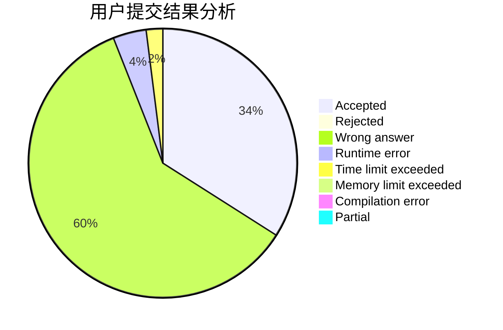
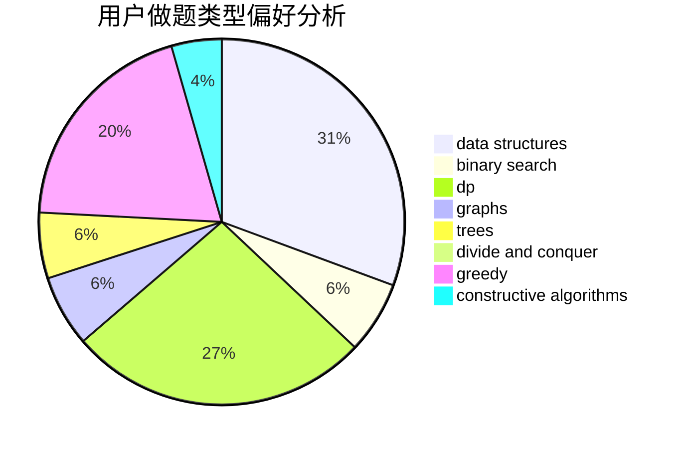
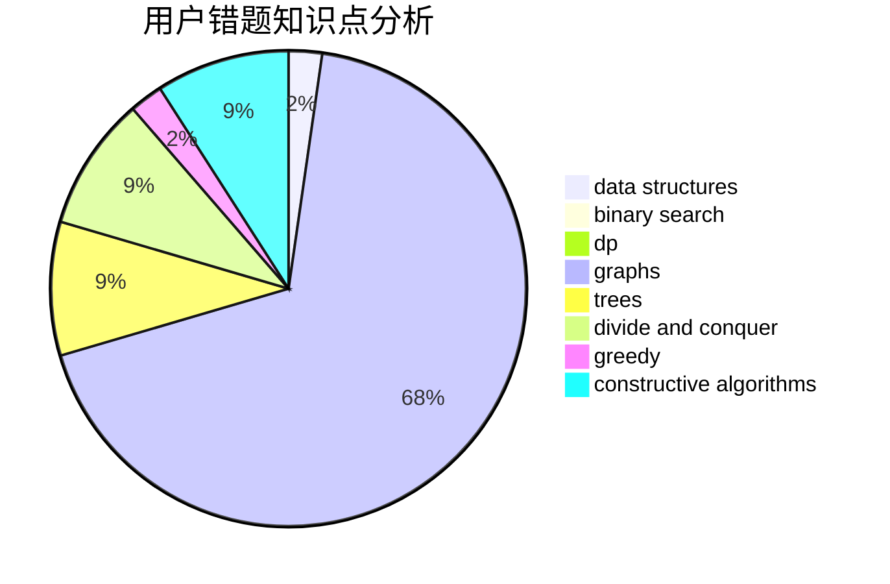

# Kato_Megumi

<!-- tabs:start -->

#### **用户提交结果分析**

#### **用户做题类型偏好分析**

#### **用户错题知识点分析**

<!-- tabs:end -->
# 推荐题目
[1468N](https://codeforces.com/contest/1468/problem/N)		greedy,
                        implementation		  
[764A](https://codeforces.com/contest/764/problem/A)		brute force,
                        implementation,
                        math		  
[1349E](https://codeforces.com/contest/1349/problem/E)		constructive algorithms,
                        dp,
                        greedy		  
[1236B](https://codeforces.com/contest/1236/problem/B)		combinatorics,
                        math		  
[1459F](https://codeforces.com/contest/1459/problem/F)		dsu,graphs,sortings,trees		  
[680B](https://codeforces.com/contest/680/problem/B)		constructive algorithms,
                        implementation		  
[433B](https://codeforces.com/contest/433/problem/B)		dp,
                        implementation,
                        sortings		  
[553C](https://codeforces.com/contest/553/problem/C)		dfs and similar,
                        dsu,
                        graphs		  
[523A](https://codeforces.com/contest/523/problem/A)		*special problem,
                        implementation		  
[1104E](https://codeforces.com/contest/1104/problem/E)		dsu,graphs,sortings,trees		  
