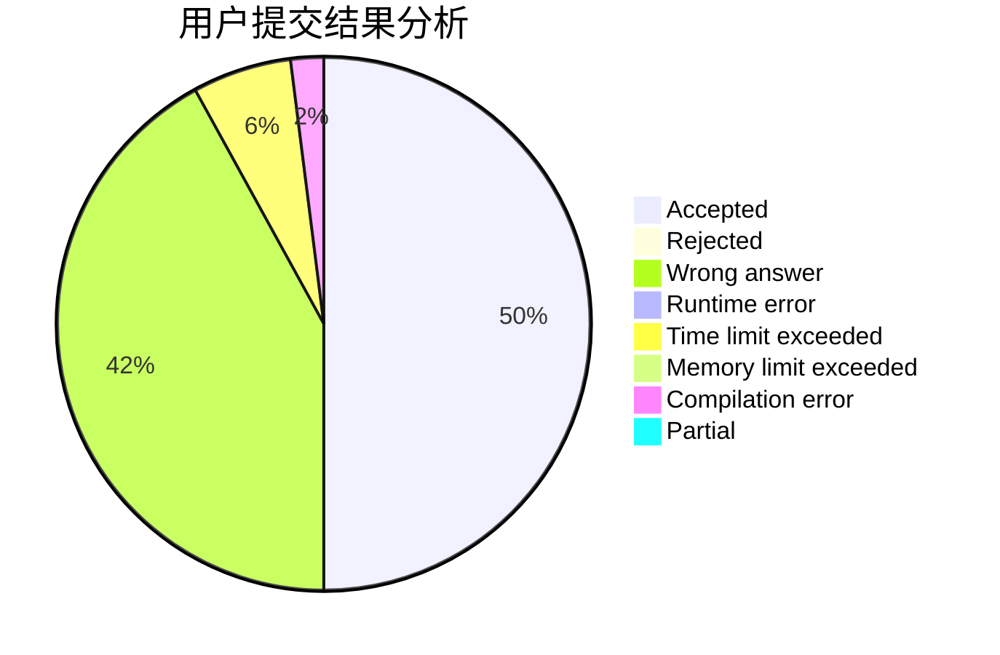
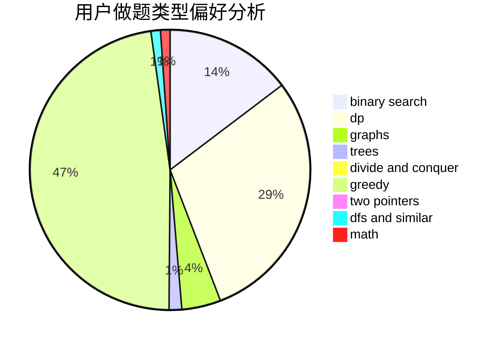

# KeeWuuuuu

<!-- tabs:start -->

#### **用户提交结果分析**

#### **用户做题类型偏好分析**

<!-- tabs:end -->
# 推荐题目
[1490C](https://codeforces.com/contest/1490/problem/C)
[720D](https://codeforces.com/contest/720/problem/D)
[300A](https://codeforces.com/contest/300/problem/A)
[767B](https://codeforces.com/contest/767/problem/B)
[631E](https://codeforces.com/contest/631/problem/E)
[812A](https://codeforces.com/contest/812/problem/A)
[436C](https://codeforces.com/contest/436/problem/C)
[721D](https://codeforces.com/contest/721/problem/D)
[1368A](https://codeforces.com/contest/1368/problem/A)
[518B](https://codeforces.com/contest/518/problem/B)
