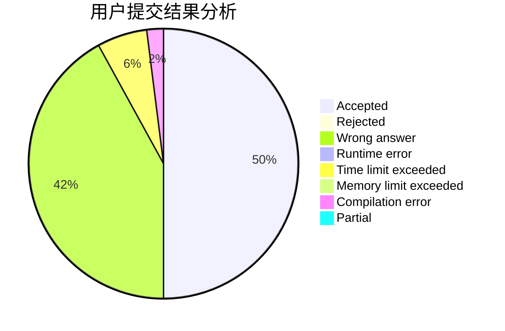
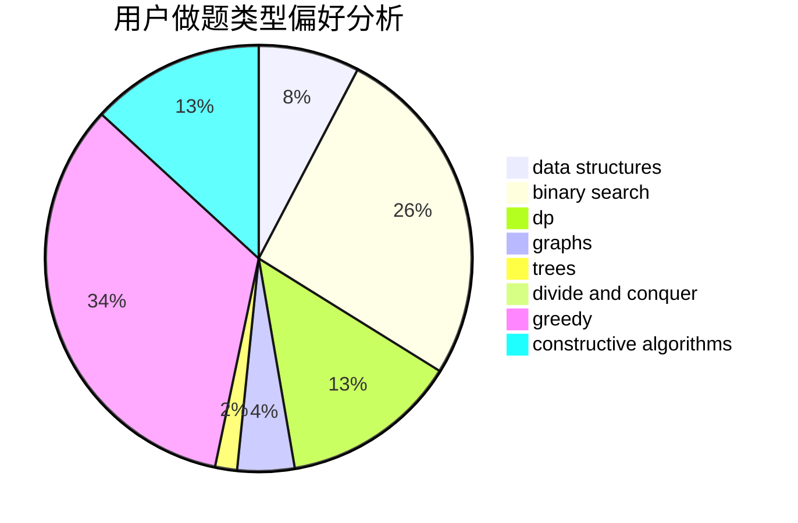
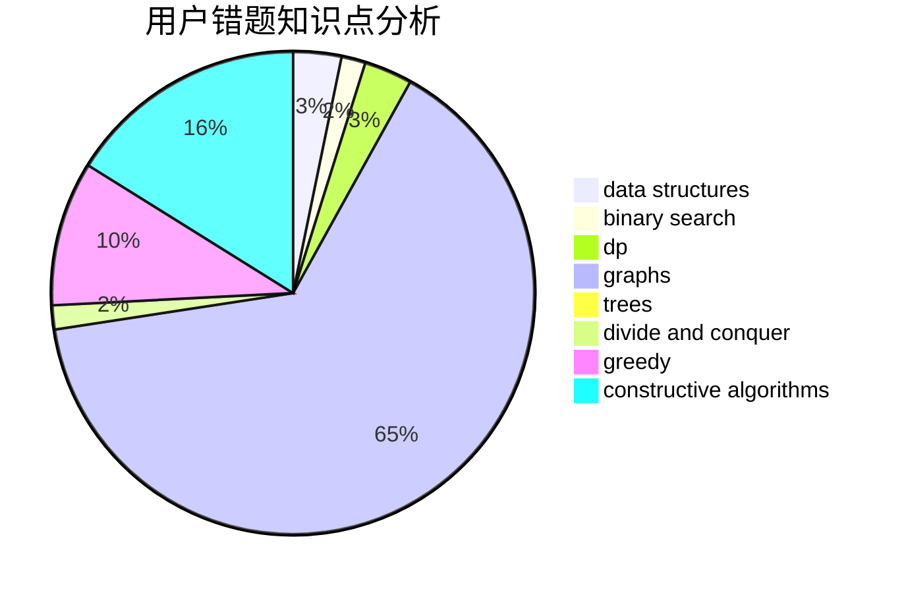

# KeeWuuuuu
<!-- tabs:start -->
#### **用户提交结果分析**

#### **用户做题类型偏好分析**

#### **用户错题知识点分析**

<!-- tabs:end -->
# 推荐题目
[Mike and palindrome](http://codeforces.com/problemset/problem/798/A)		brute force,
                        constructive algorithms,
                        strings		  
[Treeland and Viruses](http://codeforces.com/problemset/problem/1320/E)		data structures,
                        dfs and similar,
                        dp,
                        shortest paths,
                        trees		  
[Replace To Make Regular Bracket Sequence](http://codeforces.com/problemset/problem/612/C)		data structures,
                        expression parsing,
                        math		  
[T-Shirts](http://codeforces.com/problemset/problem/702/F)		data structures		  
[New Year and Hurry](http://codeforces.com/problemset/problem/750/A)		binary search,
                        brute force,
                        implementation,
                        math		  
[k-d-sequence](http://codeforces.com/problemset/problem/407/E)		data structures		  
[Skyline Photo](http://codeforces.com/problemset/problem/1482/E)		data structures,
                        divide and conquer,
                        dp		  
[Bath Queue](http://codeforces.com/problemset/problem/28/C)		combinatorics,
                        dp,
                        probabilities		  
[Graph and Queries](https://codeforces.com/contest/1417/problem/F)		data structures,
                        dsu,
                        graphs,
                        implementation,
                        trees		  
[Subsequences Return](http://codeforces.com/problemset/problem/497/E)		dp,
                        matrices		  
<!-- tabs:start -->
#### **data structures**
[Mike and palindrome](http://codeforces.com/problemset/problem/1320/E)		data structures,
                        dfs and similar,
                        dp,
                        shortest paths,
                        trees		  
[Treeland and Viruses](http://codeforces.com/problemset/problem/612/C)		data structures,
                        expression parsing,
                        math		  
[Replace To Make Regular Bracket Sequence](http://codeforces.com/problemset/problem/702/F)		data structures		  
[T-Shirts](http://codeforces.com/problemset/problem/407/E)		data structures		  
[New Year and Hurry](http://codeforces.com/problemset/problem/1482/E)		data structures,
                        divide and conquer,
                        dp		  
[k-d-sequence](https://codeforces.com/contest/1417/problem/F)		data structures,
                        dsu,
                        graphs,
                        implementation,
                        trees		  
[Skyline Photo](http://codeforces.com/problemset/problem/938/G)		bitmasks,
                        data structures,
                        dsu,
                        graphs		  
[Bath Queue](http://codeforces.com/problemset/problem/1056/G)		brute force,
                        data structures,
                        graphs		  
[Graph and Queries](http://codeforces.com/problemset/problem/1379/F2)		data structures,
                        divide and conquer		  
[Subsequences Return](https://codeforces.com/contest/1447/problem/F2)		data structures,
                        greedy,
                        two pointers		  
#### **binary search**
[Mike and palindrome](http://codeforces.com/problemset/problem/750/A)		binary search,
                        brute force,
                        implementation,
                        math		  
[Treeland and Viruses](https://codeforces.com/contest/866/problem/C)		binary search,
                        dp		  
[Replace To Make Regular Bracket Sequence](http://codeforces.com/problemset/problem/1493/C)		binary search,
                        brute force,
                        constructive algorithms,
                        greedy,
                        strings		  
[T-Shirts](http://codeforces.com/problemset/problem/1352/C)		binary search,
                        math		  
[New Year and Hurry](http://codeforces.com/problemset/problem/1492/C)		binary search,
                        data structures,
                        dp,
                        greedy,
                        two pointers		  
[k-d-sequence](http://codeforces.com/problemset/problem/1463/D)		binary search,
                        constructive algorithms,
                        greedy,
                        two pointers		  
[Skyline Photo](http://codeforces.com/problemset/problem/1490/G)		binary search,
                        data structures,
                        math		  
[Bath Queue](http://codeforces.com/problemset/problem/1479/D)		binary search,
                        bitmasks,
                        brute force,
                        data structures,
                        probabilities,
                        trees		  
[Graph and Queries](http://codeforces.com/problemset/problem/1436/E)		binary search,
                        data structures,
                        two pointers		  
[Subsequences Return](http://codeforces.com/problemset/problem/1461/D)		binary search,
                        brute force,
                        data structures,
                        divide and conquer,
                        implementation,
                        sortings		  
#### **dp**
[Mike and palindrome](http://codeforces.com/problemset/problem/1320/E)		data structures,
                        dfs and similar,
                        dp,
                        shortest paths,
                        trees		  
[Treeland and Viruses](http://codeforces.com/problemset/problem/1482/E)		data structures,
                        divide and conquer,
                        dp		  
[Replace To Make Regular Bracket Sequence](http://codeforces.com/problemset/problem/28/C)		combinatorics,
                        dp,
                        probabilities		  
[T-Shirts](http://codeforces.com/problemset/problem/497/E)		dp,
                        matrices		  
[New Year and Hurry](http://codeforces.com/problemset/problem/702/A)		dp,
                        greedy,
                        implementation		  
[k-d-sequence](https://codeforces.com/contest/866/problem/C)		binary search,
                        dp		  
[Skyline Photo](http://codeforces.com/problemset/problem/1041/F)		data structures,
                        divide and conquer,
                        dp,
                        math		  
[Bath Queue](http://codeforces.com/problemset/problem/285/E)		combinatorics,
                        dp,
                        math		  
[Graph and Queries](http://codeforces.com/problemset/problem/1439/D)		combinatorics,
                        dp,
                        fft		  
[Subsequences Return](http://codeforces.com/problemset/problem/755/G)		combinatorics,
                        divide and conquer,
                        dp,
                        fft,
                        math,
                        number theory		  
#### **graph**
[Mike and palindrome](https://codeforces.com/contest/1417/problem/F)		data structures,
                        dsu,
                        graphs,
                        implementation,
                        trees		  
[Treeland and Viruses](http://codeforces.com/problemset/problem/938/G)		bitmasks,
                        data structures,
                        dsu,
                        graphs		  
[Replace To Make Regular Bracket Sequence](http://codeforces.com/problemset/problem/1056/G)		brute force,
                        data structures,
                        graphs		  
[T-Shirts](http://codeforces.com/problemset/problem/1487/C)		brute force,
                        constructive algorithms,
                        dfs and similar,
                        graphs,
                        greedy,
                        implementation,
                        math		  
[New Year and Hurry](http://codeforces.com/problemset/problem/1437/C)		dp,
                        flows,
                        graph matchings,
                        greedy,
                        math,
                        sortings		  
[k-d-sequence](http://codeforces.com/problemset/problem/1470/D)		constructive algorithms,
                        dfs and similar,
                        graph matchings,
                        graphs,
                        greedy		  
[Skyline Photo](http://codeforces.com/problemset/problem/1476/C)		dp,
                        graphs,
                        greedy		  
[Bath Queue](http://codeforces.com/problemset/problem/1304/D)		constructive algorithms,
                        graphs,
                        greedy,
                        two pointers		  
[Graph and Queries](http://codeforces.com/problemset/problem/1475/C)		combinatorics,
                        graphs,
                        math		  
[Subsequences Return](http://codeforces.com/problemset/problem/553/E)		dp,
                        fft,
                        graphs,
                        math,
                        probabilities		  
#### **trees**
[Mike and palindrome](http://codeforces.com/problemset/problem/1320/E)		data structures,
                        dfs and similar,
                        dp,
                        shortest paths,
                        trees		  
[Treeland and Viruses](https://codeforces.com/contest/1417/problem/F)		data structures,
                        dsu,
                        graphs,
                        implementation,
                        trees		  
[Replace To Make Regular Bracket Sequence](http://codeforces.com/problemset/problem/1305/D)		constructive algorithms,
                        dfs and similar,
                        interactive,
                        trees		  
[T-Shirts](http://codeforces.com/problemset/problem/1207/G)		data structures,
                        dfs and similar,
                        hashing,
                        string suffix structures,
                        strings,
                        trees		  
[New Year and Hurry](http://codeforces.com/problemset/problem/1479/D)		binary search,
                        bitmasks,
                        brute force,
                        data structures,
                        probabilities,
                        trees		  
[k-d-sequence](http://codeforces.com/problemset/problem/1511/C)		brute force,
                        data structures,
                        implementation,
                        trees		  
[Skyline Photo](http://codeforces.com/problemset/problem/1499/F)		combinatorics,
                        dfs and similar,
                        dp,
                        trees		  
[Bath Queue](http://codeforces.com/problemset/problem/1491/E)		brute force,
                        dfs and similar,
                        divide and conquer,
                        number theory,
                        trees		  
[Graph and Queries](http://codeforces.com/problemset/problem/1466/D)		data structures,
                        greedy,
                        sortings,
                        trees		  
[Subsequences Return](http://codeforces.com/problemset/problem/1495/D)		combinatorics,
                        dfs and similar,
                        graphs,
                        math,
                        shortest paths,
                        trees		  
#### **divide and conquer**
[Mike and palindrome](http://codeforces.com/problemset/problem/1482/E)		data structures,
                        divide and conquer,
                        dp		  
[Treeland and Viruses](http://codeforces.com/problemset/problem/1379/F2)		data structures,
                        divide and conquer		  
[Replace To Make Regular Bracket Sequence](http://codeforces.com/problemset/problem/1041/F)		data structures,
                        divide and conquer,
                        dp,
                        math		  
[T-Shirts](http://codeforces.com/problemset/problem/755/G)		combinatorics,
                        divide and conquer,
                        dp,
                        fft,
                        math,
                        number theory		  
[New Year and Hurry](http://codeforces.com/problemset/problem/1461/D)		binary search,
                        brute force,
                        data structures,
                        divide and conquer,
                        implementation,
                        sortings		  
[k-d-sequence](http://codeforces.com/problemset/problem/1466/G)		combinatorics,
                        divide and conquer,
                        hashing,
                        math,
                        string suffix structures,
                        strings		  
[Skyline Photo](http://codeforces.com/problemset/problem/1490/D)		dfs and similar,
                        divide and conquer,
                        implementation		  
[Bath Queue](https://codeforces.com/contest/1483/problem/C)		data structures,
                        divide and conquer,
                        dp		  
[Graph and Queries](http://codeforces.com/problemset/problem/1491/E)		brute force,
                        dfs and similar,
                        divide and conquer,
                        number theory,
                        trees		  
[Subsequences Return](http://codeforces.com/problemset/problem/1303/G)		data structures,
                        divide and conquer,
                        geometry,
                        trees		  
#### **greedy**
[Mike and palindrome](http://codeforces.com/problemset/problem/730/D)		greedy,
                        implementation,
                        math		  
[Treeland and Viruses](http://codeforces.com/problemset/problem/702/A)		dp,
                        greedy,
                        implementation		  
[Replace To Make Regular Bracket Sequence](http://codeforces.com/problemset/problem/1360/B)		greedy,
                        sortings		  
[T-Shirts](http://codeforces.com/problemset/problem/468/A)		constructive algorithms,
                        greedy,
                        math		  
[New Year and Hurry](http://codeforces.com/problemset/problem/1267/E)		greedy		  
[k-d-sequence](https://codeforces.com/contest/1447/problem/F2)		data structures,
                        greedy,
                        two pointers		  
[Skyline Photo](http://codeforces.com/problemset/problem/1406/A)		greedy,
                        implementation,
                        math		  
[Bath Queue](http://codeforces.com/problemset/problem/1252/E)		greedy,
                        two pointers		  
[Graph and Queries](http://codeforces.com/problemset/problem/1493/C)		binary search,
                        brute force,
                        constructive algorithms,
                        greedy,
                        strings		  
[Subsequences Return](http://codeforces.com/problemset/problem/1355/B)		dp,
                        greedy,
                        sortings		  
#### **constructive algorithms**
[Mike and palindrome](http://codeforces.com/problemset/problem/798/A)		brute force,
                        constructive algorithms,
                        strings		  
[Treeland and Viruses](http://codeforces.com/problemset/problem/468/A)		constructive algorithms,
                        greedy,
                        math		  
[Replace To Make Regular Bracket Sequence](http://codeforces.com/problemset/problem/1196/A)		brute force,
                        constructive algorithms,
                        math		  
[T-Shirts](https://codeforces.com/contest/1262/problem/C)		constructive algorithms		  
[New Year and Hurry](http://codeforces.com/problemset/problem/1375/A)		constructive algorithms,
                        math		  
[k-d-sequence](http://codeforces.com/problemset/problem/1305/D)		constructive algorithms,
                        dfs and similar,
                        interactive,
                        trees		  
[Skyline Photo](https://codeforces.com/contest/1456/problem/B)		bitmasks,
                        brute force,
                        constructive algorithms		  
[Bath Queue](http://codeforces.com/problemset/problem/128/B)		brute force,
                        constructive algorithms,
                        hashing,
                        implementation,
                        string suffix structures,
                        strings		  
[Graph and Queries](http://codeforces.com/problemset/problem/1493/C)		binary search,
                        brute force,
                        constructive algorithms,
                        greedy,
                        strings		  
[Subsequences Return](http://codeforces.com/problemset/problem/1493/A)		constructive algorithms,
                        greedy		  
#### **sortings**
[Mike and palindrome](http://codeforces.com/problemset/problem/1360/B)		greedy,
                        sortings		  
[Treeland and Viruses](http://codeforces.com/problemset/problem/1355/B)		dp,
                        greedy,
                        sortings		  
[Replace To Make Regular Bracket Sequence](https://codeforces.com/contest/1496/problem/C)		geometry,
                        greedy,
                        math,
                        sortings		  
[T-Shirts](http://codeforces.com/problemset/problem/1495/A)		geometry,
                        greedy,
                        math,
                        sortings		  
[New Year and Hurry](http://codeforces.com/problemset/problem/1497/A)		brute force,
                        data structures,
                        greedy,
                        sortings		  
[k-d-sequence](http://codeforces.com/problemset/problem/1427/A)		math,
                        sortings		  
[Skyline Photo](http://codeforces.com/problemset/problem/1461/D)		binary search,
                        brute force,
                        data structures,
                        divide and conquer,
                        implementation,
                        sortings		  
[Bath Queue](http://codeforces.com/problemset/problem/1437/C)		dp,
                        flows,
                        graph matchings,
                        greedy,
                        math,
                        sortings		  
[Graph and Queries](http://codeforces.com/problemset/problem/1473/A)		greedy,
                        implementation,
                        math,
                        sortings		  
[Subsequences Return](http://codeforces.com/problemset/problem/1486/B)		binary search,
                        geometry,
                        shortest paths,
                        sortings		  
<!-- tabs:end -->
